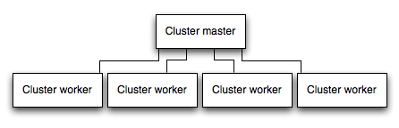

## Express 应用程序生成器

> https://www.expressjs.com.cn/starter/generator.html

npx express-generator

一般都是创建不带视图引擎的项目

express --no-view myapp

## 托管静态文件

```javascript
const path = require("path");
app.use("/static", express.static(path.join(__dirname, "public")));
```

## example

[prisma-fullstack](https://github.com/prisma/prisma-examples/tree/latest/orm/express) - Fullstack app with Next.js using Prisma as an ORM

## 路由(英文值得再翻译一下)

> https://www.expressjs.com.cn/guide/routing.html

可以使用 express app 对象中对应于 http 方法的方法定义路由，比如 app.get、app.post

使用 app.all 处理所有的 http 请求

使用 app.use 指定中间件，调用 next 移交控制权给下一个 callback

### 路由处理器

可以提供多个类似中间件行为的 callback 去处理一个请求，唯一的例外是，这些回调可能会调用 next('route')来绕过剩余的路由 callback。您可以使用此机制在路由上施加前置条件，然后在没有理由继续当前路由时将控制权传递给后续路由。

### response 方法

下表中的响应对象（res）上的方法可以向客户端发送响应，并终止请求-响应周期。如果这些方法都没有从路由处理程序中调用，则客户端请求将被挂起。
|method|描述|
|-----|------|
|res.download()|Prompt a file to be downloaded.|
|res.end()|End the response process.|
|res.json()|Send a JSON response.|
|res.jsonp()| Send a JSON response with JSONP support.|
|res.redirect()|Redirect a request.|
|res.render()|Render a view template.|
|res.send()|Send a response of various types.|
|res.sendFile()| Send a file as an octet stream.|
|res.sendStatus()|Set the response status code and send its string representation as the response body.|

### Chained route hander

避免冗余

```javascript
app
  .route("/book")
  .get((req, res) => {
    res.send("Get a random book");
  })
  .post((req, res) => {
    res.send("Add a book");
  })
  .put((req, res) => {
    res.send("Update the book");
  });
```

### Router

使用 Express.Router 类创建模块化，可安装的路由处理程序。路由器实例是一个完整的中间件和路由系统。因此，它通常被称为“迷你应用”

```javascript
// birds.js
const express = require("express");
const router = express.Router();

// middleware that is specific to this router
const timeLog = (req, res, next) => {
  console.log("Time: ", Date.now());
  next();
};
router.use(timeLog);

// define the home page route
router.get("/", (req, res) => {
  res.send("Birds home page");
});
// define the about route
router.get("/about", (req, res) => {
  res.send("About birds");
});

module.exports = router;
```

```javascript
const birds = require("./birds");

// ...

app.use("/birds", birds);
```

但是，如果父路线/birds 有路径参数，则默认情况下无法从子路线访问它。为了使其可访问，您需要将 mergeParams 选项传递给 Router 构造函数引用。

```javascript
const router = express.Router({ mergeParams: true });
```

## 编写中间件

中间件功能可以执行以下任务：

- 执行任何代码。
- 对请求和响应对象进行更改。
- 结束请求-响应周期。
- 调用堆栈中的下一个中间件。

```javascript
const express = require("express");
const cookieParser = require("cookie-parser");
const cookieValidator = require("./cookieValidator");

const app = express();

async function validateCookies(req, res, next) {
  await cookieValidator(req.cookies);
  next();
}

app.use(cookieParser());

app.use(validateCookies);

// error handler
app.use((err, req, res, next) => {
  res.status(400).send(err.message);
});

app.listen(3000);
```

如果你向 next()函数传递任何东西（字符串‘route’或‘router’除外），Express 将当前请求视为错误，并将跳过任何剩余的非错误处理路由和中间件函数。

## 使用中间件

Express 应用程序可以使用以下类型的中间件：

- Application-level middleware
- Router-level middleware
- Error-handling middleware
- Built-in middleware
- Third-party middleware

您可以使用可选的挂载路径加载应用程序级和路由器级中间件。您还可以一起加载一系列中间件功能，这将在挂载点创建中间件系统的子堆栈。

此示例显示了一个处理对/user/：id 路径的 GET 请求的中间件子堆栈

```javascript
app.get(
  "/user/:id",
  (req, res, next) => {
    console.log("ID:", req.params.id);
    next();
  },
  (req, res, next) => {
    res.send("User Info");
  }
);
```

路由处理程序使您能够为路径定义多条路由。

下面的示例定义了 GET 请求到/user/：id 路径的两条路由。第二条路由不会引起任何问题，但它永远不会被调用，因为第一条路由结束了请求-响应周期。

```javascript
app.get(
  "/user/:id",
  (req, res, next) => {
    console.log("ID:", req.params.id);
    next();
  },
  (req, res, next) => {
    res.send("User Info");
  }
);

// handler for the /user/:id path, which prints the user ID
app.get("/user/:id", (req, res, next) => {
  res.send(req.params.id);
});
```

要从路由器中间件堆栈中跳过其余的中间件功能，调用 next（'route'）将控制权传递给下一个路由。

### Router-Level 中间件

```javascript
const express = require("express");
const app = express();
const router = express.Router();

// a middleware function with no mount path. This code is executed for every request to the router
router.use((req, res, next) => {
  console.log("Time:", Date.now());
  next();
});

// a middleware sub-stack shows request info for any type of HTTP request to the /user/:id path
router.use(
  "/user/:id",
  (req, res, next) => {
    console.log("Request URL:", req.originalUrl);
    next();
  },
  (req, res, next) => {
    console.log("Request Type:", req.method);
    next();
  }
);

// a middleware sub-stack that handles GET requests to the /user/:id path
router.get(
  "/user/:id",
  (req, res, next) => {
    // if the user ID is 0, skip to the next router
    if (req.params.id === "0") next("route");
    // otherwise pass control to the next middleware function in this stack
    else next();
  },
  (req, res, next) => {
    // render a regular page
    res.render("regular");
  }
);

// handler for the /user/:id path, which renders a special page
router.get("/user/:id", (req, res, next) => {
  console.log(req.params.id);
  res.render("special");
});

// mount the router on the app
app.use("/", router);
```

要跳过路由器的其余中间件函数，调用 next('router')将控制权传递会该路由器实例之外。

```javascript
const express = require("express");
const app = express();
const router = express.Router();

// predicate the router with a check and bail out when needed
router.use((req, res, next) => {
  if (!req.headers["x-auth"]) return next("router");
  next();
});

router.get("/user/:id", (req, res) => {
  res.send("hello, user!");
});

// use the router and 401 anything falling through
app.use("/admin", router, (req, res) => {
  res.sendStatus(401);
});
```

### 内置中间件

- express.static
- express.json
- express.urlencoded

### 第三方中间件

> https://www.expressjs.com.cn/resources/middleware.html

比如：cookie-parser

## 错误处理

express 带有一个默认的错误处理，可以不用自定义

### 捕获错误

- 对于发生在路由 handler 和中间件里内的同步代码的错误，无需额外处理工作，express 会捕获和处理它
- 对于异步代码里抛出的错误，需要将错误传递给 next(),这样 express 才会捕获和处理错误

```javascript
app.get("/", (req, res, next) => {
  fs.readFile("/file-does-not-exist", (err, data) => {
    if (err) {
      next(err); // Pass errors to Express.
    } else {
      res.send(data);
    }
  });
});
```

从 express5 开始，在路由 handler 和中间件里返回 promise 并且在内部抛出错误或者 reject(value)就会自动调用 next(value)

### 默认错误处理器

默认错误处理中间件函数会被放置在中间件函数栈的最底部

如果一个传递给 next()的错误没有被自定义错误处理器处理，那么就会被默认错误处理器处理，这个处理器会将错误写到客户端，在开发环境下还会带上错误栈路径

> 将环境变量 NODE_ENV 设置为生产模式，以在生产模式下运行应用程序。

在已经开始写响应（比如，streaming the response to the client）后调用 next(err),express 错误处理器会关闭连接，这个请求失败

在自定义处理器中调用 next(err),就会将错误委派到下一个错误处理程序中

### 写自定义错误处理器

在其他 app.use()和 routes 调用之后，最后定义错误处理中间件

```javascript
app.use((err, req, res, next) => {
  console.error(err.stack);
  res.status(500).send("Something broke!");
});
```

请注意，在错误处理函数中不调用 next 时，您要负责编写（和结束）响应。否则，这些请求将挂起，并且没有资格进行垃圾收集。

```javascript
function clientErrorHandler(err, req, res, next) {
  if (req.xhr) {
    res.status(500).send({ error: "Something failed!" });
  } else {
    next(err);
  }
}
```

## 覆写 express api

- 全局：express.request and express.response
- 应用：app.request and app.response

### 方法

```javascript
app.response.sendStatus = function (statusCode, type, message) {
  // code is intentionally kept simple for demonstration purpose
  return this.contentType(type).status(statusCode).send(message);
};
```

### 属性

1. Assigned properties (ex: req.baseUrl, req.originalUrl)，不可被复写，因为是在当前请求响应周期上下文中确定的
2. Defined as getters (ex: req.secure, req.ip)

```javascript
Object.defineProperty(app.request, "ip", {
  configurable: true,
  enumerable: true,
  get() {
    return this.get("Client-IP");
  },
});
```

### 原型

request/response objects 从相同的原型链继承就行，默认情况下，请求是 http.IncomingRequest.prototype，响应是 http.ServerResponse.prototype。请注意，所使用的原型应尽可能与默认原型的功能相匹配。

```javascript
// Use FakeRequest and FakeResponse in place of http.IncomingRequest and http.ServerResponse
// for the given app reference
Object.setPrototypeOf(
  Object.getPrototypeOf(app.request),
  FakeRequest.prototype
);
Object.setPrototypeOf(
  Object.getPrototypeOf(app.response),
  FakeResponse.prototype
);
```

## 使用模板引擎

就是一种可以把模板中的变量在运行时替换为实际值的技术实现，使得生成 html 更加容易

## 集成数据库

### mysql

> https://github.com/mysqljs/mysql

```javascript
const mysql = require("mysql");
const connection = mysql.createConnection({
  host: "localhost",
  user: "dbuser",
  password: "s3kreee7",
  database: "my_db",
});

connection.connect();

connection.query("SELECT 1 + 1 AS solution", (err, rows, fields) => {
  if (err) throw err;

  console.log("The solution is: ", rows[0].solution);
});

connection.end();
```

### mongodb

> https://github.com/mongodb/node-mongodb-native

> https://github.com/LearnBoost/mongoose

```javascript
const MongoClient = require("mongodb").MongoClient;

MongoClient.connect("mongodb://localhost:27017/animals", (err, client) => {
  if (err) throw err;

  const db = client.db("animals");

  db.collection("mammals")
    .find()
    .toArray((err, result) => {
      if (err) throw err;

      console.log(result);
    });
});
```

## API

### express()

#### 创建一个 express 应用

```javascript
const express = require("express");
const app = express();
```

#### 方法

##### express.json([options])

内置的 request body parser 中间件，基于 body-parser

| 属性    | 描述                                                                              | 类型     | 默认值             |
| ------- | --------------------------------------------------------------------------------- | -------- | ------------------ |
| inflate | 是否允许解析压缩过的 body                                                         | Boolean  | true               |
| limit   | 控制最大的请求 body 大小，数值类型就表示字节大小，字符串类型就传给 bytes 库作解析 | Mixed    | "100kb"            |
| strict  | 是否只允许接受 array 和 object 类型，否的话将接受 JSON.parse 能接受的格式         | Boolean  | true               |
| reviver | 直接传递给 JSON.parse 的第二个参数                                                | Function | null               |
| type    | 决定哪种媒体格式能够被解析                                                        | Mixed    | "application/json" |
| verify  | verify(req, res, buf, encoding)，解析可以通过抛出错误而中止。                     | Function | undefined          |

##### express.static(root, [options])

基于 serve-static 提供静态文件服务能力

> 为了获得最佳效果，请使用[反向代理](https://www.expressjs.com.cn/en/advanced/best-practice-performance.html#use-a-reverse-proxy)缓存来提高服务静态资源的性能。

默认行为是通过结果 root 和 req.url 去决定哪个文件提供服务，如果没有找到，调用 next()到下一个中间件

| 属性         | 描述                                                                                                                                                                                             | 类型     | 默认值       |
| ------------ | ------------------------------------------------------------------------------------------------------------------------------------------------------------------------------------------------ | -------- | ------------ |
| dotfiles     | .文件如何处理，“allow”， “deny”-403 并且调用 next(),“ignore”-404 并且调用 next()                                                                                                                 | String   | “ignore”     |
| etag         | 是否启用 etag                                                                                                                                                                                    | Boolean  | true         |
| extensions   | 找不到文件时默认检索扩展名                                                                                                                                                                       | Mixed    | false        |
| fallthrough  | true 时对于找不到的文件将会调用 next(),false 时将调用 next(err)即使是 404                                                                                                                        | Boolean  | true         |
| immutable    | 启用或禁用 Cache-Control 响应头中的 immutable 指令。如果启用，还应该指定 maxAge 选项以启用缓存。immutable 指令将阻止受支持的客户端在 maxAge 选项的生命周期内发出条件请求，以检查文件是否已更改。 | Boolean  | false        |
| index        | 发送指定的目录索引文件,设置为 false 将禁用目录索引。                                                                                                                                             | Mixed    | “index.html” |
| lastModified | 将 last-modified 头设置为文件在操作系统上的最后修改日期。                                                                                                                                        | Boolean  | true         |
| maxAge       | 设置 Cache-Control 报头的 max-age 属性，单位为毫秒或 ms 格式的字符串。                                                                                                                           | Number   | 0            |
| redirect     | Redirect to trailing “/” when the pathname is a directory.                                                                                                                                       | Boolean  | true         |
| setHeaders   | 用于设置与文件一起的 HTTP 头，fn(res, path, stat)                                                                                                                                                | Function |              |

##### express.Router([options])

创建一个新的 router 对象，可以像应用一样添加中间件和 http 方法路由

##### express.urlencoded([options])

它解析带有 urlencoded 有效负载的传入请求，并基于 body-parser。

### Application

app 对象通常表示 Express 应用程序。

```javascript
const express = require("express");
const app = express();

app.get("/", (req, res) => {
  res.send("hello world");
});

app.listen(3000);
```

#### 属性

##### app.locals

app.locals 对象内有很多可在应用内使用的本地属性，作为应用级数据，可以在模板中使用，也可以在中间件中通过 req.app.locals 引用

res.locals 属性仅在请求的生存期内有效。

```javascript
app.locals.title = "My App";
app.locals.strftime = require("strftime");
app.locals.email = "me@myapp.com";
```

##### app.mountpath

app.mountpath 属性包含一个或多个挂载子应用的路径模式。它类似于 req 对象的 baseUrl 属性，除了 req.baseUrl 返回匹配的 URL 路径，而不是匹配的模式。

```javascript
const admin = express();

admin.get("/", (req, res) => {
  console.log(admin.mountpath); // [ '/adm*n', '/manager' ]
  res.send("Admin Homepage");
});

const secret = express();
secret.get("/", (req, res) => {
  console.log(secret.mountpath); // /secr*t
  res.send("Admin Secret");
});

admin.use("/secr*t", secret); // load the 'secret' router on '/secr*t', on the 'admin' sub app
app.use(["/adm*n", "/manager"], admin); // load the 'admin' router on '/adm*n' and '/manager', on the parent app
```

##### app.router

#### 事件

##### app.on('mount', callback(parent))

当子应用被挂载到父应用上时，会在子应用上触发 mount 事件。父应用被传递给回调函数。

```javascript
const admin = express();

admin.on("mount", (parent) => {
  console.log("Admin Mounted");
  console.log(parent); // refers to the parent app
});

admin.get("/", (req, res) => {
  res.send("Admin Homepage");
});

app.use("/admin", admin);
```

#### 方法

##### app.all(path, callback [, callback ...])

它匹配所有 HTTP 动词

##### app.delete(path, callback [, callback ...])

将 HTTP DELETE 请求路由到指定的路径

##### app.engine(ext, callback)

设置渲染引擎

##### app.get(path, callback [, callback ...])

将 HTTP GET 请求路由到指定的路径

##### app.listen([port[, host[, backlog]]][, callback])

监听指定 host 和 port 上的连接

不分配 port 的话操作系统会自动分配一个未使用的 port,这通常在自动化任务中很有用

express（）返回的应用程序实际上是一个 JavaScript 函数，被设计为作为回调传递给 Node 的 HTTP 服务器来处理请求。这使得它很容易用相同的代码库提供 HTTP 和 HTTPS 版本的应用程序

```javascript
const express = require("express");
const https = require("https");
const http = require("http");
const app = express();

http.createServer(app).listen(80);
https.createServer(options, app).listen(443);
```

app.listen()的方便实现

```javascript
app.listen = function () {
  const server = http.createServer(this);
  return server.listen.apply(server, arguments);
};
```

##### app.param(name, callback)

可以作为路由参数的其中处理器，callback(req,res,next,paramVal, paramName)

如果 name 是一个数组，则按照声明的顺序，为其中声明的每个参数注册回调触发器。此外，对于每个声明的参数（最后一个除外），在回调中调用 next 将调用下一个声明的参数的回调。对于最后一个参数，对 next 的调用将调用当前正在处理的路由的下一个中间件

```javascript
app.param("user", (req, res, next, id) => {
  // try to get the user details from the User model and attach it to the request object
  User.find(id, (err, user) => {
    if (err) {
      next(err);
    } else if (user) {
      req.user = user;
      next();
    } else {
      next(new Error("failed to load user"));
    }
  });
});
```

参数回调函数对于定义它们的路由器来说是本地的。它们不会被挂载的应用程序或路由器继承，也不会被从父路由器继承的路由参数触发。因此，在 app 上定义的参数回调只会被在 app 路由上定义的路由参数触发。

所有参数回调都将在参数发生的任何路由的任何处理程序之前被调用，并且它们在请求-响应周期中只被调用一次

```javascript
app.param(['id', 'page'], (req, res, next, value) => {
  console.log('CALLED ONLY ONCE with', value)
  next()
})

app.get('/user/:id/:page', (req, res, next) => {
  console.log('although this matches')
  next()
})

app.get('/user/:id/:page', (req, res) => {
  console.log('and this matches too')
  res.end()
})

# result
CALLED ONLY ONCE with 42
CALLED ONLY ONCE with 3
although this matches
and this matches too
```

##### app.render(view, [locals], callback)

在 callback 中返回渲染好的 html,res.render()内部也是使用该函数

##### app.route(path)

返回单个路由的实例，然后您可以使用它来处理带有可选中间件的 HTTP。使用 app.route()来避免重复的路由名

```javascript
const app = express();

app
  .route("/events")
  .all((req, res, next) => {
    // runs for all HTTP verbs first
    // think of it as route specific middleware!
  })
  .get((req, res, next) => {
    res.json({});
  })
  .post((req, res, next) => {
    // maybe add a new event...
  });
```

##### app.set(name, value)

可以存放一些设置 key-value 对，某些 name 的配置会影响 server 的行为

##### app.use([path,] callback [, callback...])

在指定路径上挂载指定的中间件函数或函数：当请求路径的 base 与 path 匹配时，执行中间件函数。

下表提供了一些简单的中间件函数示例，这些函数可以用作 app.use()、app.METHOD()和 app.all()的回调参数。

- 单个中间件

```javascript
app.use((req, res, next) => {
  next();
});
```

路由器是有效的中间件

```javascript
const router = express.Router();
router.get("/", (req, res, next) => {
  next();
});
app.use(router);
```

Express 应用程序是有效的中间件。

```javascript
const subApp = express();
subApp.get("/", (req, res, next) => {
  next();
});
app.use(subApp);
```

- 一系列中间件

```javascript
const r1 = express.Router();
r1.get("/", (req, res, next) => {
  next();
});

const r2 = express.Router();
r2.get("/", (req, res, next) => {
  next();
});

app.use(r1, r2);
```

- 数组
  使用数组对中间件进行逻辑分组。

```javascript
const r1 = express.Router();
r1.get("/", (req, res, next) => {
  next();
});

const r2 = express.Router();
r2.get("/", (req, res, next) => {
  next();
});

app.use([r1, r2]);
```

- 上述方式的结合

```javascript
function mw1(req, res, next) {
  next();
}
function mw2(req, res, next) {
  next();
}

const r1 = express.Router();
r1.get("/", (req, res, next) => {
  next();
});

const r2 = express.Router();
r2.get("/", (req, res, next) => {
  next();
});

const subApp = express();
subApp.get("/", (req, res, next) => {
  next();
});

app.use(mw1, [mw2, r1, r2], subApp);
```

### Request

req 对象是 Node 自己的请求对象的增强版本，支持所有内置字段和方法。

#### 属性

##### req.app

此属性包含对使用中间件的 Express 应用程序实例的引用。

##### req.baseUrl

```javascript
const greet = express.Router();

greet.get("/jp", (req, res) => {
  console.log(req.baseUrl); // /greet
  res.send("Konichiwa!");
});

app.use("/greet", greet); // load the router on '/greet'
```

##### req.body

包含在请求体中提交的数据的键值对。默认情况下，它是未定义的，并在使用 body-parser 和 multer 等 body-parsing 中间件时填充。

```javascript
const app = require("express")();
const bodyParser = require("body-parser");
const multer = require("multer"); // v1.0.5
const upload = multer(); // for parsing multipart/form-data

app.use(bodyParser.json()); // for parsing application/json
app.use(bodyParser.urlencoded({ extended: true })); // for parsing application/x-www-form-urlencoded

app.post("/profile", upload.array(), (req, res, next) => {
  console.log(req.body);
  res.json(req.body);
});
```

##### req.cookies

需要使用 cookie-parser 中间件获取

##### req.fresh

当响应在客户端缓存中仍然是新鲜的时，返回 true，否则返回 false，表示客户端缓存现在已经过期，应该发送完整的响应。

当客户端发送 Cache-Control: no-cache 请求头来指示端到端重新加载请求时，该模块将返回 false 以处理这些请求

##### req.host

包含来源从主机 HTTP 标头的主机。
当 trust proxy 设置的值不为 false 时，此属性将从 X-Forwarded-Host 报头字段获取值。该报头可以由客户端或代理设置。

##### req.hostname

类似 host

##### req.ip

包含请求的远程 IP 地址。

当信任代理设置的计算结果不为 false 时，此属性的值源自从 X-Forwarded-For 标头中最左边的项。该报头可以由客户端或代理设置。

##### req.ips

当信任代理设置的值不为 false 时，此属性包含在 X-Forwarded-For 请求标头中指定的 IP 地址数组。否则，它包含一个空数组。该报头可以由客户端或代理设置。

例如，如果“X-Forwarded-For”为 client， proxy1, proxy2, req。ip 将是["client", "proxy1", "proxy2"]，其中 proxy2 是最下游的。

##### req.method

包含一个与请求的 HTTP 方法相对应的字符串：GET、POST、PUT 等等。

##### req.originalUrl

> req.url 不是 Express native 属性，它继承自 Node 的 http 模块。

这个属性很像 request.url,但是，它保留了原始请求 URL，允许您重写 req.Url 用于内部路由目的。

```javascript
// GET 'http://www.example.com/admin/new?sort=desc'
app.use("/admin", (req, res, next) => {
  console.dir(req.originalUrl); // '/admin/new?sort=desc'
  console.dir(req.baseUrl); // '/admin'
  console.dir(req.path); // '/new'
  next();
});
```

##### req.params

用于获取路由参数

##### req.path

包含请求 URL 的路径部分。

```javascript
// example.com/users?sort=desc
console.dir(req.path);
// => "/users"
```

> When called from a middleware, the mount point is not included in req.path

##### req.protocol

包含请求协议字符串：http 或（对于 TLS 请求）https。

当 trust proxy 设置的值不为 false 时，此属性将使用 X-Forwarded-Proto 报头字段的值（如果存在）。该报头可以由客户端或代理设置。

##### req.query

该属性是一个对象，包含路由中每个查询字符串参数的属性。当 query parser 设置为 disabled 时，它是一个空对象{}，否则它是配置的查询解析器的结果。

可覆盖默认的实现

```javascript
const qs = require("qs");
app.set("query parser", (str) =>
  qs.parse(str, {
    /* custom options */
  })
);
```

##### req.res

此属性包含对与此请求对象相关的响应对象的引用。

##### req.secure

一个布尔属性，如果建立了 TLS 连接，则为 true。相当于以下内容

```javascript
req.protocol === "https";
```

##### req.signedCookies

签名的 cookie,还不理解 TODO

##### req.stale

指示请求是否过期，与 request .fresh 相反

##### req.subdomains

请求域名中的子域数组。

```javascript
// Host: "tobi.ferrets.example.com"
console.dir(req.subdomains);
// => ["ferrets", "tobi"]
```

应用程序属性子域偏移量（默认为 2）用于确定子域段的开始。要更改此行为，请使用 app.set 更改其值。

##### req.xhr

如果请求的 X-Requested-With 报头字段是 XMLHttpRequest，则为 true 的布尔属性，表明请求是由诸如 jQuery 之类的客户端库发出的。

#### 方法

##### req.accepts(types)

根据请求的 Accept HTTP 报头字段，检查指定的内容类型是否可接受。该方法返回最佳匹配，或者如果指定的内容类型都不可接受，则返回 false（在这种情况下，应用程序应响应 406 "Not acceptable "）。

##### req.acceptsCharsets(charset [, ...])

根据请求的 Accept-Charset HTTP 报头字段，返回指定字符集中第一个可接受的字符集。如果指定的字符集都不被接受，则返回 false。

##### req.acceptsEncodings(encoding [, ...])

根据请求的 Accept-Encoding HTTP 报头字段，返回指定编码的第一个接受的编码。如果不接受指定的编码，则返回 false。

##### req.acceptsLanguages(lang [, ...])

根据请求的 Accept-Language HTTP 报头字段，返回指定语言中第一个接受的语言。如果不接受指定的语言，则返回 false。

##### req.get(field)

返回指定的 HTTP 请求报头字段, Aliased as req.header(field).

##### req.range(size[, options])

header parser

### Response

res 对象是 Node 自己的响应对象的增强版本，支持所有内置字段和方法。

#### 属性

##### res.app

此属性包含对使用中间件的 Express 应用程序实例的引用。

##### res.headersSent

布尔属性，指示应用是否为响应发送 HTTP 报头。

##### res.locals

使用此属性可以设置在 res.render 渲染的模板中可访问的变量。在 res.locals 上设置的变量在单个请求-响应周期内可用，并且不会在请求之间共享。

##### res.req

此属性包含对与此响应对象相关的请求对象的引用。

#### 方法

##### res.append(field [, value])

设置响应头的值

```javascript
res.append("Link", ["<http://localhost/>", "<http://localhost:3000/>"]);
res.append("Set-Cookie", "foo=bar; Path=/; HttpOnly");
res.append("Warning", "199 Miscellaneous warning");
```

##### res.attachment([filename])

将 HTTP 响应 Content-Disposition 头字段设置为 attachment。如果给出了文件名，则它通过 res.type()根据扩展名设置 Content-Type，并设置 Content-Disposition filename=参数。

```javascript
res.attachment();
// Content-Disposition: attachment

res.attachment("path/to/logo.png");
// Content-Disposition: attachment; filename="logo.png"
// Content-Type: image/png
```

##### res.cookie(name, value [, options])

设置 cookie 名称为 value。value 参数可以是字符串或转换为 JSON 的对象。

| 属性     | 类型              | 描述                                                                |
| -------- | ----------------- | ------------------------------------------------------------------- |
| domain   | String            | cookie 的域名。默认为应用程序的域名。                               |
| encode   | Function          | 用于 cookie 值编码的同步函数。默认为 encodeuriccomponent。          |
| expires  | Date              | cookie 的过期日期（GMT）。如果不指定或设置为 0，则创建会话 cookie。 |
| httpOnly | Boolean           | 将 cookie 标记为只能由 web 服务器访问。                             |
| maxAge   | Number            | 用于设置相对于当前时间（以毫秒为单位）的到期时间的方便选项          |
| path     | String            | cookie 的路径。默认为“/”。                                          |
| secure   | Boolean           | 将 cookie 标记为仅用于 HTTPS。                                      |
| signed   | Boolean           | 指示是否应该对 cookie 进行签名。                                    |
| sameSite | Boolean or String | 是否只在当前站点下发送，可用于防止 csrf 攻击                        |

示例用例：您需要为组织中的另一个站点设置一个域范围的 cookie。另一个站点（不在您的管理控制之下）不使用 uri 编码的 cookie 值。

```javascript
// Default encoding
res.cookie("some_cross_domain_cookie", "http://mysubdomain.example.com", {
  domain: "example.com",
});
// Result: 'some_cross_domain_cookie=http%3A%2F%2Fmysubdomain.example.com; Domain=example.com; Path=/'

// Custom encoding
res.cookie("some_cross_domain_cookie", "http://mysubdomain.example.com", {
  domain: "example.com",
  encode: String,
});
// Result: 'some_cross_domain_cookie=http://mysubdomain.example.com; Domain=example.com; Path=/;'
```

你可以传递一个对象作为值参数；然后其被序列化为 JSON 并由 bodyParser()中间件解析。

```javascript
res.cookie("cart", { items: [1, 2, 3] });
res.cookie("cart", { items: [1, 2, 3] }, { maxAge: 900000 });
```

当使用 cookie-parser 中间件时，此方法还支持签名的 cookie。只需将带 signed 的选项设置为 true。然后，res.cookie()将使用传递给 cookieParser（secret）的 secret 对值进行签名。

```javascript
res.cookie("name", "tobi", { signed: true });
```

##### res.clearCookie(name [, options])

清除指定名称的 cookie。

Web 浏览器和其他兼容的客户端只有在给定选项与 res.cookie()相同时才会清除 cookie，不包括 expires 和 maxAge。

```javascript
res.cookie("name", "tobi", { path: "/admin" });
res.clearCookie("name", { path: "/admin" });
```

##### res.download(path [, filename] [, options] [, fn])

以附件的形式传输路径上的文件。通常，浏览器会提示用户下载。默认情况下，Content-Disposition 报头 filename=参数派生自 path 参数，但可以用 filename 参数覆盖。如果 path 是相对的，那么它将基于进程的当前工作目录。

| 属性         | 描述                                                                                                                                                                                                                                                                                                                     | 默认值   | 可用性 |
| ------------ | ------------------------------------------------------------------------------------------------------------------------------------------------------------------------------------------------------------------------------------------------------------------------------------------------------------------------ | -------- | ------ |
| maxAge       | 设置 Cache-Control 报头的 max-age 属性，单位为毫秒或 ms 格式的字符串                                                                                                                                                                                                                                                     | 0        | 4.16+  |
| lastModified | 将 last-modified 头设置为文件在操作系统上的最后修改日期。设置 false 为禁用。                                                                                                                                                                                                                                             | Enabled  | 4.16+  |
| headers      | 包含要与文件一起提供的 HTTP 头。标题 Content-Disposition 将被 filename 参数覆盖。                                                                                                                                                                                                                                        |          | 4.16+  |
| dotfiles     | Option for serving dotfiles. Possible values are “allow”, “deny”, “ignore”.                                                                                                                                                                                                                                              | “ignore” | 4.16+  |
| acceptRanges | Enable or disable accepting ranged requests.                                                                                                                                                                                                                                                                             | true     | 4.16+  |
| cacheControl | 启用或禁用 Cache-Control 响应头设置。                                                                                                                                                                                                                                                                                    | true     | 4.16+  |
| immutable    | Enable or disable the immutable directive in the Cache-Control response header. If enabled, the maxAge option should also be specified to enable caching. The immutable directive will prevent supported clients from making conditional requests during the life of the maxAge option to check if the file has changed. | false    | 4.16+  |

当传输完成或发生错误时，该方法调用回调函数 fn（err）。如果指定了回调函数并且发生了错误，则回调函数必须通过结束请求-响应周期或将控制传递给下一个路由来显式地处理响应过程。

```javascript
res.download("/report-12345.pdf");

res.download("/report-12345.pdf", "report.pdf");

res.download("/report-12345.pdf", "report.pdf", (err) => {
  if (err) {
    // Handle error, but keep in mind the response may be partially-sent
    // so check res.headersSent
  } else {
    // decrement a download credit, etc.
  }
});
```

##### res.end([data] [, encoding])

结束响应过程。这个方法实际上来自 Node 核心，http.ServerResponse 的 response.end（）方法。

用于在没有任何数据的情况下快速结束响应。如果你需要用数据来响应，可以使用 res.send（）和 res.json（）等方法。

```javascript
res.end();
res.status(404).end();
```

##### res.get(field)

返回由字段指定的 HTTP 响应头。

```javascript
res.get("Content-Type");
// => "text/plain"
```

##### res.json([body])

发送一个 JSON 响应。此方法发送一个响应（具有正确的内容类型），该响应是使用 JSON.stringify（）转换为 JSON 字符串的参数。

```javascript
res.json(null);
res.json({ user: "tobi" });
res.status(500).json({ error: "message" });
```

##### res.jsonp([body])

发送具有 JSONP 支持的 JSON 响应。此方法与 res.json（）相同，只是它选择加入 JSONP 回调支持。

默认情况下，JSONP 回调名称仅为 callback。使用 jsonp 回调名称设置覆盖此设置。

```javascript
// ?callback=foo
res.jsonp({ user: "tobi" });
// => foo({ "user": "tobi" })

app.set("jsonp callback name", "cb");

// ?cb=foo
res.status(500).jsonp({ error: "message" });
// => foo({ "error": "message" })
```

##### res.links(links)

##### res.location(path)

将响应位置 HTTP 头设置为指定的路径参数。

路径值“back”具有特殊含义，它指的是请求的 Referer 标头中指定的 URL。如果未指定 Referer 标头，则它引用“/”。

```javascript
res.location("/foo/bar");
res.location("http://example.com");
res.location("back");
```

##### res.redirect([status,] path)

重定向到从指定路径派生的 URL，具有指定的状态，一个与 HTTP 状态码对应的正整数。如果未指定，status 默认为 302 “Found”。

```javascript
res.redirect("/foo/bar");
res.redirect("http://example.com");
res.redirect(301, "http://example.com");
res.redirect("../login");
```

##### res.render(view [, locals] [, callback])

渲染视图并将渲染的 HTML 字符串发送到客户端

##### res.send([body])

发送 HTTP 响应。

body 参数可以是 Buffer 对象、String、object、Boolean 或 Array

```javascript
res.send(Buffer.from("whoop"));
res.send({ some: "json" });
res.send("<p>some html</p>");
res.status(404).send("Sorry, we cannot find that!");
res.status(500).send({ error: "something blew up" });
```

此方法对简单的非流响应执行许多有用的任务：例如，它自动分配 Content-Length HTTP 响应头字段，并提供自动 HEAD 和 HTTP 缓存新鲜度支持。

当参数是 Buffer 对象时，该方法将 Content-Type 响应头字段设置为“application/octet-stream”，除非之前已定义

##### res.sendFile(path [, options] [, fn])

##### res.sendStatus(statusCode)

将响应 HTTP 状态码设置为 statusCode，并将注册的状态消息作为文本响应体发送。

##### res.set(field [, value])

将响应的 HTTP 头字段设置为 value。要一次设置多个字段，可以传递一个对象作为参数。

##### res.status(code)

设置响应的 HTTP 状态

##### res.type(type)

将 Content-Type HTTP 标头设置为由指定类型确定的 MIME 类型。如果 type 包含“/”字符，则将 Content-type 设置为类型的确切值，否则将假定为文件扩展名，并使用 express.static.MIME.lookup（）方法在映射中查找 MIME 类型。

```javascript
res.type(".html"); // => 'text/html'
res.type("html"); // => 'text/html'
res.type("json"); // => 'application/json'
res.type("application/json"); // => 'application/json'
res.type("png"); // => image/png:
```

##### res.vary(field)

### Router

router 对象是中间件和路由的一个实例。您可以将其视为一个小型应用程序，仅能够执行中间件和路由功能。每个 Express 应用都有一个内置的应用路由器。

路由器的行为就像中间件本身，所以你可以把它用作 app.use（）的参数，也可以作为另一个路由器的 use（）方法的参数。

顶层的 express 对象有一个 Router（）方法，用来创建一个新的 Router 对象。

一旦创建了路由器对象，就可以像应用程序一样向其添加中间件和 HTTP 方法路由（如 get、put、post 等）。例如

```javascript
// invoked for any requests passed to this router
router.use((req, res, next) => {
  // .. some logic here .. like any other middleware
  next();
});
```

然后，您可以将路由器用于特定的根 URL，从而将路由分离到文件甚至迷你应用程序中。

```javascript
// only requests to /calendar/* will be sent to our "router"
app.use("/calendar", router);
```

#### 方法

大多数都和 app 的一致

##### router.param(name, callback)

与 app.param（）不同，router.param（）不接受路由参数数组。

## 构建模板引擎

```javascript
const fs = require("fs"); // this engine requires the fs module
app.engine("ntl", (filePath, options, callback) => {
  // define the template engine
  fs.readFile(filePath, (err, content) => {
    if (err) return callback(err);
    // this is an extremely simple template engine
    const rendered = content
      .toString()
      .replace("#title#", `<title>${options.title}</title>`)
      .replace("#message#", `<h1>${options.message}</h1>`);
    return callback(null, rendered);
  });
});
app.set("views", "./views"); // specify the views directory
app.set("view engine", "ntl"); // register the template engine
```

## 最佳安全实践

### 不使用废弃或者有漏洞的版本

### 使用 TLS

Also, a handy tool to get a free TLS certificate is [Let’s Encrypt](https://letsencrypt.org/about/), a free, automated, and open certificate authority (CA) provided by the Internet Security Research Group (ISRG).

### 不要相信用户输入

#### 阻止开放重定向

应用程序必须验证它支持重定向到传入 URL，以避免将用户发送到恶意链接，如网络钓鱼网站，以及其他风险。

```javascript
app.use((req, res) => {
  try {
    if (new Url(req.query.url).host !== "example.com") {
      return res
        .status(400)
        .end(`Unsupported redirect to host: ${req.query.url}`);
    }
  } catch (e) {
    return res.status(400).end(`Invalid url: ${req.query.url}`);
  }
  res.redirect(req.query.url);
});
```

### Use Helmet

Helmet 可以通过适当设置 HTTP 标头来帮助保护您的应用程序免受一些众所周知的 web 漏洞的攻击。

- helmet.contentSecurityPolicy，用于设置内容安全策略(csp)标头。这有助于防止跨站点脚本攻击等。
- helmet.hsts，用于设置 Strict-Transport-Security 标头。这有助于加强与服务器的安全（HTTPS）连接。
- helmet.frameguard，用于设置 X-Frame-Options 标头。这提供了点击劫持保护。

```javascript
const helmet = require("helmet");
app.use(helmet());
```

### Reduce fingerprinting

它可以帮助提供额外的安全层，以减少攻击者确定服务器使用的软件的能力，称为指纹识别。

默认情况下，Express 发送 X-Powered-By 响应头，您可以使用 app.disable（）方法禁用该响应头

```javascript
app.disable("x-powered-by");
```

### 安全地使用 cookies

## 最佳性能实践

> https://www.expressjs.com.cn/advanced/best-practice-performance.html

### 开发

#### 使用 gzip 压缩

在 node 端是可以开启 gzip 压缩的

```javascript
const compression = require("compression");
const express = require("express");
const app = express();
app.use(compression());
```

但是在生产环境的高流量网站中，最好的方式是在反向代理层面实现它，比如[nginx](https://nginx.org/en/docs/http/ngx_http_gzip_module.html)

#### 不要使用同步函数

同步函数的微小延迟在高流量场景下会影响应用的性能，唯一可能的调用场景是在初始启动时

在开发环境添加--trace-sync-io 命令行参数会在你使用同步 api 的时候打印警告和堆栈信息

#### 正确记录日志

一般来说，从应用程序中记录日志有两个原因：用于调试和记录应用程序活动,开发环境一般是通过 console.log（）或 console.error（）将日志消息打印到终端,但是，当目标是终端或文件时，这些函数是同步的，因此它们不适合用于生产，除非您将输出管道传输到另一个程序。

##### 用于调试

如果您记录日志是为了调试，那么不要使用 console.log()，而是使用一个特殊的调试模块，如[debug](https://www.npmjs.com/package/debug)。该模块使您能够使用 DEBUG 环境变量来控制发送给 console.error（）的调试消息（如果有的话）。为了让你的应用保持纯异步，你仍然需要将 console.error（）管道传递给另一个程序。但是，您实际上并不打算在生产环境中进行调试的。。。

##### 用于应用程序活动

如果你正在记录应用活动（例如，跟踪流量或 API 调用），而不是使用 console.log()，使用像 Winston 或 Bunyan 这样的日志库。

#### 正确处理异常

Node 应用程序在遇到未捕获的异常时崩溃。

要确保处理了所有异常，请使用以下技术

- Use try-catch
- Use promises

node 中的异步的错误处理使用 error-first callback，即第一个参数是错误，第二个参数是成功时的结果，如果没有错误，第一个参数为 null

##### 不要做

您不应该做的一件事是监听 uncaughtException 事件，该事件在异常冒泡返回事件循环时发出。为 uncaughtException 添加事件监听器将改变遇到异常的进程的默认行为；尽管存在异常，进程仍将继续运行。这听起来像是防止应用程序崩溃的好方法，但在未捕获异常后继续运行应用程序是一种危险的做法，不建议这样做，因为进程的状态变得不可靠和不可预测。

##### Use try-catch

try-catch 只适用于同步代码。因为 Node 平台主要是异步的（特别是在生产环境中），所以 try-catch 不会捕获很多异常。

##### Use promises

promise 将处理使用 then（）的异步代码块中的任何异常（显式和隐式）。只需在 promise 链的末尾添加。catch（next）。

事件发射器（如 stream）仍然可能导致未捕获的异常。所以确保你正确地处理了错误事件；例如

```javascript
const wrap =
  (fn) =>
  (...args) =>
    fn(...args).catch(args[2]);

app.get(
  "/",
  wrap(async (req, res, next) => {
    const company = await getCompanyById(req.query.id);
    const stream = getLogoStreamById(company.id);
    stream.on("error", next).pipe(res);
  })
);
```

### 在您的环境/设置中要做的事情

#### Set NODE_ENV to “production”

将 NODE_ENV 设置为“production”会使 Express：

- Cache view templates.
- Cache CSS files generated from CSS extensions.
- Generate less verbose error messages.

如果需要编写特定于环境的代码，可以使用 process.env.NODE ENV 检查 NODE ENV 的值。请注意，检查任何环境变量的值都会导致性能损失，因此应该谨慎执行。

在开发中，通常在交互式 shell 中设置环境变量，例如使用 export 或.bash_profile 配置文件。但一般来说，你不应该在生产服务器上这样做；相反，使用操作系统的初始化系统（systemd 或 Upstart）。

- 对于 Upstart，在 job 文件中使用 env 关键字。

```shell
# /etc/init/env.conf
 env NODE_ENV=production
```

- 对于 systemd，在 unit 文件中使用 Environment 指令。

```shell
# /etc/systemd/system/myservice.service
Environment=NODE_ENV=production
```

#### 确保应用程序自动重启

在生产环境中，您绝对不希望应用程序处于脱机状态。这意味着你需要确保它在应用程序崩溃和服务器本身崩溃的情况下都能重新启动。

- 使用进程管理器在应用程序崩溃时重新启动应用

* 当操作系统崩溃时，使用操作系统提供的 init 系统重新启动进程管理器。也可以在没有进程管理器的情况下使用 init 系统。

##### 使用流程管理器

流程管理器是应用程序的容器，它有助于部署、提供高可用性，并使您能够在运行时管理应用程序。

除了在应用程序崩溃时重新启动外，进程管理器还可以使您能够:

- 深入了解运行时性能和资源消耗。
- 动态修改设置以提高性能。
- 控制集群（StrongLoop PM 和 pm2）。

最流行的 Node 进程管理器如下:

- [StrongLoop Process Manager](https://strong-pm.io/)
- [PM2](https://github.com/Unitech/pm2)

对于他们之间的比较在[这里](https://strong-pm.io/compare/)

StrongLoop PM 有很多专门针对生产部署的特性。您可以使用它和相关的 StrongLoop 工具来:

- 在本地构建和打包应用程序，然后将其安全地部署到生产系统。
- 自动重启你的应用程序，如果它崩溃的任何原因。
- 远程管理集群。
- 查看 CPU 配置文件和堆快照以优化性能并诊断内存泄漏。
- 查看应用程序的性能指标
- 通过 Nginx 负载均衡器的集成控制，轻松扩展到多个主机。

如下所述，当您使用 init 系统将 StrongLoop PM 安装为操作系统服务时，它将在系统重启时自动重启。因此，它将使您的应用程序进程和集群永远保持活跃。

##### Use an init system

可靠性的下一层是确保你的应用程序在服务器重启时也能重启。系统仍然可能因为各种原因而崩溃。为了确保应用程序在服务器崩溃时能够重新启动，请使用内置在操作系统中的 init 系统。目前使用的两个主要初始化系统是[systemd](https://wiki.debian.org/systemd)和[Upstart](http://upstart.ubuntu.com/)。

有两种方法可以在 Express 应用中使用 init 系统

- 在进程管理器中运行你的应用，并将进程管理器作为服务与 init 系统一起安装。当应用程序崩溃时，进程管理器会重启你的应用程序，当操作系统重启时，init 系统会重启进程管理器。这是推荐的方法。
- 直接用 init 系统运行你的应用（和 Node）。这在某种程度上更简单，但是您没有获得使用流程管理器的额外优势。

###### Systemd

Systemd 是一个服务管理器。大多数主要的 Linux 发行版都采用 systemd 作为默认的初始化系统。

systemd 服务配置文件称为 unit 文件，文件名以.service 结尾。下面是一个直接管理 Node 应用程序的示例单元文件。为你的系统和应用替换<尖括号>中的值

```shell
[Unit]
Description=<Awesome Express App>

[Service]
Type=simple
ExecStart=/usr/local/bin/node </projects/myapp/index.js>
WorkingDirectory=</projects/myapp>

User=nobody
Group=nogroup

# Environment variables:
Environment=NODE_ENV=production

# Allow many incoming connections
LimitNOFILE=infinity

# Allow core dumps for debugging
LimitCORE=infinity

StandardInput=null
StandardOutput=syslog
StandardError=syslog
Restart=always

[Install]
WantedBy=multi-user.target
```

###### StrongLoop PM as a systemd service

To install StrongLoop PM as a systemd service:

```shell
$ sudo sl-pm-install --systemd
```

Then start the service with:

```shell
$ sudo /usr/bin/systemctl start strong-pm
```

###### Upstart

Upstart 是许多 Linux 发行版上可用的系统工具，用于在系统启动期间启动任务和服务，在关机期间停止任务和服务，并对其进行监督。你可以将 Express 应用或进程管理器配置为服务，这样 Upstart 就会在它崩溃时自动重启它。

#### 在集群中运行应用程序

在多核系统中，您可以通过启动进程集群将 Node 应用程序的性能提高许多倍。集群运行应用程序的多个实例，理想情况下每个 CPU 内核上有一个实例，从而在实例之间分配负载和任务。


由于应用程序实例作为单独的进程运行，它们不共享相同的内存空间。也就是说，对象对于应用程序的每个实例来说都是本地的。因此，你不能在应用程序代码中维护状态。然而，你可以使用内存中的数据存储，比如 Redis 来存储会话相关的数据和状态。这个警告基本上适用于所有形式的水平扩展，无论是多进程集群还是多物理服务器集群。

在集群应用中，工作进程可以单独崩溃，而不会影响其他进程。除了性能优势之外，故障隔离是运行应用程序进程集群的另一个原因。每当工作进程崩溃时，一定要确保记录该事件并使用 cluster.fork（）生成一个新进程。

##### 使用 Node 的集群模块

Node 的集群模块使集群成为可能。这使得主进程能够生成 worker 进程，并在 worker 之间分发传入的连接。然而，与其直接使用该模块，不如使用自动完成此任务的众多工具之一；例如 node-pm 或 cluster-service。

##### Using StrongLoop PM

如果您将应用程序部署到 StrongLoop Process Manager (PM)，那么您可以在不修改应用程序代码的情况下利用集群。

当 StrongLoop Process Manager （PM）运行一个应用程序时，它会自动在一个具有与系统上 CPU 内核数量相等的工人数量的集群中运行该应用程序。您可以使用 slc 命令行工具手动更改集群中工作进程的数量，而无需停止应用程序。

例如，假设您已经将应用程序部署到 prod.foo.com，并且 StrongLoop PM 正在监听端口 8701（默认值），那么使用 slc 将集群大小设置为 8:

```shell
$ slc ctl -C http://prod.foo.com:8701 set-size my-app 8
```

##### Using PM2

如果使用 PM2 部署应用程序，那么无需修改应用程序代码就可以利用集群。首先，您应该确保应用程序是无状态的，这意味着进程中没有存储本地数据（如会话、websocket 连接等）。

在使用 PM2 运行应用程序时，您可以启用集群模式，以便在具有您选择的多个实例的集群中运行该应用程序，例如匹配机器上可用 cpu 的数量。您可以使用 pm2 命令行工具手动更改集群中的进程数，而无需停止应用程序。

要启用集群模式，像这样启动应用程序:

```shell
# Start 4 worker processes
$ pm2 start npm --name my-app -i 4 -- start
# Auto-detect number of available CPUs and start that many worker processes
$ pm2 start npm --name my-app -i max -- start
```

这也可以在 PM2 进程文件（ecosystem.config.js 或类似文件）中配置，方法是将 exec 模式设置为 cluster，并将 instances 设置为要启动的 worker 的数量。

```shell
# Add 3 more workers
$ pm2 scale my-app +3
# Scale to a specific number of workers
$ pm2 scale my-app 2
```

##### 缓存请求结果

在生产中提高性能的另一个策略是缓存请求的结果，这样你的应用程序就不会重复操作来重复服务相同的请求。

使用像 Varnish 或 Nginx 这样的缓存服务器（参见[Nginx 缓存](https://serversforhackers.com/c/nginx-caching)）可以大大提高应用程序的速度和性能。

##### 使用负载均衡

无论应用程序如何优化，单个实例都只能处理有限的负载和流量。扩展应用程序的一种方法是运行它的多个实例，并通过负载均衡器分配流量。设置负载平衡器可以提高应用程序的性能和速度，并使其能够比单个实例扩展更多。

负载平衡器通常是一个反向代理，用于协调往返多个应用程序实例和服务器的流量。通过使用 Nginx 或 HAProxy，你可以很容易地为你的应用程序设置一个负载均衡器。

使用负载平衡，您可能必须确保与特定会话 ID 相关联的请求连接到发起它们的进程。这就是所谓的会话关联，或者粘性会话，可以通过上面的建议来解决，比如使用 Redis 这样的数据存储会话数据

##### 使用反向代理

反向代理位于 web 应用程序的前面，除了将请求定向到应用程序之外，还对请求执行支持操作。它可以处理错误页面，压缩，缓存，服务文件和负载平衡等。

将不需要了解应用程序状态的任务移交给反向代理，可以释放 Express 来执行专门的应用程序任务。因此，建议在生产环境中使用反向代理（如 Nginx 或 HAProxy）来运行 Express。
