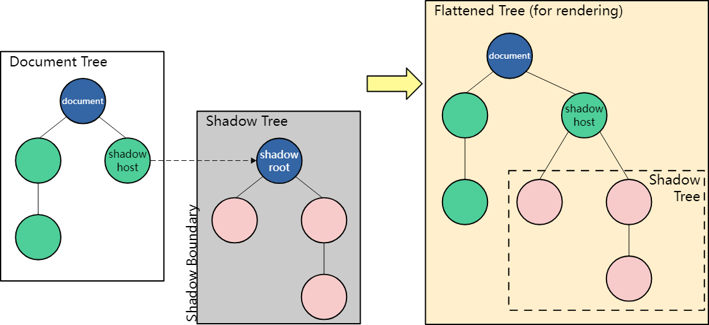

# webcomponent

## 自定义元素

> https://devdocs.io/dom/web_components/using_custom_elements
> 创建自定义元素是 webcomponent 的关键特性

### 元素类型

1. 自定义内置元素，自定义后通过 is attr 来使用，但是 Safari 没有计划支持

2. 自主定制元素，从头通过 class 定义元素的行为，继承 HTMLElement
   1）contructor 中定义 state、listener，attach shadow 等
   2）四个生命周期：

- connectedCallback：链接到 document 了，此时可以访问到 attr 了
- disconnectedCallback：从 document 中移除
- adoptedCallback: 链接到新 document
- attributeChangedCallback: attr 变更了调用，会首次调用（只有监听的 attr 更改了才会调用）

### 定义

```javascript
class MyCustomElement extends HTMLElement {
  static observedAttributes = ["size"];

  constructor() {
    super();
  }

  attributeChangedCallback(name, oldValue, newValue) {
    console.log(
      `Attribute ${name} has changed from ${oldValue} to ${newValue}.`
    );
  }
}

customElements.define("my-custom-element", MyCustomElement);
```

### 使用

<my-custom-element size="100"></my-custom-element>

### 伪类

讲的是和 build-in 元素一样，自定义元素也有状态和对应状态的 css 属性，状态分为内部和外部
外部的就是可以通过 html attr 去设置的，比如 build-in 元素的‘disabled’
详细的后面再看

## shadow dom

> https://devdocs.io/dom/web_components/using_shadow_dom



### 创建 shadow dom

1. Imperatively with JavaScript,good option for client-side rendered applications

```javascript
const host = document.querySelector("#host");
const shadow = host.attachShadow({ mode: "open" });
const span = document.createElement("span");
span.textContent = "I'm in the shadow DOM";
shadow.appendChild(span);
```

2. Declaratively with HTML, good for server-side rendered applications

```javascript
<div id="host">
  <template shadowrootmode="open">
    <span>I'm in the shadow DOM</span>
  </template>
</div>
```

### Encapsulation from JavaScript, Element.shadowRoot and the "mode" option

将模式设置为“open”，页面中的 JavaScript 可以通过 shadow host 的 shadowRoot 属性访问 shadow DOM 的内部。但是，您不应该认为这是一种强大的安全机制，因为有很多方法可以规避它，例如通过在页面中运行的浏览器扩展。这更像是一个指示，表明页面不应该访问影子 DOM 树的内部。

```javascript
const host = document.querySelector("#host");
const shadow = host.attachShadow({ mode: "open" });
const span = document.createElement("span");
span.textContent = "I'm in the shadow DOM";
shadow.appendChild(span);

const upper = document.querySelector("button#upper");
upper.addEventListener("click", () => {
  const spans = Array.from(host.shadowRoot.querySelectorAll("span"));
  for (const span of spans) {
    span.textContent = span.textContent.toUpperCase();
  }
});

const reload = document.querySelector("#reload");
reload.addEventListener("click", () => document.location.reload());
```

### Encapsulation from CSS

在 shadow DOM 树中定义的样式限定在该树的范围内，因此，正如页面样式不会影响 shadow DOM 中的元素一样，shadow DOM 样式也不会影响页面其余部分的元素。

1. Constructable stylesheets

```javascript
const sheet = new CSSStyleSheet();
sheet.replaceSync("span { color: red; border: 2px dotted black;}");

const host = document.querySelector("#host");

const shadow = host.attachShadow({ mode: "open" });
shadow.adoptedStyleSheets = [sheet];

const span = document.createElement("span");
span.textContent = "I'm in the shadow DOM";
shadow.appendChild(span);
```

2. Adding style elements in template declarations

```html
<template id="my-element">
  <style>
    span {
      color: red;
      border: 2px dotted black;
    }
  </style>
  <span>I'm in the shadow DOM</span>
</template>

<div id="host"></div>
<span>I'm not in the shadow DOM</span>
```

```javascript
const host = document.querySelector("#host");
const shadow = host.attachShadow({ mode: "open" });
const template = document.getElementById("my-element");

shadow.appendChild(template.content);
```

## template、slot

1）slot 的使用和 vue 中的 slot 使用类似

2）template 用于 html 结构复用
