## 基础概念

### OSI 七层模型和 TCP/IP 四层模型分别是什么？各层的主要功能是什么？

1. OSI（Open Systems Interconnection）模型是一个理论上的分层框架，用于标准化网络通信协议的设计。各层功能如下

| 层级    | 名称                    | 主要功能                                                                      | 常见协议/技术                    |
| ------- | ----------------------- | ----------------------------------------------------------------------------- | -------------------------------- |
| 第 7 层 | 应用层（Application）   | 为应用程序提供网络服务接口，处理用户请求（如文件传输、邮件服务）。            | HTTP、FTP、SMTP、DNS             |
| 第 6 层 | 表示层（Presentation）  | 数据格式转换（编码/解码）、加密/解密、压缩/解压缩，确保不同系统间数据兼容性。 | SSL/TLS（部分功能）、JPEG、ASCII |
| 第 5 层 | 会话层（Session）       | 管理会话（建立、维护、终止），控制对话逻辑（如断点续传、会话同步）。          | NetBIOS、RPC、PPTP               |
| 第 4 层 | 传输层（Transport）     | 提供端到端（进程间）的可靠/不可靠传输，分段数据、流量控制、错误恢复。         | TCP（可靠）、UDP（不可靠）       |
| 第 3 层 | 网络层（Network）       | 通过逻辑寻址（IP）和路由选择，将数据包从源主机传递到目标主机。                | IP、ICMP、OSPF、BGP              |
| 第 2 层 | 数据链路层（Data Link） | 在物理链路上传输帧（Frame），通过 MAC 地址实现设备间通信，错误检测（CRC）。   | Ethernet、Wi-Fi（802.11）、PPP   |
| 第 1 层 | 物理层（Physical）      | 通过物理介质（电缆、光纤）传输原始比特流，定义电气/机械特性。                 | RJ45、光纤、Hubs、中继器         |

2. TCP/IP 模型是互联网实际使用的协议栈，更注重实用性，分层更简洁：

| 层级    | 名称                            | 主要功能                                                            | 对应 OSI 层            | 常见协议/技术                       |
| ------- | ------------------------------- | ------------------------------------------------------------------- | ---------------------- | ----------------------------------- |
| 第 4 层 | 应用层（Application）           | 整合 OSI 的应用层、表示层、会话层功能，提供用户应用程序的通信接口。 | 应用层、表示层、会话层 | HTTP、DNS、FTP、SMTP、WebSocket     |
| 第 3 层 | 传输层（Transport）             | 与 OSI 传输层一致，提供端到端通信（可靠 TCP / 不可靠 UDP）。        | 传输层                 | TCP、UDP、QUIC                      |
| 第 2 层 | 网络层（Internet）              | 与 OSI 网络层一致，通过 IP 协议实现逻辑寻址和路由。                 | 网络层                 | IP、ICMP、ARP、IPv4/IPv6            |
| 第 1 层 | 网络接口层（Network Interface） | 整合 OSI 的物理层和数据链路层，处理物理介质和本地网络通信。         | 物理层、数据链路层     | Ethernet、Wi-Fi、MAC 地址、NIC 驱动 |

3. 举例说明

1）应用层（SMTP）生成邮件内容 →

2）表示层加密邮件 →

3）传输层（TCP）分段数据 →

4）网络层（IP）寻址路由 →

5）数据链路层封装成帧 →

6）物理层通过网卡发送比特流。

### 什么是 MAC 地址和 IP 地址？它们的区别是什么？

1. 核心区别

| 对比项   | MAC 地址                                         | IP 地址                                                       |
| -------- | ------------------------------------------------ | ------------------------------------------------------------- |
| 作用     | 标识同一局域网内设备的物理身份（“我是谁”）。     | 标识设备在网络中的逻辑位置（“我在哪里”）。                    |
| 分配方式 | 由设备制造商固化，全球唯一（如网卡出厂时写入）。 | 由网络动态分配（如 DHCP）或手动配置。                         |
| 可修改性 | 通常不可修改（某些网卡支持软件伪造 MAC）。       | 可随时修改（动态 IP 或静态配置）。                            |
| 可路由性 | 仅在局域网内有效，无法跨网络直接通信。           | 支持跨网络路由（通过路由器转发）。                            |
| 地址结构 | 48 位，十六进制表示（如 00:1A:2B:3C:4D:5E）。    | IPv4：32 位（点分十进制）；IPv6：128 位（冒号分隔十六进制）。 |
| 典型应用 | 交换机根据 MAC 地址转发数据帧（如以太网）。      | 路由器根据 IP 地址转发数据包（如互联网通信）。                |

2.  协同工作场景（以访问网站为例）

1）用户输入网址：浏览器通过 DNS 获取目标服务器的 IP 地址（如 203.0.113.5）。

2）本地网络通信：

- 设备通过 ARP 协议 将目标 IP 地址解析为本地网关（路由器）的 MAC 地址。
  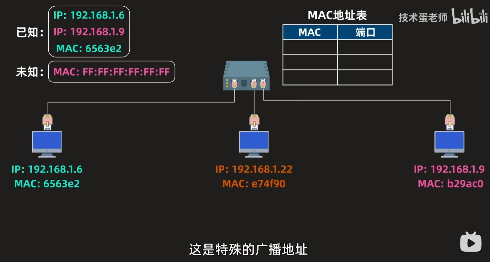

- 数据帧通过本地交换机基于 MAC 地址 转发到网关。

3）跨网络路由：

- 路由器剥离 MAC 头部，根据 IP 地址 路由数据包到目标网络。

- 目标网络的路由器通过 ARP 解析目标服务器的 MAC 地址，完成最终传输。

3. 关键总结

- MAC 地址：物理标识，局域网内直接通信的基础（“最后一公里”交付）。
- IP 地址：逻辑定位，跨网络路由的核心（“全局导航”）
- 互补关系：
  - MAC 地址确保数据在本地网络中准确到达设备。
  - IP 地址确保数据能够跨越复杂网络到达目标网络。

4. 示例场景

- 同一局域网内传输文件：直接通过 MAC 地址通信（无需 IP 路由）。

- 访问互联网服务器：IP 地址用于全局路由，MAC 地址用于每一跳的本地传输。

### 路由器（Router）和交换机（Switch） 的主要区别是什么？

1. 核心功能对比

| 对比项     | 路由器（Router）                          | 交换机（Switch）                     |
| ---------- | ----------------------------------------- | ------------------------------------ |
| 工作层级   | 网络层（OSI 第 3 层）                     | 数据链路层（OSI 第 2 层）            |
| 寻址方式   | 基于 IP 地址 进行逻辑寻址和路由决策       | 基于 MAC 地址 进行物理寻址和转发     |
| 主要作用   | 跨网络通信（连接不同网络，如 LAN 到 WAN） | 局域网内通信（连接同一网络内的设备） |
| 广播域处理 | 分割广播域（每个接口属于不同广播域）      | 不分割广播域（所有端口在同一广播域） |
| 适用场景   | 互联网接入、不同子网互联、NAT、VPN        | 局域网内设备互联（如办公室、机房）   |

2. 详细功能差异

| 特性           | 路由器                                                        | 交换机                                                   |
| -------------- | ------------------------------------------------------------- | -------------------------------------------------------- |
| 数据转发依据   | 根据 IP 地址 和路由表（如动态路由协议 OSPF、BGP）决定下一跳。 | 根据 MAC 地址表 直接转发到目标端口（无需复杂路由计算）。 |
| 连接的网络类型 | 可连接不同网络（如以太网、光纤、4G/5G），支持异构网络互联。   | 仅连接同一类型的局域网（如全以太网）。                   |
| 广播控制       | 默认隔离广播流量，防止广播风暴跨网络传播。                    | 广播流量会在所有端口泛洪（除非配置 VLAN）。              |
| 附加功能       | 支持 NAT、防火墙、VPN、QoS、DHCP 服务等。                     | 支持 VLAN 划分、端口镜像、链路聚合（LACP）等。           |
| 典型部署位置   | 网络边界（如连接内网和互联网）或不同子网之间。                | 局域网内部（如连接电脑、打印机、服务器）。               |

3.  实际应用场景

- 家庭网络：
  - 路由器：连接光猫（ISP）和家庭局域网，分配 IP（通过 DHCP），实现 NAT（将私有 IP 转换为公网 IP）。
  - 交换机：扩展路由器端口，连接多台电脑、智能电视等设备（若路由器接口不足）。

* 企业网络：
  - 核心交换机：通过 VLAN 划分部门子网，高速连接服务器和接入层交换机。
  - 路由器：连接企业内网与互联网，或通过 VPN 互联多个分支机构。

4. 关键区别总结

| 维度     | 路由器                       | 交换机                       |
| -------- | ---------------------------- | ---------------------------- |
| 核心目标 | 跨网络通信（全局路由）       | 局域网内高效交换（本地转发） |
| 逻辑层级 | 关注“去哪里”（基于 IP 地址） | 关注“给谁”（基于 MAC 地址）  |
| 网络范围 | 广域网（WAN）或互联网        | 局域网（LAN）                |
| 广播隔离 | 天然隔离不同网络的广播域     | 依赖 VLAN 隔离广播域         |

5. 协同工作示例

- 访问互联网的流程：

1. 电脑（IP: 192.168.1.100）通过 交换机 发送请求到网关（路由器）。
2. 路由器 将源 IP（私有地址）转换为公网 IP，通过互联网路由到目标服务器。
3. 返回的数据包经路由器 NAT 转换后，通过 交换机 准确送达电脑的 MAC 地址。

为什么需要区分两者？

- 网络设计：路由器用于互联复杂网络，交换机用于优化局域网性能。
- 故障排查：若局域网内通信失败，可能是交换机问题；若无法访问外网，可能是路由器配置错误。
- 安全控制：路由器提供防火墙和访问控制，交换机通过 VLAN 隔离敏感数据。

#### 示例

1. 家里的设备只通过一个路由器连接着，这个路由器是不是也充当着交换机的功能

1）家用路由器的双重角色

- 路由功能（核心职责）：负责连接家庭局域网（LAN）和广域网（WAN，如互联网），执行以下任务：
  - IP 地址分配：通过 DHCP 为设备分配私有 IP（如 192.168.1.x）。
  - NAT（网络地址转换）：将局域网设备的私有 IP 转换为公网 IP，实现多设备共享一个公网 IP 上网。
  * 路由决策：根据目标 IP 地址，决定数据包是发往局域网内设备还是外部互联网。

* 交换功能（内置模块）：大多数家用路由器背面的多个 LAN 口（通常 4 个）实际上是一个内置的 交换机模块，用于：
* 在局域网内通过 MAC 地址 直接转发数据帧（无需经过路由器 CPU）。
* 实现同一网络内设备（如电脑、NAS、智能电视）之间的高速通信。

2）为什么说它“充当了交换机”？

- 场景举例：当你的电脑（192.168.1.100）通过网线连接到路由器的 LAN 口，手机通过 Wi-Fi 连接到同一路由器时：

  - 内部交换：电脑和手机之间的文件传输（如局域网传照片）直接通过内置交换机完成，不经过路由器的 NAT 或防火墙处理。
  - 外部路由：当手机访问互联网时，数据才会经过路由器的 NAT 和 WAN 口转发到外网。

* 硬件实现：家用路由器的内部芯片通常包含两个模块：

  - 交换芯片：处理 LAN 口之间的数据交换（类似独立交换机）。
  - 路由芯片：处理 WAN 口与 LAN 口之间的路由和 NAT。

3） 家用路由器 vs 独立交换机

| 特性     | 家用路由器（内置交换）            | 独立交换机                    |
| -------- | --------------------------------- | ----------------------------- |
| 主要功能 | 路由 + 交换                       | 纯数据交换（无路由/NAT）      |
| 端口数量 | 通常 4-8 个 LAN 口                | 4-48 个端口（可扩展性强）     |
| 性能     | 交换带宽较低（如 1Gbps 共享带宽） | 高性能交换（如全双工 10Gbps） |
| 适用场景 | 小型家庭网络                      | 需要大量有线设备或高速局域网  |

4）何时需要外接独立交换机？

- 端口不足：当路由器的 LAN 口不够用时（例如连接多台电脑、NAS、摄像头）。
- 高性能需求：需要更高局域网带宽（如 10Gbps 传输）或更低的交换延迟。
- 网络隔离：通过 VLAN 划分不同子网（家用路由器通常不支持高级 VLAN 功能）。

家用路由器 = 路由器 + 交换机 + 无线 AP：它是一个多功能设备，集成了路由、交换、Wi-Fi 等功能。

## 网络层

### IPv4 和 IPv6 的主要区别是什么？IPv6 解决了哪些问题？

#### IPv4 与 IPv6 的主要区别

| 对比项   | IPv4                                 | IPv6                                           |
| -------- | ------------------------------------ | ---------------------------------------------- |
| 地址长度 | 32 位（约 43 亿个地址）              | 128 位（约 3.4×10³⁸ 个地址）                   |
| 地址表示 | 点分十进制（如 192.168.1.1）         | 冒号分隔十六进制（如 2001:db8::1）             |
| 地址类型 | 单播、组播、广播                     | 单播、组播、任播（取消广播）                   |
| 地址配置 | 手动或 DHCP 动态分配                 | 支持 SLAAC（无状态自动配置）和 DHCPv6          |
| 报头结构 | 复杂（可变长度，含校验和、选项字段） | 简化（固定长度，移除校验和，减少路由处理开销） |
| NAT 依赖 | 必需（因地址不足）                   | 无需（地址充足，支持端到端直连）               |
| 安全性   | 依赖额外协议（如 IPsec）             | 原生支持 IPsec（加密和认证集成到协议中）       |
| QoS 支持 | 有限（通过 ToS 字段）                | 新增 流标签字段，支持更精细的流量管理          |
| 分片处理 | 由路由器和发送方处理                 | 仅由发送方处理（减少路由器负担）               |
| 兼容性   | 广泛支持，但地址枯竭                 | 逐步普及，需过渡技术（双栈、隧道等）           |

#### IPv6 解决的核心问题

1. 地址枯竭问题

- IPv4 问题：32 位地址空间仅支持约 43 亿地址，无法满足物联网（IoT）和移动设备爆发式增长。
- IPv6 方案：128 位地址空间（约为地球每平方米 10²⁸ 个地址），彻底解决地址不足问题。

2. 消除 NAT 依赖

- IPv4 问题：NAT 破坏了端到端通信，导致 P2P 应用（如视频通话、文件共享）复杂化。
- IPv6 方案：每个设备可拥有全球唯一公网地址，无需 NAT 即可直接通信。

3. 简化网络配置

- IPv4 问题：依赖 DHCP 服务器手动或动态分配地址，配置复杂。
- IPv6 方案：支持 SLAAC（无状态地址自动配置），设备可自主生成地址（基于 MAC 地址或随机化前缀）。

4. 提升路由效率

- IPv4 问题：报头可变长且含校验和，路由器处理效率低。
- IPv6 方案：固定长度报头、移除校验和，路由转发更快。

5. 增强安全性

- IPv4 问题：安全性依赖额外协议（如 IPsec），部署复杂。
- IPv6 方案：IPsec 成为协议栈强制支持部分，原生保障数据完整性和加密。

6. 支持新兴应用

- IPv4 问题：缺乏对大规模物联网、5G 网络和低延迟应用的支持。
- IPv6 方案：通过任播地址、流标签字段等特性，优化内容分发和实时通信。

#### IPv6 的优势场景示例

1. 智能家居：每个智能设备（灯泡、摄像头）分配独立 IPv6 地址，无需 NAT 即可远程控制。
2. 移动网络：手机切换基站时，IPv6 地址的前缀可动态更新，保持会话连续性（基于移动 IPv6）。
3. 内容分发：使用任播地址，用户请求自动路由到最近的 CDN 节点（如 2001:db8::cdn）。

#### IPv4 与 IPv6 的主要区别

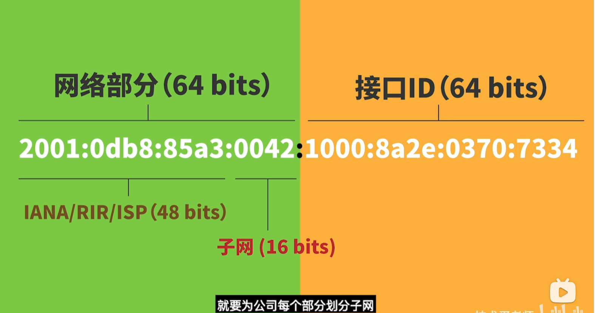
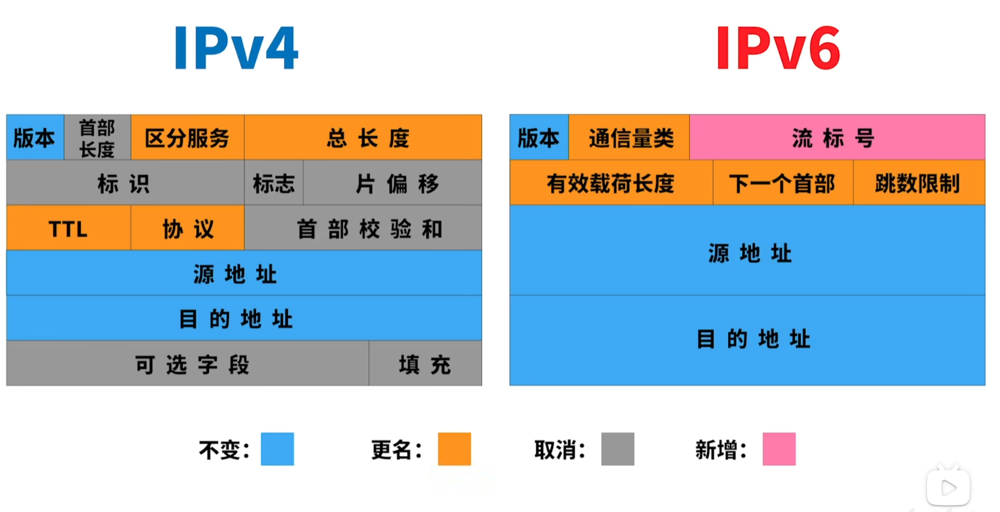

### 子网掩码

为了解决简单分类导致的 IP 分配不合理，高效对同一网域的主机号地址分配
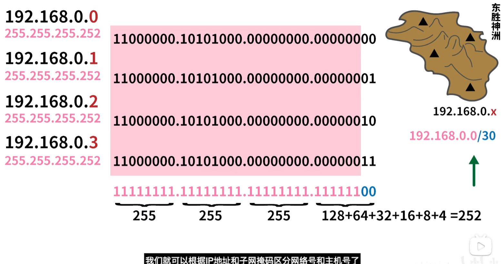

### 子网划分：给定 IP 地址 192.168.1.0/24，要求划分为 4 个子网，每个子网至少 50 台主机，如何划分子网掩码？

### NAT（网络地址转换） 的作用是什么？它的优缺点有哪些？

#### NAT 的核心作用

NAT（Network Address Translation）是一种将私有 IP 地址与公有 IP 地址互相转换的技术，主要解决以下问题：

1. 缓解 IPv4 地址短缺

- 允许多个设备共享一个公网 IP 地址，通过端口映射（PAT，即 NAT Overload）实现。
- 例如：家庭中手机、电脑、智能电视等设备通过路由器的单一公网 IP 访问互联网。

2. 隐藏内部网络拓扑

- 内部设备使用私有 IP（如 192.168.1.0/24），对外仅暴露公网 IP，降低被攻击风险。

3. 简化网络管理

- 内部网络重组时（如更换 ISP），只需修改 NAT 设备的公网 IP，无需调整内部设备配置。

4. 支持重叠地址场景

- 不同私有网络可使用相同的 IP 地址段（如 10.0.0.0/8），NAT 将其转换为唯一的公网 IP

#### NAT 的工作原理

以最常见的 PAT（端口地址转换） 为例：

- 出站流量：
  - 内部设备（192.168.1.100:5000）发送数据包到公网服务器。
  - NAT 路由器将源 IP 替换为公网 IP（203.0.113.5），并分配唯一端口（如 203.0.113.5:60000），记录映射关系。
- 入站流量：
  - 公网服务器返回数据到 203.0.113.5:60000。
  - NAT 路由器根据端口映射表，将目标 IP 还原为 192.168.1.100:5000。

#### NAT 的优点

| 优点              | 说明                                                 |
| ----------------- | ---------------------------------------------------- |
| 节省公网 IP 地址  | 单公网 IP 支持成百上千设备上网，缓解 IPv4 枯竭问题。 |
| 增强网络隐私性    | 外部无法直接访问内部设备 IP，降低扫描和攻击风险。    |
| 简化网络扩展      | 内部网络扩容时，无需申请额外公网 IP。                |
| 支持地址重叠场景  | 不同组织的私有网络可使用相同 IP 段，NAT 解决冲突。   |
| 低成本过渡到 IPv6 | 在 IPv6 普及前，通过 NAT 延长 IPv4 使用寿命。        |

#### NAT 的缺点

| 缺点             | 说明                                                                     |
| ---------------- | ------------------------------------------------------------------------ |
| 破坏端到端连接   | 外部无法直接访问 NAT 后的设备，需手动配置端口映射（如搭建家庭 NAS）。    |
| 影响部分应用协议 | 需 ALG（应用层网关）支持 FTP、SIP 等协议（因其在载荷中携带 IP 信息）。   |
| 增加网络复杂度   | 故障排查困难（需跟踪 NAT 表），且 NAT 设备可能成为单点故障。             |
| 性能开销         | 高并发场景下，NAT 表维护和端口转换可能成为瓶颈（如大型企业网关）。。     |
| 限制 P2P 通信    | 需借助 STUN/TURN/ICE 等穿透技术（如视频通话、BT 下载）。                 |
| 掩盖真实 IP 信息 | 日志记录中仅显示 NAT 设备 IP，难以追踪具体内部设备（需结合其他审计手段） |

#### NAT 的典型类型

1. 静态 NAT（1:1 映射）

- 将公网 IP 固定映射到内部设备，用于托管服务器（如 203.0.113.5:80 → 192.168.1.100:80）。

2. 动态 NAT（NAT Pool）

- 从公网 IP 池中动态分配地址，适合企业多公网 IP 场景。

3. PAT（NAT Overload）

- 通过端口复用，实现多设备共享单一公网 IP（家用路由器默认模式）。

4. ICMP 协议 是什么？举一个基于 ICMP 的工具（如 ping 或 traceroute）。

#### NAT 与 IPv6 的关系

- IPv6 的普及目标：通过海量地址（128 位）消除对 NAT 的依赖，恢复端到端直连。
- 现实过渡阶段：IPv4 与 IPv6 共存（双栈网络），NAT 仍广泛用于 IPv4 侧互联。

#### 场景示例：

- 家庭网络：路由器通过 PAT 将手机、电脑的流量转换为公网 IP，访问互联网。
- 企业网络：使用静态 NAT 将公网 IP 映射到内部服务器，提供对外服务（如 Web 站点）。

## 传输层

### TCP 流量控制

#### 超时重传计时器

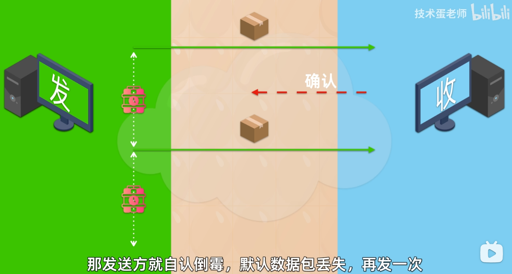

#### TCP 首部的窗口字段

用来描述大小，接受方告诉发送方所能接受数据大小的重要信息

#### 窗口值

窗口值只能代表接收方提供给你的缓存
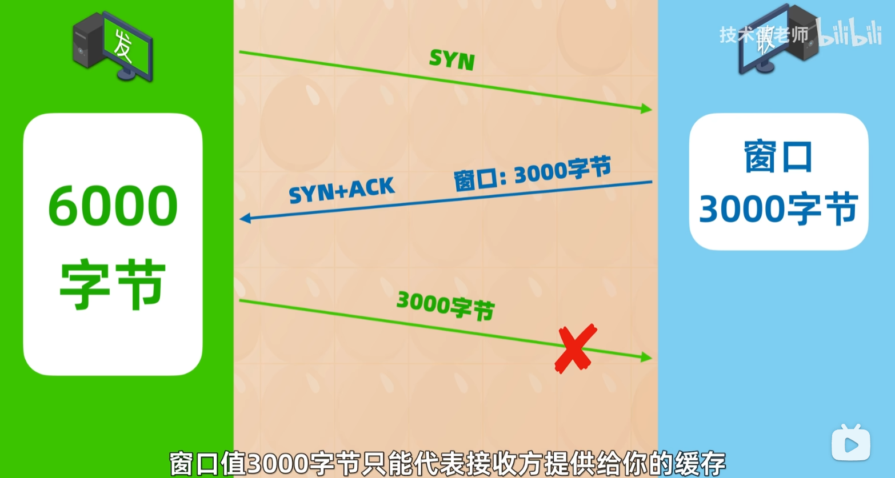
实际上，数据发送过去还要考虑到物理接口的限制
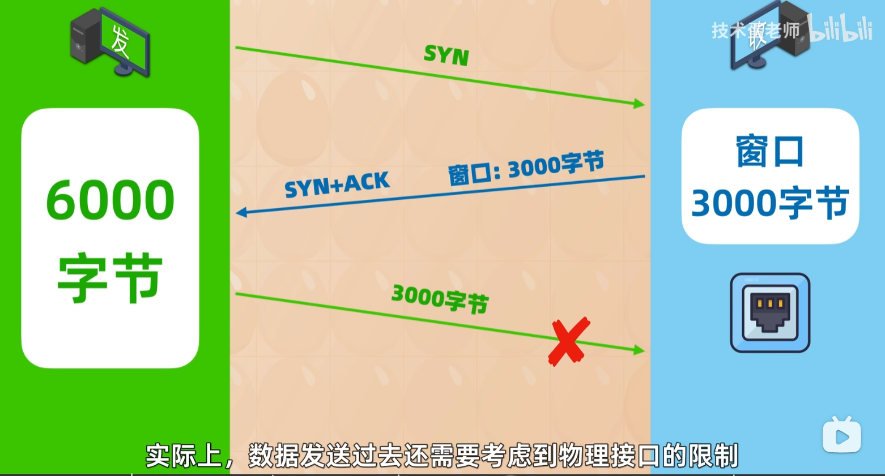
因此接受方会计算并告知发送方自己的 MSS(最大分段大小) 值，也就是一个 TCP 段最多能有多少数据
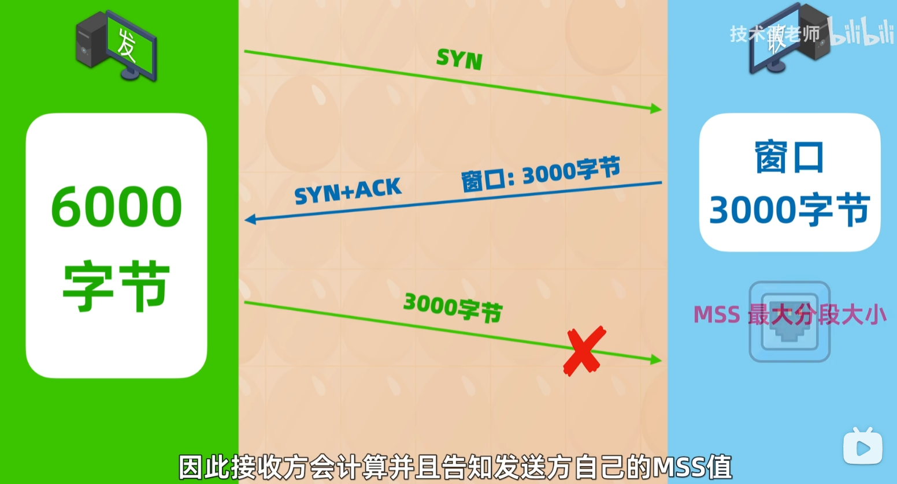

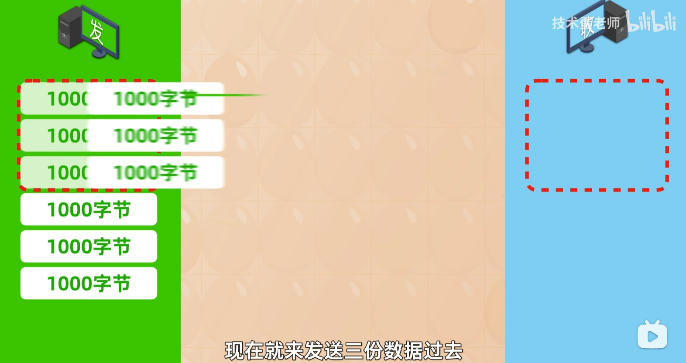
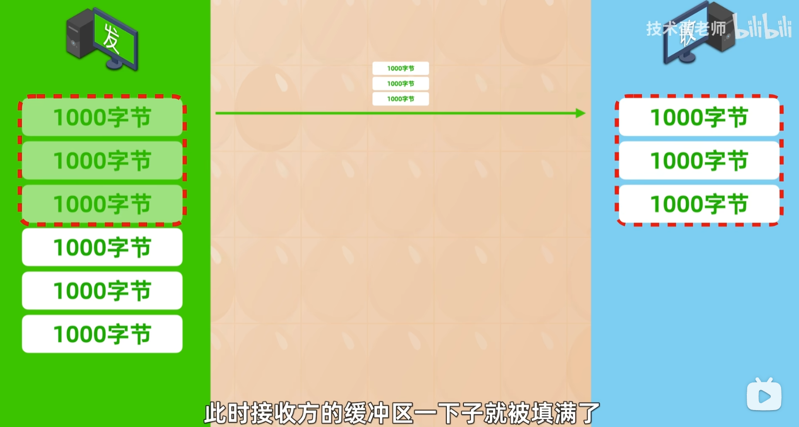
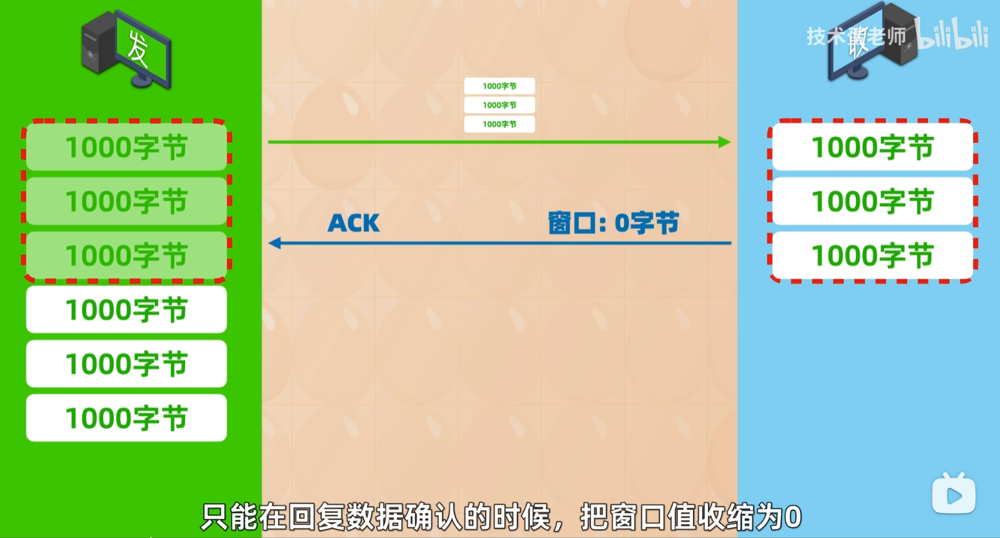
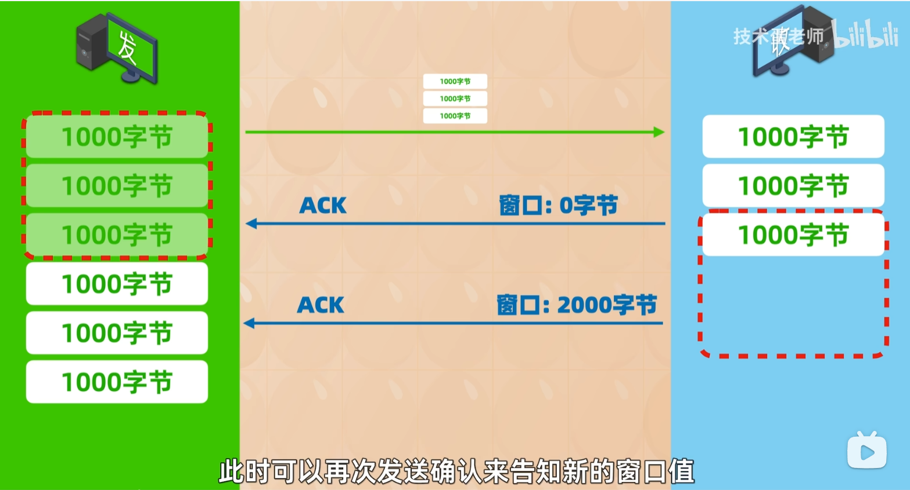
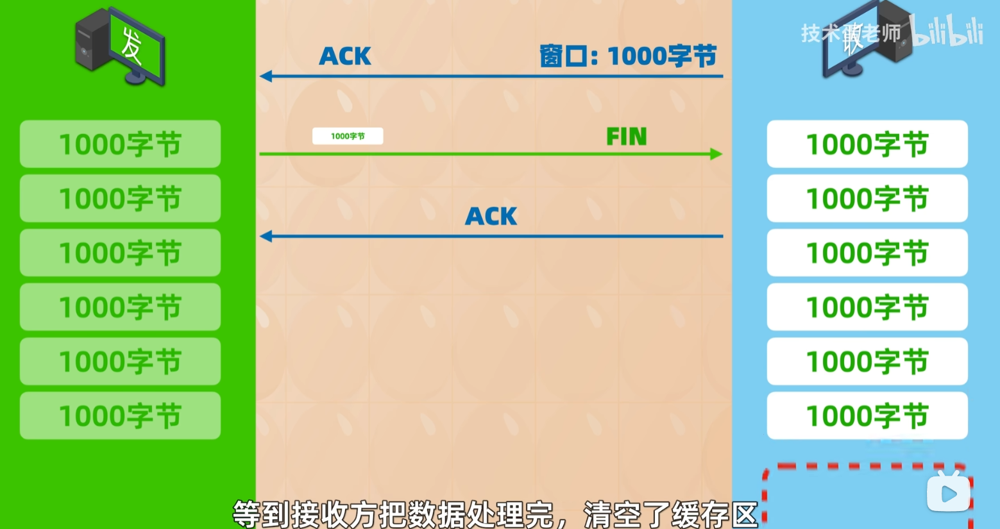

### TCP 和 UDP 的区别是什么？举一个使用 UDP 的实际场景。

#### TCP 与 UDP 的核心区别

| 特性     | TCP                                          | UDP                                    |
| -------- | -------------------------------------------- | -------------------------------------- |
| 连接方式 | 面向连接（三次握手建立，四次挥手关闭）       | 无连接（直接发送数据包）               |
| 可靠性   | 保证数据完整、有序、无丢失（确认+重传机制）  | 不保证可靠性（可能丢包、乱序）         |
| 传输效率 | 低（需握手、确认、拥塞控制）                 | 高（无额外控制开销）                   |
| 数据顺序 | 严格按发送顺序接收                           | 不保证顺序                             |
| 流量控制 | 通过滑动窗口机制动态调节发送速率             | 无流量控制                             |
| 头部开销 | 较大（20 字节基础 + 可选字段）               | 极小（仅 8 字节固定头部）              |
| 适用场景 | 文件传输、网页浏览、电子邮件等可靠性优先场景 | 实时通信、广播、简单查询等效率优先场景 |

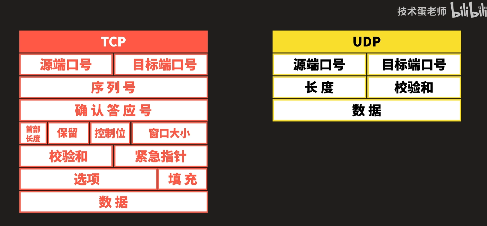

#### UDP 的实际应用场景：实时视频流传输

为什么选择 UDP？

1. 低延迟优先：

- 视频通话（如 Zoom、微信视频）要求实时性，TCP 重传机制会导致画面卡顿。
- 示例：UDP 允许少量丢包（如 5% 的帧丢失），但保持流畅，而 TCP 会因重传增加延迟。

2. 无连接开销：

- 无需建立连接（如直播平台同时服务百万用户时，TCP 握手会成为瓶颈）。

3. 广播/组播支持：

- 视频会议中，UDP 支持将同一数据包发送给多个接收者（如团队会议画面分发）。

#### 典型协议与技术

- RTP（Real-Time Transport Protocol）：基于 UDP 传输音视频流。
- QUIC（HTTP/3 底层协议）：在 UDP 上实现可靠传输，优化网络切换和延迟。

#### 总结

- 选 TCP：当数据完整性比速度更重要时（如银行转账、文件下载）。
- 选 UDP：当实时性比完美传输更重要时（如在线游戏、IoT 传感器上报）。

### TCP 三次握手 的详细过程是什么？为什么需要三次握手？

两次握手只能确认 server 可以收发消息，client 能发送消息，通过三次握手确认 client 和 server 都能收发消息

不能通过三次挥手断开链接的原因是 server 端可能还有未发送完的消息，所以需要等待 server 端发送 FIN 标志位的报文
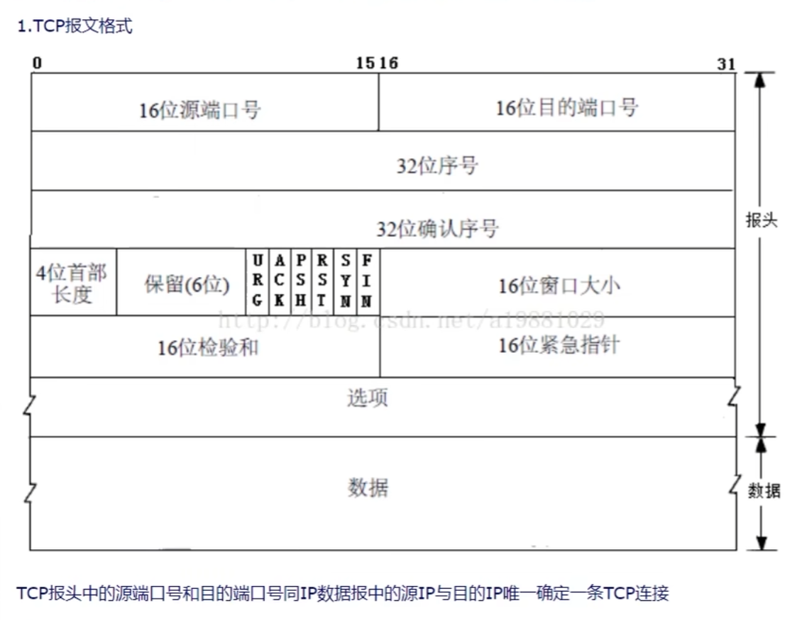
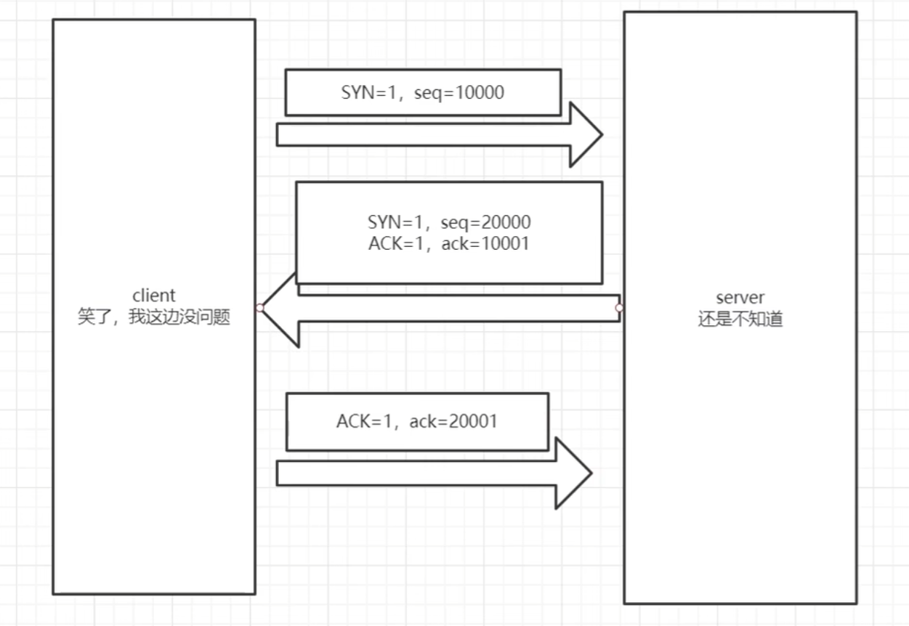
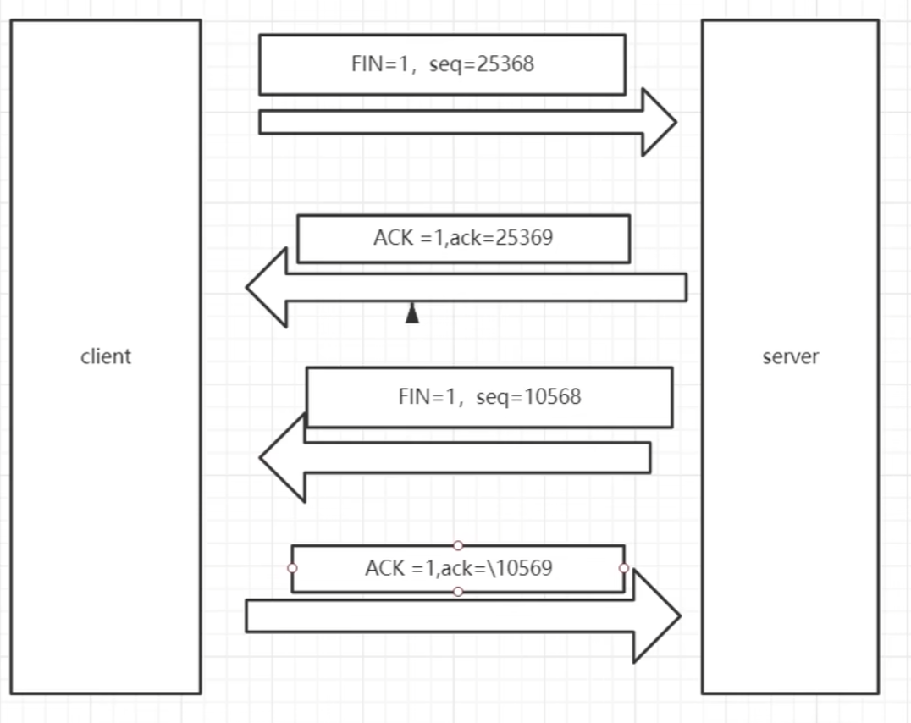
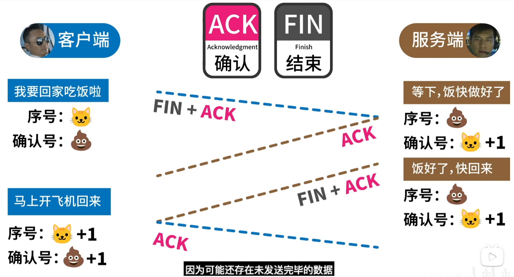

### TCP 四次挥手 的过程？为什么需要等待 TIME_WAIT 状态？

#### TCP 四次挥手过程

当 TCP 连接需要正常关闭时，双方通过四次报文交互确认终止连接，具体流程如下：

```plaintext
客户端                              服务端
  |-------- FIN (seq=u) -------->|    # 客户端主动关闭，进入 FIN_WAIT_1 状态
  |<------- ACK (ack=u+1) -------|    # 服务端确认收到 FIN，进入 CLOSE_WAIT 状态
  |                              |
  |<------- FIN (seq=v) ---------|    # 服务端发送 FIN，进入 LAST_ACK 状态
  |-------- ACK (ack=v+1) ------>|    # 客户端确认 FIN，进入 TIME_WAIT 状态
  |                              |    # 服务端收到 ACK 后关闭连接（CLOSED）
  |（等待 2MSL 后关闭）            |
```

#### 为什么需要 TIME_WAIT 状态？

客户端发送最后一个 ACK 后进入 TIME_WAIT 状态，等待 2MSL（Maximum Segment Lifetime，报文最大生存时间，通常 1-2 分钟）。其核心作用如下：

1. 确保最后一个 ACK 可靠到达

- 问题：若客户端直接关闭，服务端未收到 ACK 会重传 FIN。
- 解决：TIME_WAIT 期间客户端可重发 ACK，避免服务端卡在 LAST_ACK 状态。

2. 消除旧连接的残留报文

- 问题：网络中可能存在旧连接的延迟报文（如被路由错误转发的包）。
- 解决：等待 2MSL 确保旧连接的报文彻底失效，避免与新连接混淆。
  - 示例：旧连接的延迟 FIN 若在新连接建立后到达，会被视为非法报文丢弃。

#### 总结

- 四次挥手必要性：TCP 是全双工协议，需双方独立确认关闭。
- TIME_WAIT 意义：保障连接可靠终止，防止脏数据干扰新连接。
- 实践建议：服务器端优先让客户端发起关闭（减少服务端 TIME_WAIT 堆积），结合内核参数优化缓解资源压力。

### 什么是 TCP 的拥塞控制？慢启动、拥塞避免、快重传、快恢复是如何工作的？

> https://www.bilibili.com/video/BV1L4411a7RN/?spm_id_from=333.1387.favlist.content.click&vd_source=844205e632ef5b6338fe76bd1490ca9a

#### 总览

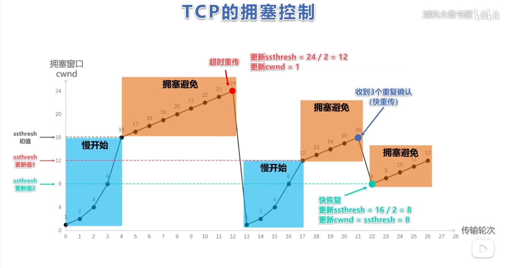

#### 拥塞控制概念

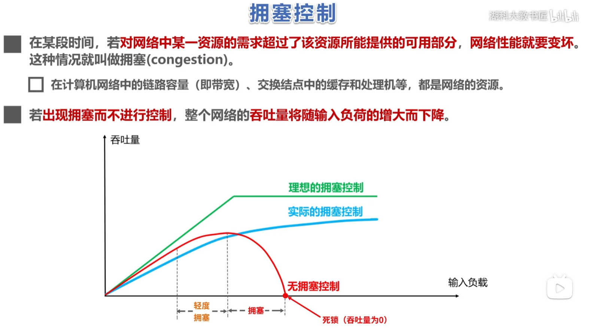
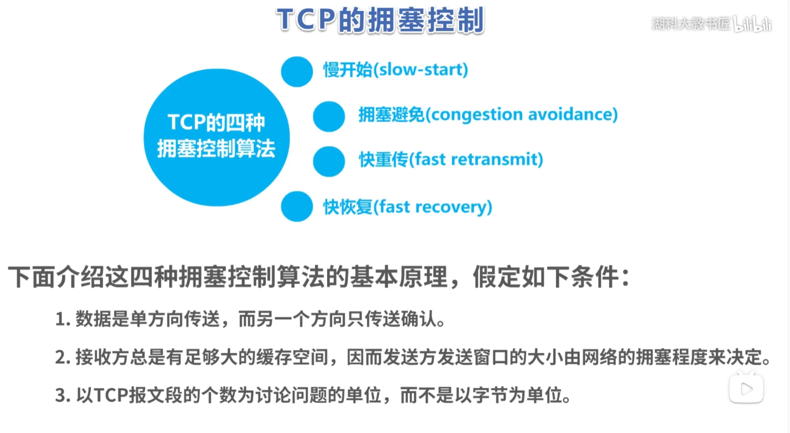
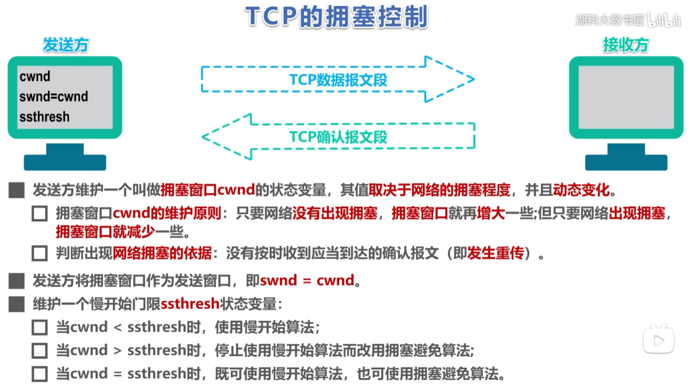
传输轮次是指发送方给接收方发送数据报文段之后，接收方给发送方发回对应的确认报文段，一个传输轮次经历的时间就是往返时间 rtt,rtt 不是恒定的数值

拥塞窗口 cwnd 会随网络拥塞程度和所使用的拥塞控制算法动态变化，在 tcp 双方建立连接逻辑关系时，cwnd=1
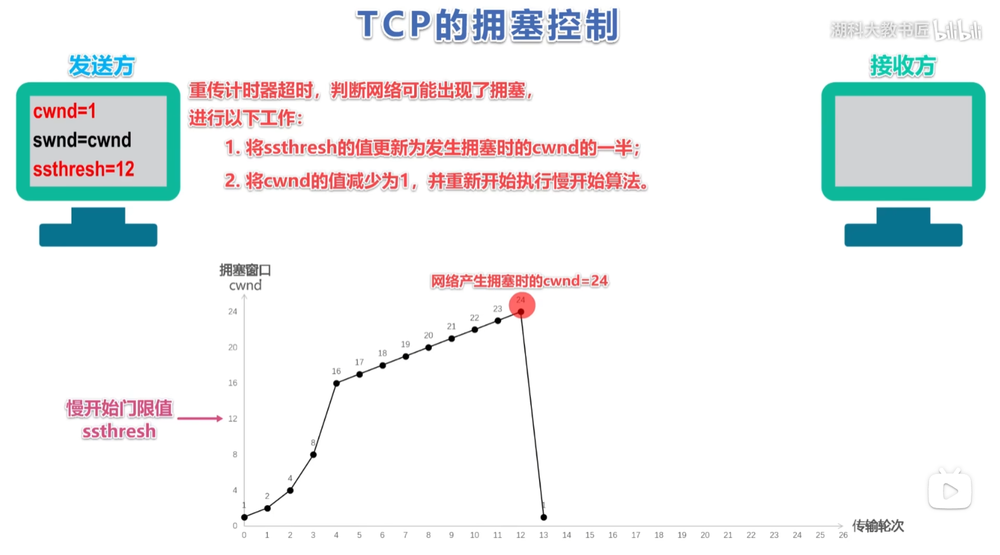

#### 慢开始、拥塞避免

慢开始会导致新访问网页刷新速度较慢

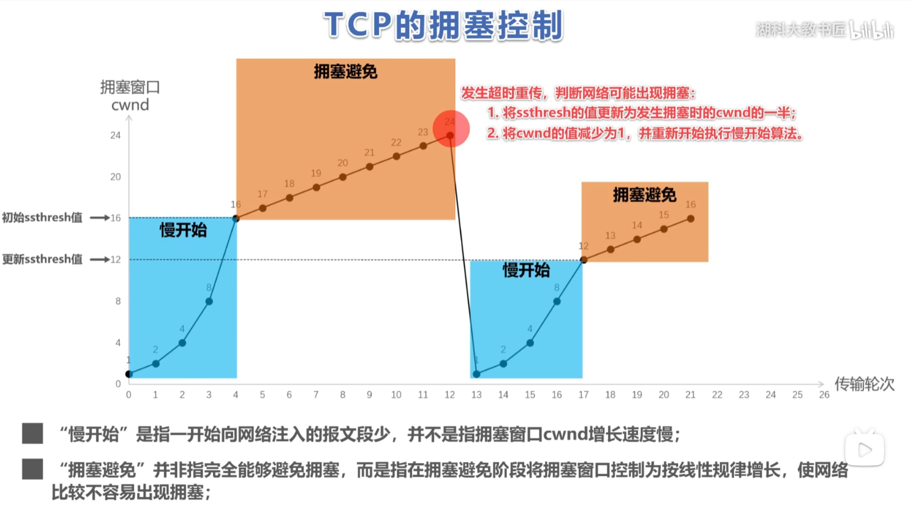

#### 快重传

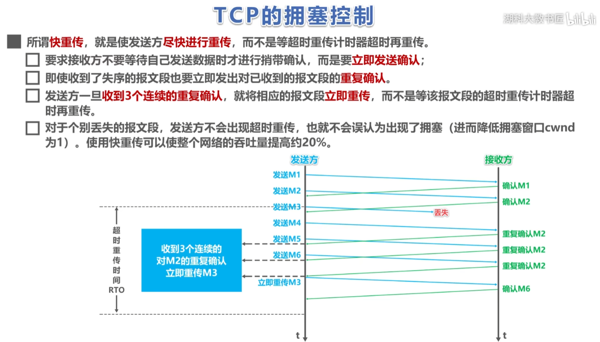

#### 快恢复

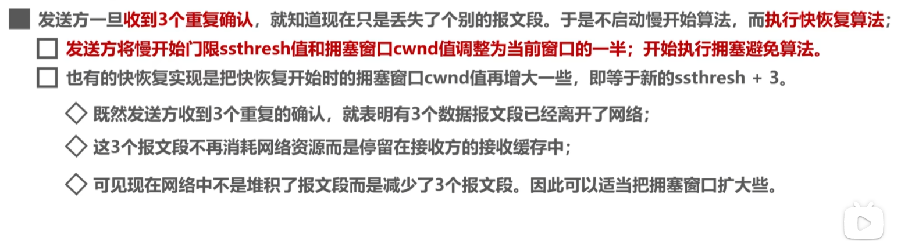

### TCP 粘包/拆包 问题是什么？如何解决？

## 应用层

### HTTP 1.0/1.1/2.0/3.0 的主要区别是什么？(需要进一步视频等理解)

#### HTTP/1.0（1996）

- 基础特性：
  - 短连接：每个请求需单独建立/关闭 TCP 连接（高延迟）。
  - 无 Host 头：不支持虚拟主机（一个 IP 对应一个域名）。
  - 简单缓存：仅支持 Expires 和 Last-Modified 缓存控制。

#### HTTP/1.1（1997）

- 关键改进：
  - 持久连接（默认开启）：通过 Connection: keep-alive 复用 TCP 连接，减少握手开销。
  * 管道化（Pipelining）：允许连续发送多个请求，但响应必须按顺序返回（仍有队头阻塞）
  * Host 头：支持虚拟主机（一个 IP 托管多域名）。
  * 分块传输（Chunked Encoding）：支持流式传输（无需预知内容长度）。
  * 增强缓存：引入 ETag、Cache-Control 等更灵活的缓存策略。
  * 方法扩展：新增 PUT、DELETE、OPTIONS 等方法。

#### HTTP/2（2015）

- 核心优化：
  - 二进制协议：用二进制帧替代文本格式，解析更高效。
  * 多路复用：单连接上并行传输多个请求/响应（彻底解决 HTTP 层队头阻塞）。
  * 头部压缩（HPACK）：大幅减少重复头部的体积。
  * 服务器推送：主动推送资源（如 CSS/JS）到客户端缓存。
  * 流优先级：允许标记请求优先级（如优先加载关键资源）。
  * 缺点：仍基于 TCP，TCP 层丢包会导致所有流阻塞（传输层队头阻塞）。

##### 多路复用

采用二进制格式传输数据，不改变 http 既有的语义在应用层与传输层之间增加了二进制分帧层，将 http 由文本协议转换成二进制协议
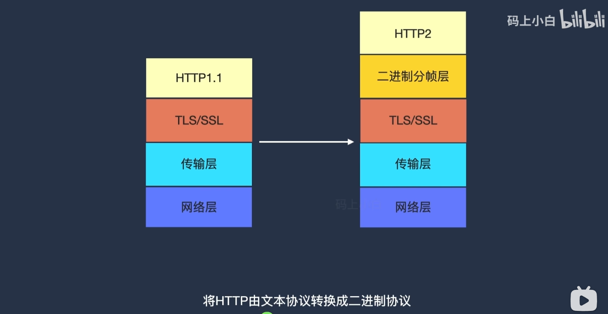
帧和流是二进制分帧层的 2 个核心概念，帧是数据传输的最小单位，帧头一共有 9 字节，其中包含长度、类型、标志、保留位、流标识符
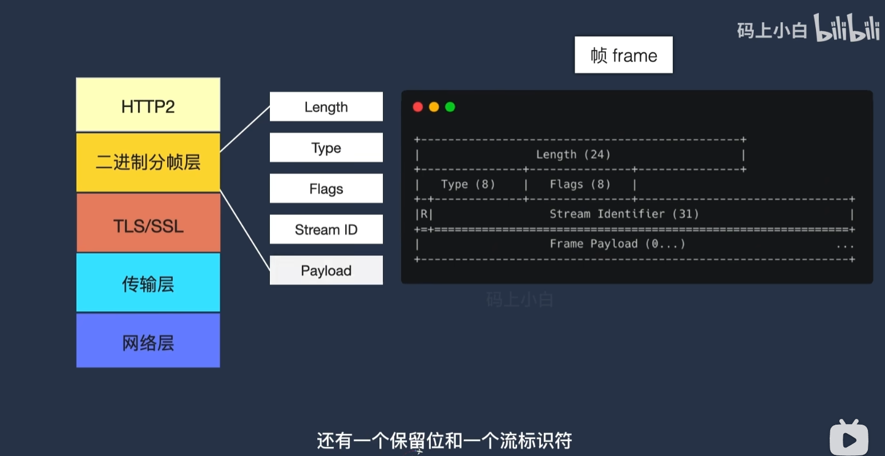
http2 把请求和响应报文分成头部帧和数据帧，有 type 字段标识
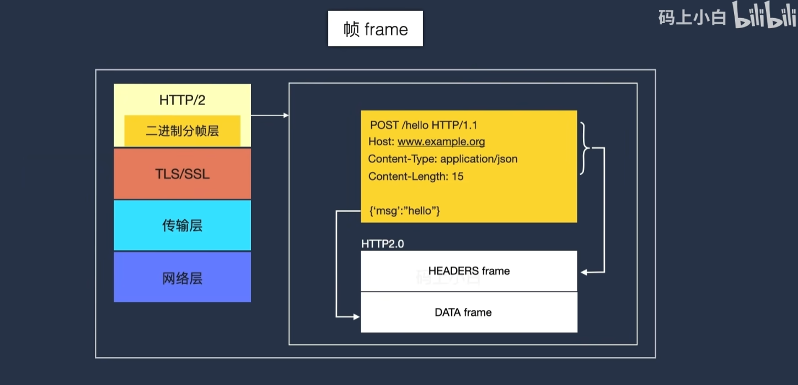
流是一个逻辑上的概念，一个资源请求就是一个流，一个流由多个帧组成，用同一个流 ID 标识，接收方可以通过流 ID 将帧关联起来，从而实现乱序请求和响应的关联
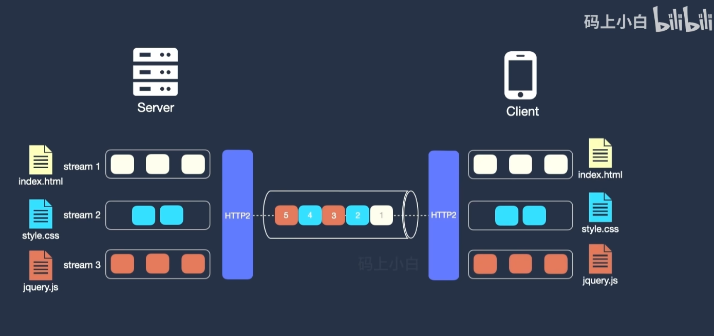

##### 头部压缩

为了优化 http1.1 头信息重复传输的问题，http2 使用 HPACK 算法来压缩头信息，用于减少头信息的大小，减少发送包的数量从而降低延迟

HPACK 算法的主要压缩思路是通过静态字典表和动态字典表来共享已知的 HTTP 头部字段，使用索引号来代替 HTTP 头部字段名和值，从而减少了传输数据的大小，同时还使用了 Huffman 编码来压缩字符串，进一步减少了传输数据的体积，静态表是预定义的，其中包含了 61 个常见的 HTTP 头部字段和值，这些字段和值是写死在协议中的
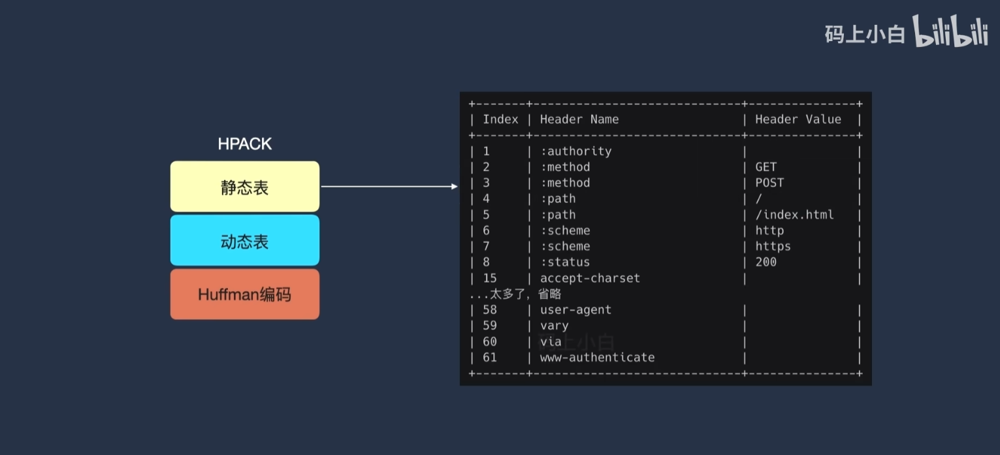
动态表是动态生成的，其中存储了请求或响应中出现的 HTTP 头部字段和值，发送方可以将动态表中的部分内容发送给接收方

Huffman 编码是一种基于字符出现频率的无损压缩编码方法，能够通过赋予高频字段较短的编码来实现数据压缩，而不会丢失任何信息。使用 Huffman 编码对 http 头部字段和值进行压缩，从而进一步减少了传输数据的体积
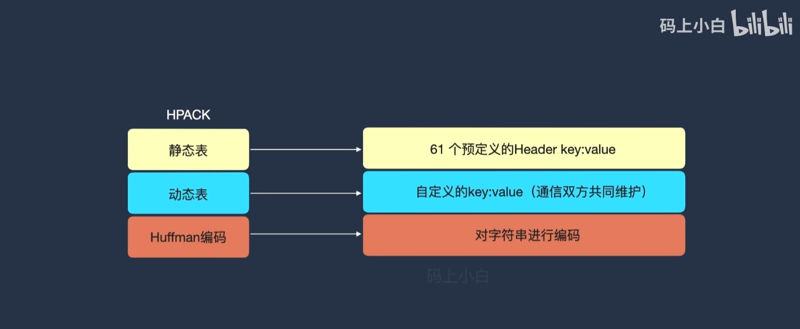
首次请求时不存在在静态表中的在动态表中定义，然后通过 Huffman 压缩后和索引一起发送，后续请求如果能通过索引找到的就不用再发送字段 key 和 value 了
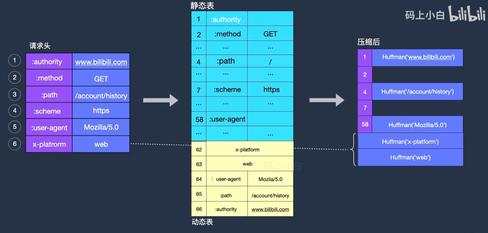

#### HTTP/3（2022）

- 革命性变化：
  - 基于 QUIC 协议：弃用 TCP，改用 UDP 实现可靠传输（解决 TCP 队头阻塞）。
  - 独立流：每个 HTTP 流独立传输，丢包仅影响单个流。
  - 零 RTT 握手：通过缓存会话密钥实现快速连接（首次连接 1-RTT）。
  - 连接迁移：网络切换（如 WiFi → 4G）时保持连接（基于连接 ID 而非 IP）。
  - 内置加密：QUIC 强制使用 TLS 1.3，提升安全性。

#### 对比总结

| 特性         | HTTP/1.0 | HTTP/1.1   | HTTP/2     | HTTP/3           |
| ------------ | -------- | ---------- | ---------- | ---------------- |
| 连接复用     | × 短连接 | √ 持久连接 | √ 多路复用 | √ 多路复用       |
| 传输协议     | TCP      | TCP        | TCP        | QUIC (基于 UDP)  |
| 头部压缩     | ×        | ×          | √ HPACK    | √ QPACK          |
| 队头阻塞     | 严重     | 应用层存在 | 传输层存在 | √ 彻底解决       |
| 服务器推送   | ×        | ×          | ✔️ 支持    | ✔️ 支持          |
| 握手延迟     | 高       | 高         | 中         | ✔️ 低（0/1-RTT） |
| 网络切换支持 | ❌       | ❌         | ❌         | ✔️ 连接迁移      |

#### 选择建议

- 兼容性优先：HTTP/1.1 仍是广泛支持的标准。
- 性能优化：HTTP/2 适用于高带宽、低丢包环境（如 CDN）。
- 极致体验：HTTP/3 适合移动网络和高延迟场景（如视频流、实时通信）。

2. HTTP 状态码：200、301、302、400、403、404、500、502 分别代表什么？

| 状态码 | 类别       | 含义                  | 典型场景                  |
| ------ | ---------- | --------------------- | ------------------------- |
| 200    | 成功       | 请求成功              | 正常加载页面/API 响应数据 |
| 301    | 重定向     | 永久跳转              | 网站更换域名              |
| 302    | 重定向     | 临时跳转              | 登录后跳转到主页          |
| 400    | 客户端错误 | 请求语法/参数错误     | 提交表单数据格式错误      |
| 403    | 客户端错误 | 无权访问              | 未授权用户访问受限资源    |
| 404    | 客户端错误 | 资源不存在            | 输入错误 URL              |
| 500    | 服务器错误 | 服务器内部错误        | 代码异常或数据库崩溃      |
| 502    | 服务器错误 | 网关/代理收到无效响应 | 后端服务宕机或网络超时    |

3. HTTPS 是如何工作的？SSL/TLS 握手过程是怎样的？

服务端需要申请 SSL 证书来证明这个域名就是大家所熟知的网站,SSL 证书其实就是保存在源服务器的数据文件，要让 SSL 证书生效就需要向 CA(certificate authority)第三方机构申请，这个证书除了表明域名是谁的，日期等信息意外，还包括了公钥和私钥

服务器安装了 SSL 证书以后，用户就可以通过 HTTPS 来访问服务器了

TCP 三次握手以后，客户端发送了一个 Client Hello 给服务端，客户端就会告诉服务端支持 TLS1.2 版本和支持的加密套件,这里 16 加密套件可以理解为不同的加密算法组合，然后生成一个随机数发送给服务端
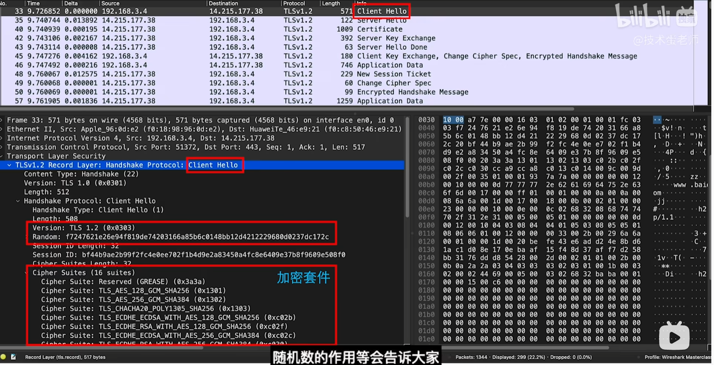

服务端发送 Server Hello 给客户端，在响应报文里面会告诉客户端服务端确认支持的 TLS 版本和选择的加密套件，并且服务器也生成一个随机数发给客户端
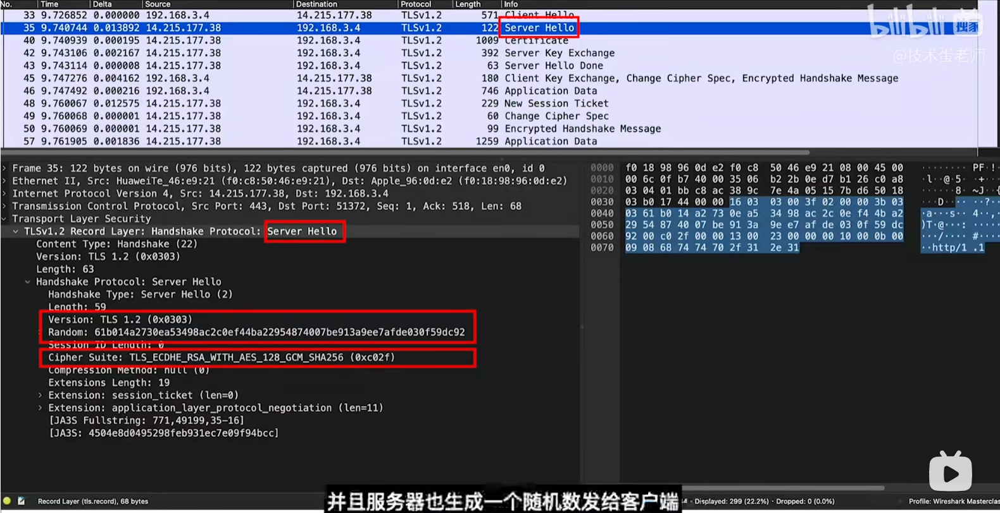

然后服务器会再发一个响应，来出示服务器自己的证书，这样浏览器就可以根据对照自己的证书信任列表来确认这个服务器是否可信
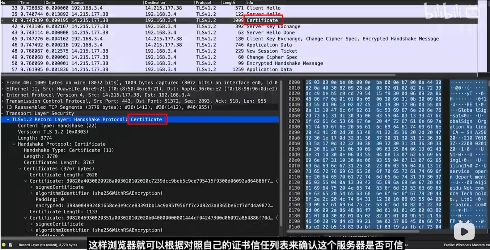

Server Key Exchange,服务器把公钥发送给了客户端，如果服务器也想要客户端的证书会在这里发出请求，比如登录网银就很可能需要这个步骤了
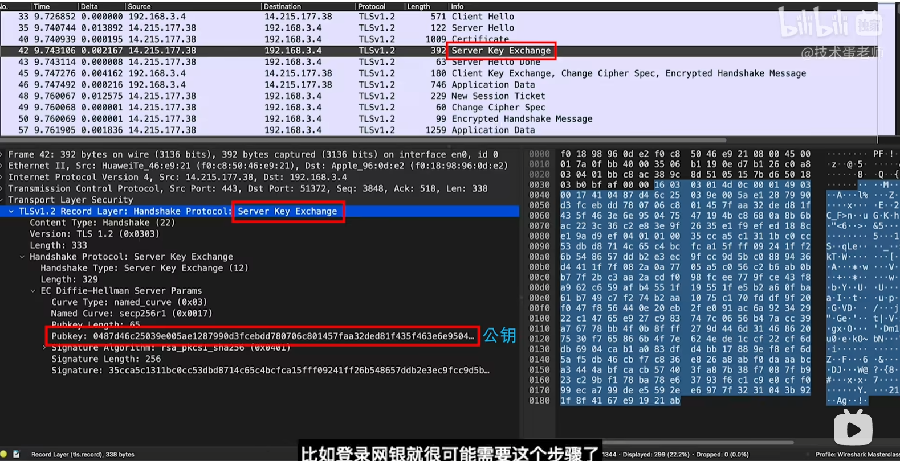

Server Hello Done

Client Key Exchange,客户端会生成第三个随机数，也叫预主密钥，第三个随机数会用刚刚收到的公钥进行加密，并且把这个加密后的随机数发送给服务器

Change Cipher Spec,这一步就是告诉服务器往后的数据就用协商好的算法和密钥来加密咯

Encrypted Handshake Message,表示客户端这边的 TLS 协商已经没有问题，加密开始

同样的后面服务器也发来了 Encrypted Handshake Message,表示服务器这边准备好了，也表示这 TLS 的握手已经成功了，可以给数据加密进行交换了
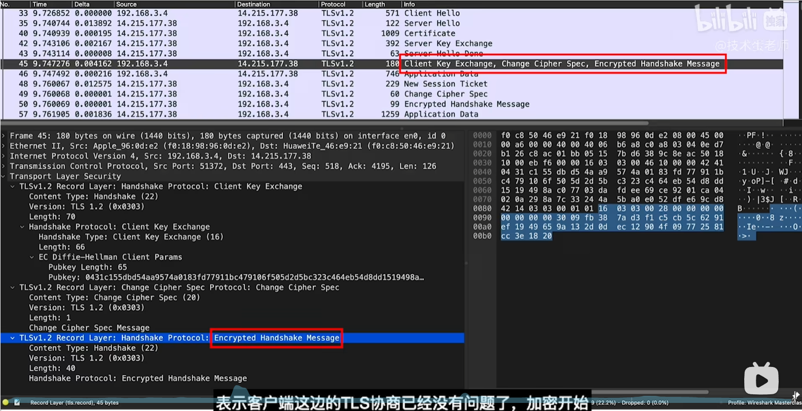

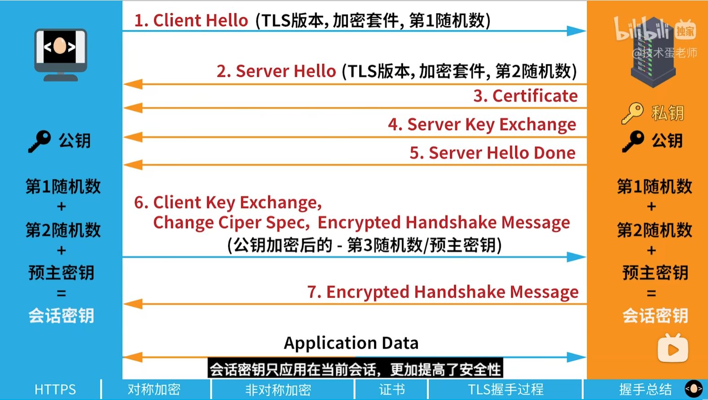

### DNS 解析过程 是什么？递归查询和迭代查询的区别？

A 解析和 AAAA 解析分别是 IPv4 和 IPv6

CName 用于域名的跳转

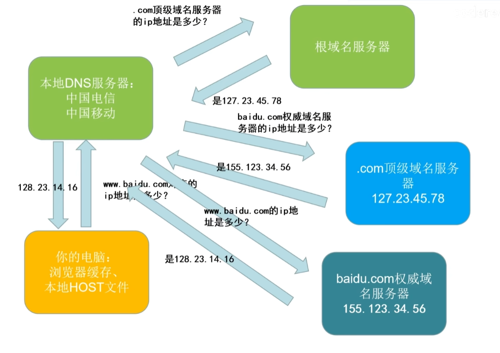

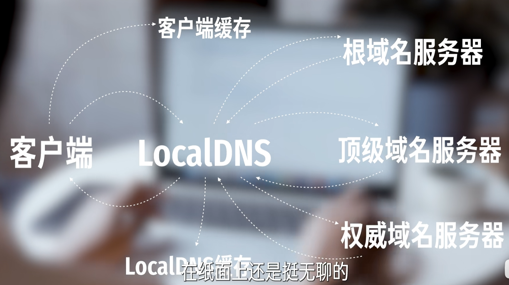

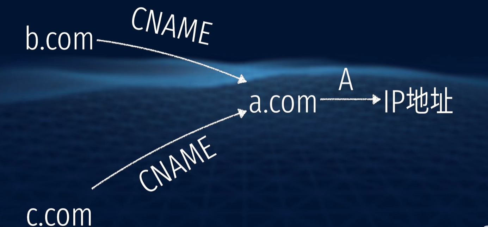
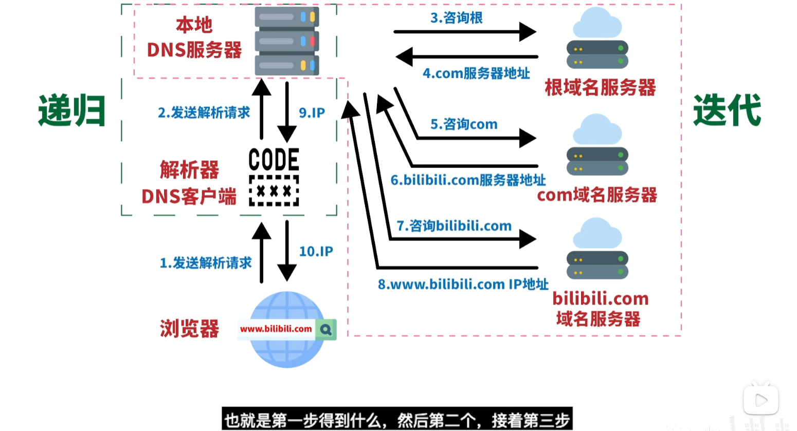

假设你的电脑要查询 `www.example.com`：

1.  **本地解析器启动：** 你的存根解析器（如操作系统 DNS 客户端）将查询发送给配置好的**递归解析器**（如你的 ISP DNS、Google 8.8.8.8）。
2.  **递归解析器检查缓存：** 递归解析器检查其缓存中是否有 `www.example.com` 的 A/AAAA 记录。
    - 如果有且未过期，直接返回结果，过程结束。
    - 如果没有（或过期），继续。
3.  **递归解析器查找根服务器 (关键步骤)：**
    - 递归解析器检查其缓存中是否有 `.com` 顶级域名的权威域名服务器记录。
    - 如果没有（这是首次查询 .com 或缓存过期），它需要查询根服务器。
    - 它**查阅其本地的 `root.hints` 文件**，获取根服务器 IP 列表。
    - 它**根据其性能模型，从列表中选择一个它认为最快/最可靠的根服务器 IP 地址**（比如 `198.41.0.4`，对应 `a.root-servers.net`）。
    - 它向 `198.41.0.4` 发送一个 **DNS 查询**，查询类型是 `NS`，查询域名是 `com.`（注意末尾的根点）。询问：`.com` 域的权威域名服务器是谁？
4.  **根服务器响应：** 根服务器 `a.root-servers.net` 收到查询，它不负责 `.com` 域，但它知道谁负责。它返回一个**响应**，其中包含：
    - `.com.` 域的 **NS 记录**：列出了负责 `.com` 的所有顶级域名服务器的主机名（如 `a.gtld-servers.net.`, `b.gtld-servers.net.`, ..., `m.gtld-servers.net.`）。
    - **粘合记录：** 通常，为了帮助解析器找到这些顶级域名服务器的 IP 地址，响应中会**附带**这些 NS 记录对应的 **A 记录（IPv4）和 AAAA 记录（IPv6）**。例如，会包含 `a.gtld-servers.net. IN A 192.5.6.30` 和 `a.gtld-servers.net. IN AAAA 2001:503:a83e::2:30` 等记录。
5.  **递归解析器处理响应并缓存：** 递归解析器收到根服务器的响应。
    - 它将 `.com` 的 NS 记录以及对应的 A/AAAA 记录**缓存**起来（根据响应中的 TTL 设置）。
    - 它现在知道了 `.com` 顶级域名服务器的域名和 IP 地址。
6.  **查询顶级域名服务器：** 递归解析器现在需要查询 `example.com.` 的权威服务器是谁。
    - 它从刚缓存的 `.com` NS 记录对应的 IP 列表中，**再次根据性能模型选择**一个它认为最快/最可靠的 `.com` 顶级域名服务器 IP（比如 `192.5.6.30`）。
    - 它向 `192.5.6.30` 发送一个 **DNS 查询**，查询类型是 `NS`，查询域名是 `example.com.`。
7.  **顶级域名服务器响应：** `.com` 顶级域名服务器收到查询，它知道 `example.com.` 域的权威服务器是谁。它返回一个响应，包含：
    - `example.com.` 域的 **NS 记录**：列出了 `example.com` 域的所有权威域名服务器（如 `ns1.example.com.`, `ns2.example.com.`）。
    - **可能的粘合记录：** 如果这些权威服务器的域名也在 `example.com` 或其子域下（通常如此），响应中通常会附带这些 NS 记录对应的 **A 记录和 AAAA 记录**（如果注册商在注册时提供了这些 IP 地址）。否则，解析器需要额外查询这些 NS 域名的 IP。
8.  **递归解析器处理响应并缓存：** 递归解析器缓存 `example.com` 的 NS 记录及对应的 IP（如果提供了粘合记录）。
9.  **查询权威域名服务器：** 递归解析器现在需要查询 `www.example.com.` 的 IP 地址。
    - 它从缓存的 `example.com` NS 记录对应的 IP 列表中，**选择**一个权威服务器 IP。
    - 它向该权威服务器发送一个 **DNS 查询**，查询类型是 `A` 或 `AAAA`，查询域名是 `www.example.com.`。
10. **权威域名服务器响应：** `example.com` 的权威服务器收到查询，查找其区域文件。
    - 如果 `www.example.com.` 有 A/AAAA 记录，它直接返回这些记录。
    - 如果 `www` 是 CNAME 别名，它会返回 CNAME 记录，然后递归解析器需要**重新开始解析**这个别名指向的域名（回到步骤 2）。
11. **最终响应返回给用户：** 递归解析器收到 `www.example.com.` 的最终 A/AAAA 记录。
    - 它将结果**缓存**起来（根据 TTL）。
    - 它将最终的 **IP 地址返回**给最初发起请求的存根解析器（你的电脑）。
12. **用户电脑连接：** 你的电脑使用获得的 IP 地址去连接 `www.example.com` 的服务器。

### Cookie 和 Session 的区别是什么？如何保证 Session 的安全性？ 6. WebSocket 和 HTTP 的区别是什么？它的应用场景有哪些？

## 网络安全

### 对称加密和非对称加密 的区别是什么？各自的应用场景？

#### 对称加密 vs 非对称加密

| 特性       | 对称加密                           | 非对称加密                                         |
| ---------- | ---------------------------------- | -------------------------------------------------- |
| 密钥数量   | 单一密钥（加密和解密使用相同密钥） | 一对密钥（公钥加密，私钥解密；私钥签名，公钥验证） |
| 加密速度   | 快（适合处理大量数据）             | 慢（适合小数据或密钥交换）                         |
| 密钥分发   | 需安全通道传输密钥（易泄露风险）   | 公钥可公开分发，私钥严格保密（无需安全通道）       |
| 安全性依赖 | 密钥的保密性                       | 数学难题（如大质数分解、椭圆曲线离散对数）         |
| 典型算法   | AES、DES、3DES、ChaCha20           | RSA、ECC（椭圆曲线加密）、Diffie-Hellman           |
| 资源消耗   | 低（适合嵌入式设备或高频次加密）   | 高（需复杂数学运算）                               |

#### 应用场景

1. 对称加密

- 适用场景：
  - 大规模数据加密（如文件加密、数据库加密、硬盘加密）。
  - 实时通信加密（如 HTTPS 数据传输、VPN 流量加密）。
  - 高吞吐量场景（如视频流加密、物联网设备通信）。

* 典型案例：
  - HTTPS：数据传输阶段使用 AES 加密。
  - Wi-Fi 安全：WPA3 使用 AES 加密无线通信。
  - ZIP 文件加密：7-Zip 使用 AES-256 保护压缩文件。

2. 非对称加密

- 适用场景：
  - 密钥交换（如 TLS 握手阶段用 RSA/ECDHE 交换对称密钥）。
  - 数字签名（如软件发布时用私钥签名，用户用公钥验证完整性）。
  - 身份认证（如 SSH 登录、SSL 证书验证）。
  - 小数据加密（如加密对称密钥或短消息）。
- 典型案例：
  - SSL/TLS 证书：网站公钥嵌入证书，用于建立安全连接。
  - SSH 密钥对：客户端用私钥认证服务器，无需密码。

#### 混合加密系统（结合两者优势）

- 工作原理：
  - 非对称加密用于安全交换对称密钥（如 TLS 握手阶段）。
  - 对称加密用于高效加密实际通信数据。

* 典型应用：
  - HTTPS：RSA/ECDHE 交换 AES 密钥，后续通信使用 AES 加密。

#### 选择建议

- 优先对称加密：当需要加密大量数据或对性能敏感时（如实时视频流）。
- 优先非对称加密：当需安全分发密钥、验证身份或签名时（如登录认证）。
- 混合使用：在安全性和性能之间取得平衡（如 HTTPS 协议）。

#### 安全注意事项

- 对称加密：
  - 使用强算法（如 AES-256，避免 DES/3DES）。
  - 定期更换密钥（防止长期泄露风险）。
- 非对称加密：
  - 确保密钥长度足够（如 RSA ≥ 2048 位，ECC ≥ 256 位）。
  - 保护私钥（硬件安全模块 HSM 或离线存储）。

2. 什么是 DDoS 攻击？如何防御？

### XSS（跨站脚本攻击） 和 CSRF（跨站请求伪造） 的原理及防御方法？

#### CSRF

http 是无状态的，所以需要 cookie 去保持状态
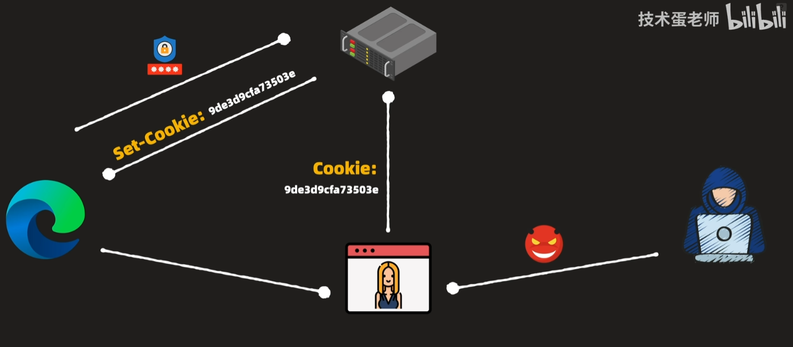

- 防御办法

1. csrf-token
   表单里面加上一个随机的 token 值，每个用户都是不一样的 token 值，token 在请求的消息主体里面，不会被自动发送
   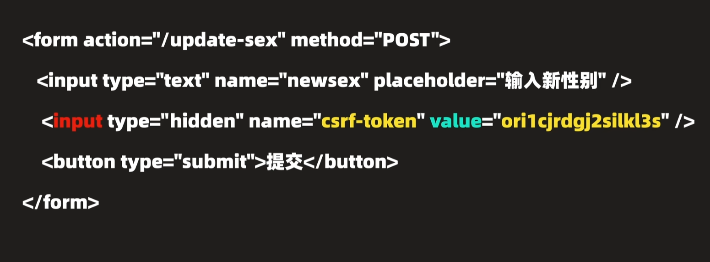

2. cookie 的 samesite 新属性

SameSite=Strict: 不允许跨站传输 cookie

SameSite=Lax: 允许跨站传输 cookie,主要是有些 get 请求可以发送 cookie

SameSite=None: 需要 cookie 在 https 下发送，也就是一定要为 cookie 设置 secure 属性

3. Refer、Cors

4. 中间人攻击（Man-in-the-Middle） 是什么？如何防范？
5. 什么是 ARP 欺骗？如何解决？

## 场景分析题

1. 用户在浏览器输入 https://www.google.com 后按下回车，背后发生了什么？（从 DNS、TCP、TLS、HTTP 到页面渲染的全过程）
2. 如何排查服务器无法访问外网的问题？（可能涉及路由、防火墙、DNS 配置等）
3. 如果客户端频繁出现 TCP 连接超时，可能是什么原因？

## 进阶问题

### CDN（内容分发网络） 的工作原理是什么？如何加速网站访问？

源服务器把静态内容提前备份给 cdn
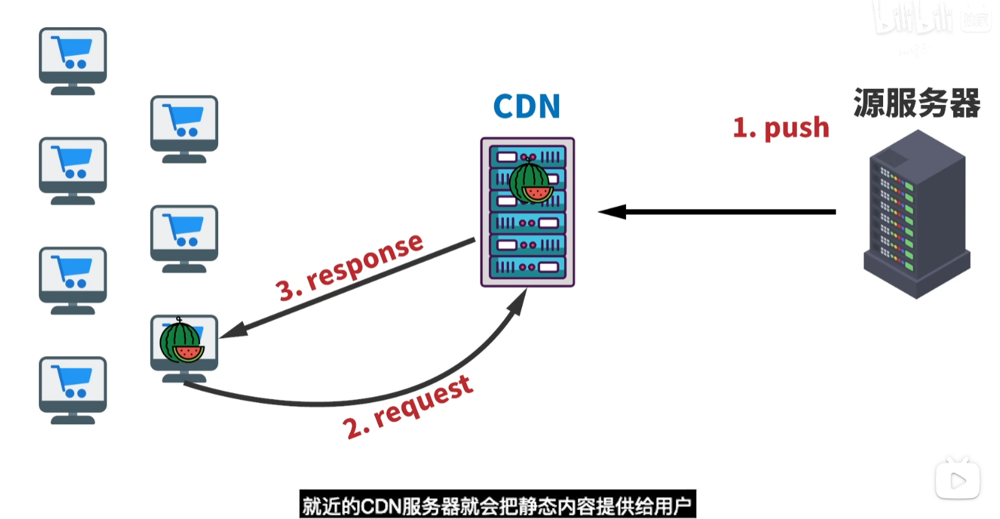
如果没有提前备份，就先去源服务器拉取
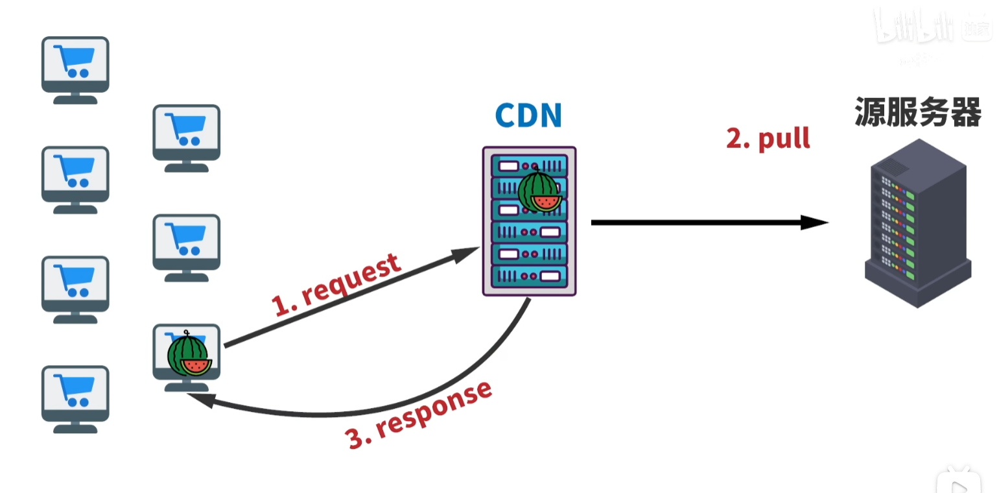

### IPv4 分片问题|MTU、MSS

#### MTU、MSS

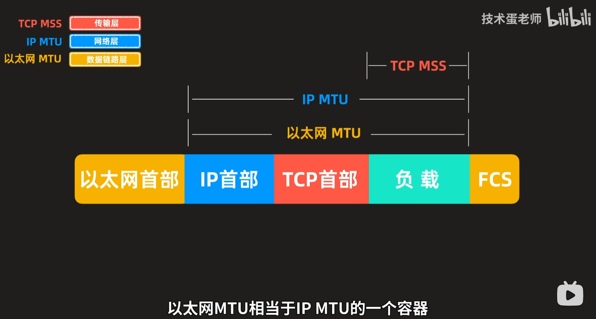

#### TCP 分段

tcp 分段就是为了后面的 IP 不在分片
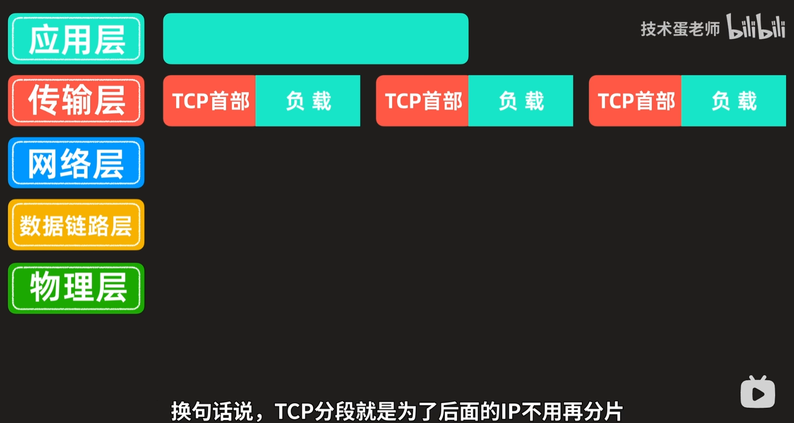

#### IP 分片

数据包依然可能遇到链路上的设备接口低于 MTU1500(假如 MTU 是 1500)的路由，此时就可能进行 IP 分片
以下是只支持 MTU576 的接口，那么数据包就会被分成三份，就会多了 40 字节首部，并且如果三个数据包丢了其中一个分片的话，就会进行重传，但是重传是由四层 TCP 层进行的，分片是由路由进行分片的，IP 协议是不可靠传输(职责就是更快更高效的传输数据包)，所以就需要重传所有分片，也就是重传那一段 TCP 数据段
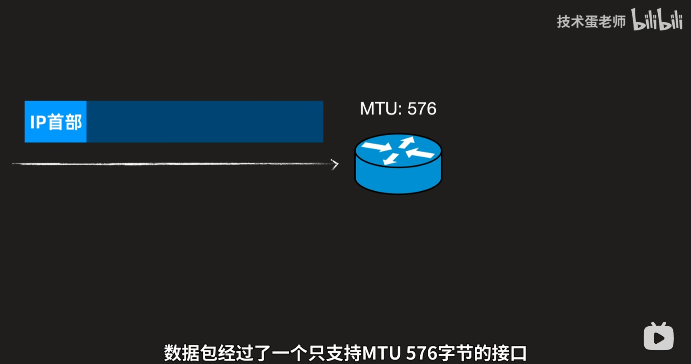
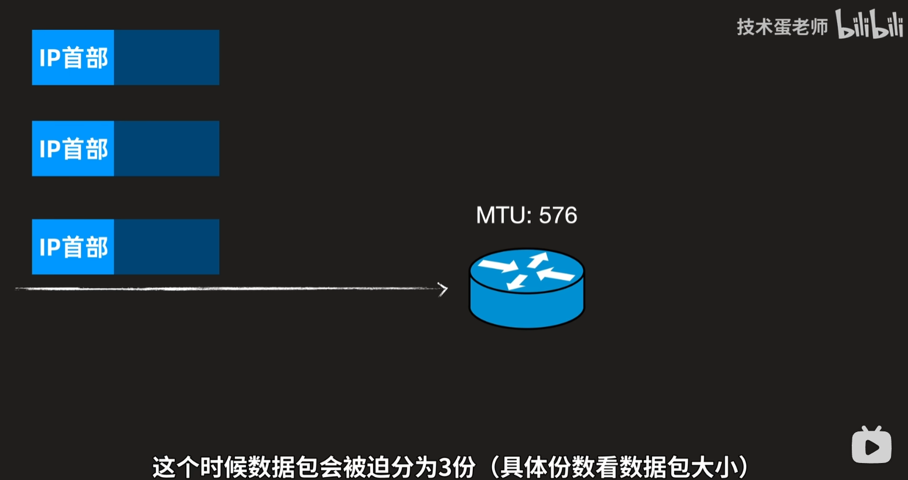
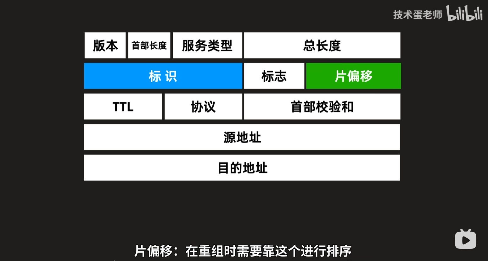
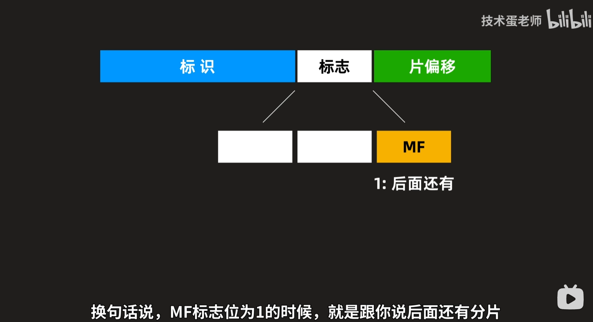
路由设备的缓冲区是有限的，分片太多很有可能因为缓冲区的限制导致部分分片被丢弃，分片会增加路由设备的算力和内存的负担
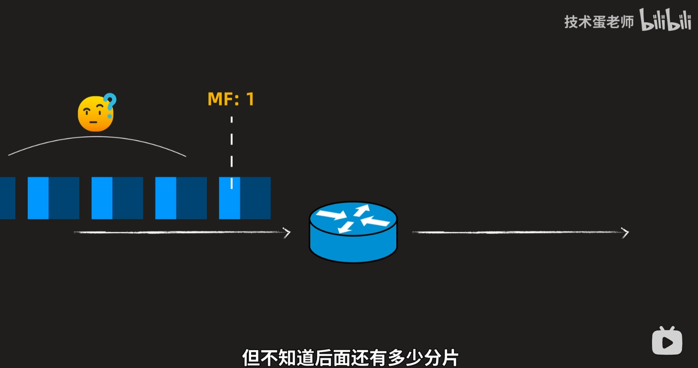

#### 避免分片

IPv4 首部里有个 DF(dont fragment)不分片标志位，如果设置了这个 DF 标志位,链路上的设备碰到超过 MTU 的数据包不会进行分片处理，直接丢掉这个包，并且返回消息告知发送方需要进行分片，这样发送方就需要降低 MTU,然后再次发送，直到发现 MTU 的最小值
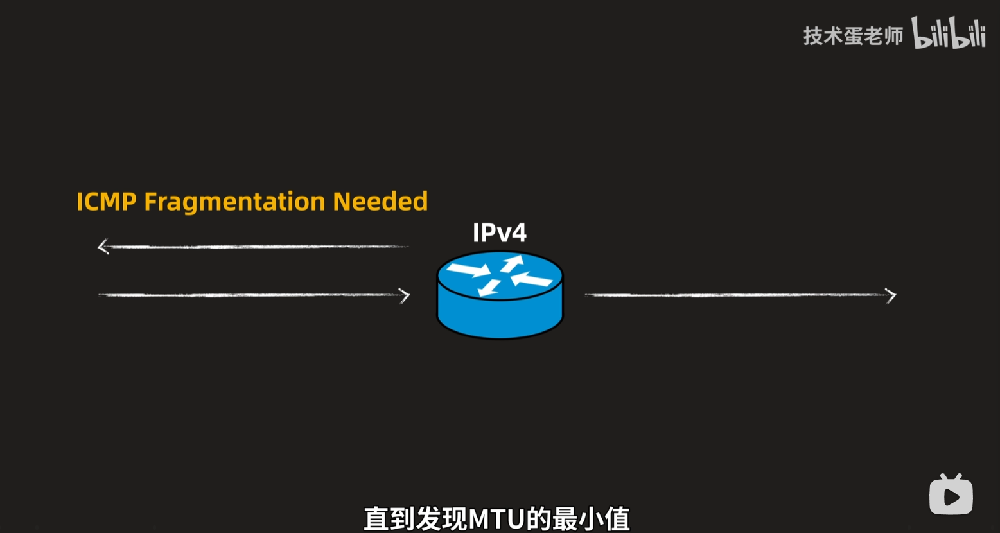

在 IPv6 就不一样，ipv6 只允许发送源对数据包进行切分，不允许链路上的设备进行分片，因此 ipv6 不需要另外设置，如果数据包太大，链路上的设备直接丢包，并且返回消息告知对方太大，这样也是可以发现 MTU 最小值的
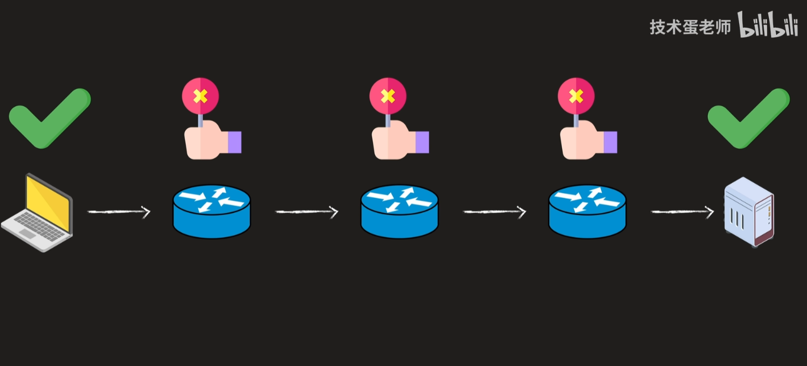
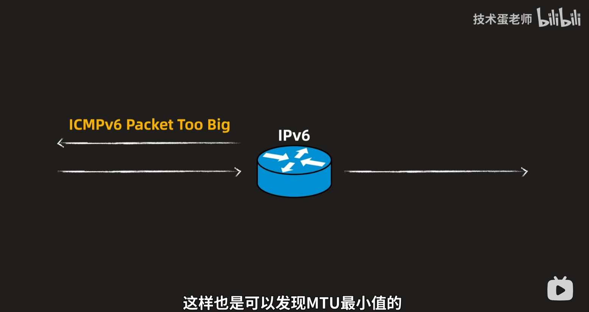

### Socket

socket 就是一个接口层，介于内核和应用程序之间，提供了一些高度封装过的接口，让我们使用内核网络的传输功能，我们平时写的应用程序代码里，虽然使用 socket 实现了收发数据包的功能，但其实真正执行网络通信功能的，不用应用程序，而是操作系统内核。比如 linux 就像是被分成了应用程序和内核，内核就像是后端暴露了很多 api 接口，其中一类就是 socket 的 send()和 recv()、connect()、listen()这些方法，应用程序就像是前端，负责调用内核提供的接口来实现想要的功能
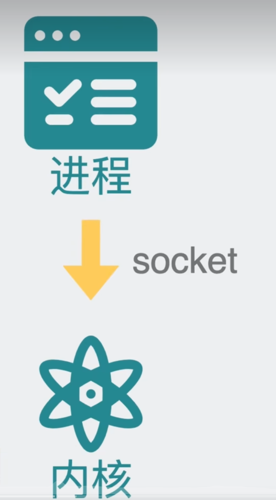
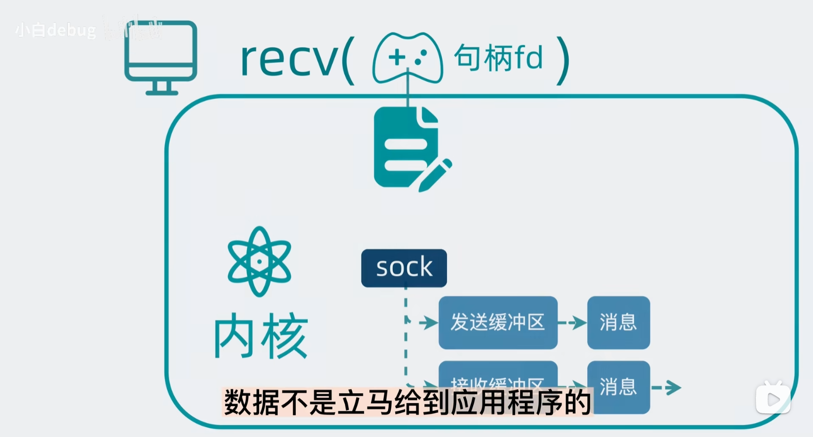
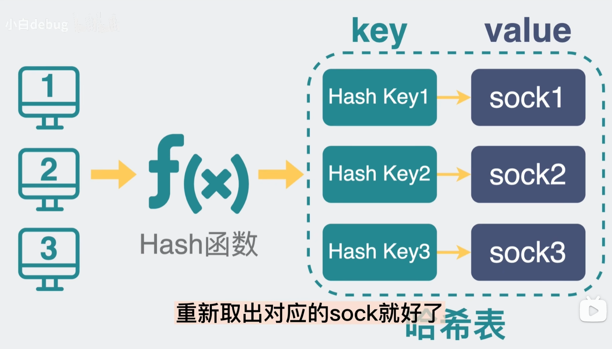
服务端 listen 的时候，那么多数据包发到一个 listen socket 上，服务端是怎么区分多个客户端的？

客户端发来的数据包上会有源 ip 地址和端口以及目的 ip 和端口，这四个元素构成一个四元组，可以用于唯一标记一个客户端，服务端会创建一个新的 socket,并用四元组生成一个 hash key,将它放入一个 hash 表中，下次再有消息进来的时候，通过消息内的四元组生成 hash key,再到这个 hash 表里重新取出对应的 socket 就好了
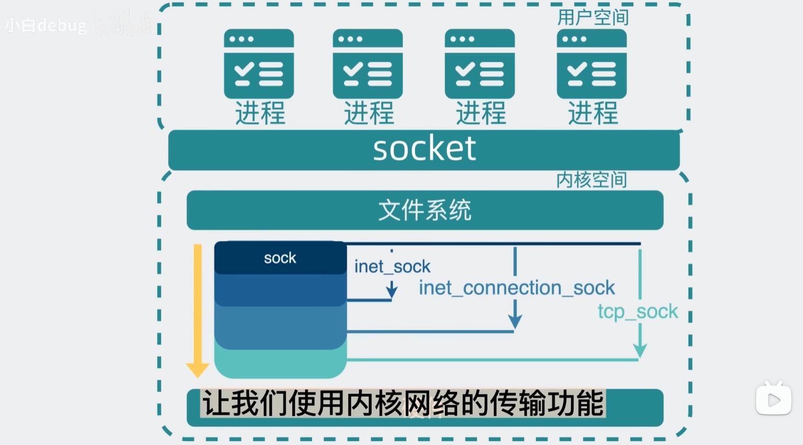

## 自我提问

### http1.1 导致队头阻塞的根本原因是什么？多个请求发过来的时候不可以通过 tcp 数据段的序列号来判断是来自不同的请求报文然后分别进行处理么？为什么需要等到一个请求的响应收到后才发送下一个请求？为什么 http2.0 通过在流中进行分帧后就不会有对头阻塞的问题？详细描述一下

HTTP/1.1 队头阻塞的根本原因在于其基于文本的请求/响应模型和严格的顺序处理机制。

#### 一、HTTP/1.1 队头阻塞的根本原因

1. 请求/响应必须严格顺序化

HTTP/1.1 默认使用串行请求处理模型（除非开启 Keep-Alive 但响应仍需顺序返回）。

- 客户端发送多个请求时（如通过一个 TCP 连接），服务器必须按请求到达的顺序返回响应。
- 如果第一个请求的响应延迟（例如需要查询数据库），后续响应即使已准备好，也必须等待。

2. TCP 无法解决应用层队头阻塞

- TCP 是面向字节流的协议，它只保证数据按序到达（通过序列号），但不识别 HTTP 请求边界。
- 服务器收到 TCP 数据流后，需要依赖 HTTP 协议解析请求（如通过 Content-Length 或 chunked 编码确定报文边界）。

#### 二、为什么不能通过 TCP 序列号区分请求？

- TCP 序列号的作用：仅保证字节流的顺序传输（例如防止乱序），但不区分应用层报文。
- HTTP/1.1 的缺陷：
  - 协议未设计“请求标识符”，无法将响应与请求动态关联。
  - 响应必须按请求顺序返回（例如：请求 A → B → C，响应必须为 A' → B' → C'）。

#### 三、HTTP/2 如何通过分帧解决队头阻塞？

HTTP/2 引入了 二进制分帧层（Binary Framing Layer） 和 流（Stream） 的概念：

1. 核心机制

| 概念                     | 作用                                                         |
| ------------------------ | ------------------------------------------------------------ |
| 流（Stream）             | 一个虚拟通道，承载双向字节流，每个流有唯一 ID 和优先级。     |
| 帧（Frame）              | 数据传输的最小单位（如 HEADERS、DATA 帧），携带所属流的 ID。 |
| 多路复用（Multiplexing） | 多个流的帧可交错发送，无需按顺序。                           |

2. 解决队头阻塞的原理

- 帧可乱序发送：
  不同流的帧可以交替传输（例如：流 1 的帧 1 → 流 2 的帧 1 → 流 1 的帧 2）。
- 接收方重组帧：客户端根据帧头的 Stream ID 将帧分组，重组出完整的响应。

3. 为什么 HTTP/2 没有应用层队头阻塞？

- 响应无需按请求顺序返回（帧可乱序到达）。
- 慢请求（如大文件）不会阻塞其他请求的响应（如 CSS/JS）。

#### 四、HTTP/2 的局限性（TCP 层队头阻塞）

尽管 HTTP/2 解决了应用层队头阻塞，但仍受制于 TCP 层的队头阻塞：

- TCP 要求按序交付：若某个 TCP 包丢失（例如流 1 的帧 2），后续所有包（包括流 2 的帧）需等待重传，即使它们属于不同流。
- 解决方案：HTTP/3 基于 UDP 的 QUIC 协议，为每个流提供独立传输，彻底解决队头阻塞。

### 上面的回答中，HTTP/1.1 为什么要使用串行请求处理模型，是设计缺陷吗？为啥不能在服务器收到 TCP 数据流后，需要依赖 HTTP 协议解析请求（如通过 Content-Length 或 chunked 编码确定报文边界），这样不就可以同时确定多个 http 请求报文了吗？

这是一个极好的问题！HTTP/1.1 采用串行模型并非设计缺陷，而是特定历史条件下的权衡结果。服务器技术上确实能通过 Content-Length 或 chunked 编码解析出多个请求报文，但协议规范和应用场景的限制阻止了并行处理响应。以下是深层原因分析：

#### 一、HTTP/1.1 强制串行响应的根本原因

1. 协议规范的强制要求

RFC 2616 (HTTP/1.1) 第 8.1.2.2 节 明确规定：

> "A server MUST send its responses to requests in the same order that the requests were received."
> （服务器必须按接收请求的顺序发送响应）

这是协议层的硬性约束，与实现技术无关。

2. 客户端依赖响应顺序

- 早期无状态交互模型：HTTP/1.1 设计时，浏览器和服务器没有完善的“请求-响应”关联机制。
- 客户端如何匹配响应？
  - 若响应乱序返回，客户端无法确定响应归属哪个请求（HTTP/1.1 帧头无请求 ID 标识）。
  - 唯一可靠方式：顺序保证（第一个响应对应第一个请求，以此类推）。

3. TCP 连接管理的复杂性

- Keep-Alive 的妥协：HTTP/1.0 每个请求需新建 TCP 连接。HTTP/1.1 引入 Connection: Keep-Alive 复用连接，但必须保持响应顺序，否则：
  - 客户端需维护复杂的状态机（记录每个请求的上下文）。
  - 服务器需缓存乱序响应（当时内存资源昂贵）。

#### 二、HTTP/1.1 的变通方案与代价

为绕过队头阻塞，开发者采用以下方案，但均有明显缺点：
|方案|原理|代价|
|-----|-----|--------|
|开启多个 TCP 连接| 浏览器对同一域名开 6~8 个连接|TCP 握手慢，占用服务器资源|
| 域名分片（Domain Sharding）|将资源分配到多个子域名| DNS 查询开销，配置复杂|
|资源内联/合并|减少请求数量| 缓存失效粒度变粗，传输冗余数据|

#### 三、对比 HTTP/2 如何解决此问题

HTTP/2 通过二进制分帧层突破协议限制：

1. 核心创新：流（Stream）与帧（Frame）

- 每个请求/响应被分配唯一的 Stream ID。
- 数据被拆分为带 ID 的二进制帧（如 HEADERS, DATA 帧）。

2. 响应乱序返回的实现

```
► 请求：
   流A（大文件） → 流B（小文件）

► 服务器响应帧发送顺序：
   HEADERS帧(B) → DATA帧(B) → HEADERS帧(A) → DATA帧(A)...

► 客户端行为：
   根据帧头的 Stream ID 重组流：收到 B 的帧立即渲染，无需等待 A。
```

3. 协议层支持

- 帧头中的 Stream ID 明确标识归属。
- 客户端通过 ID 将帧重组为完整响应，无需依赖传输顺序。

#### 四、为什么 HTTP/1.1 不早用类似方案？

1. 历史局限性：

- 1999 年定稿的 HTTP/1.1 面向低复杂度场景（页面通常少于 10 个资源）。
- 2015 年的 HTTP/2 针对现代 Web（单页 100+ 资源）。

2. 文本协议 vs 二进制协议：

- HTTP/1.1 基于文本（换行符分隔），难以嵌入元数据（如 Stream ID）。
- HTTP/2 采用二进制帧，天然支持扩展头部（如 Stream ID、Priority）。

3. 实现复杂度：

- 2000 年代初的服务器/客户端算力有限，难以处理多路复用和解复用。

### 如何开启 http2

开启 HTTP/2 需要服务端和客户端共同支持，核心是服务端配置。以下是详细步骤和注意事项：

#### 一、开启 HTTP/2 的必备条件

HTTP/2 是自动协商的协议。只要服务端开启，现代浏览器会优先使用 HTTP/2（无需用户手动切换）。

1. 必须启用 HTTPS,HTTP/2 主流实现（如浏览器、Nginx/Apache）强制要求 TLS 加密。
2. 软件要求

| 软件   | 最低支持版本                          |
| ------ | ------------------------------------- |
| Nginx  | ≥ 1.9.5（需包含 http_v2_module）      |
| Apache | ≥ 2.4.17（需启用 mod_http2）          |
| 浏览器 | Chrome ≥ 41, Firefox ≥ 36             |
| CDN    | Cloudflare、AWS CloudFront 等默认支持 |

#### 二、具体配置步骤（以常见服务器为例）

```nginx
# Nginx 配置
server {
    listen 443 ssl http2;  # 关键！在 443 端口启用 http2
    server_name your-domain.com;

    ssl_certificate /path/to/cert.pem;
    ssl_certificate_key /path/to/private.key;

    # 推荐优化 SSL 配置（提升性能）
    ssl_protocols TLSv1.2 TLSv1.3;
    ssl_ciphers ECDHE-ECDSA-AES128-GCM-SHA256:ECDHE-RSA-AES128-GCM-SHA256;
    ssl_prefer_server_ciphers on;

    # 其他配置...
}
```

#### 三、高级优化建议

HTTP/2 服务端推送（谨慎使用），需在代码或 Header 中配置（如 Nginx）：

```nginx
location /index.html {
    http2_push /style.css;
    http2_push /app.js;
}
```

### (FAQ4)用图表示一次请求中 dns 解析请求报文封装发送响应，然后 TCP 三次握手，然后实际 http 请求报文发送响应的流程，这个整体流程可能涉及到重传，用图表示时请考虑这种情况

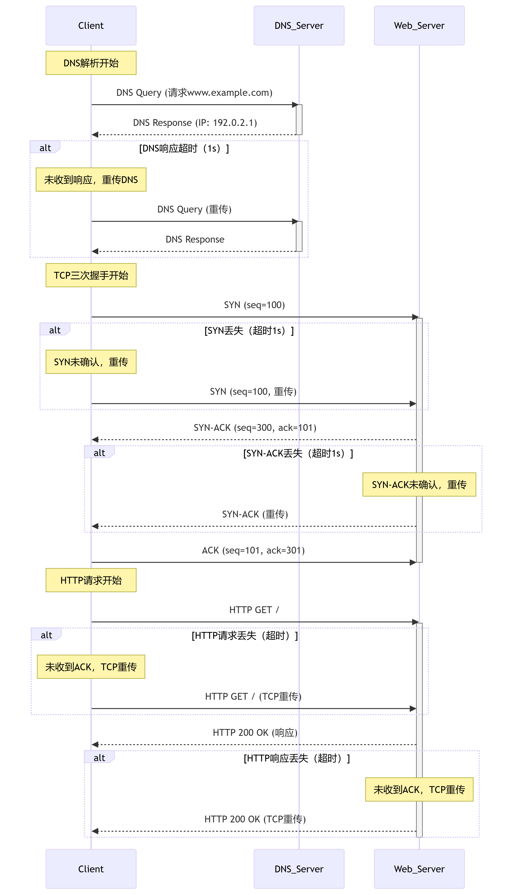

### (FAQ5)带有 http 请求报文数据位的 tcp 报文段发送到服务端后是不是先返回一个只带 ACK 控制位不带 data 数据位的 TCP 响应报文告知发送方请求顺利到达避免发送方重传，然后后续再返回带 data 数据位的 TCP 响应报文

你的理解基本正确，但实际情况更灵活一些，取决于服务端处理请求的速度和 TCP 实现的具体优化。核心原则是：TCP 必须尽快确认收到的数据，以避免发送方不必要的超时重传，但不强制要求这个确认必须是单独的纯 ACK 包。

以下是服务端收到带有 HTTP 请求数据的 TCP 报文段后可能发生的两种主要情况：
