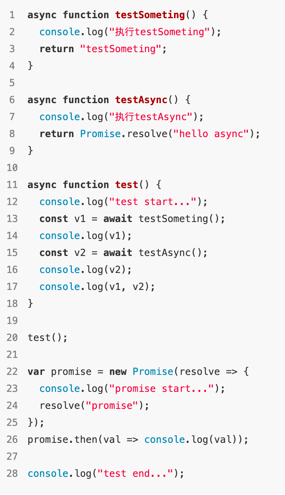
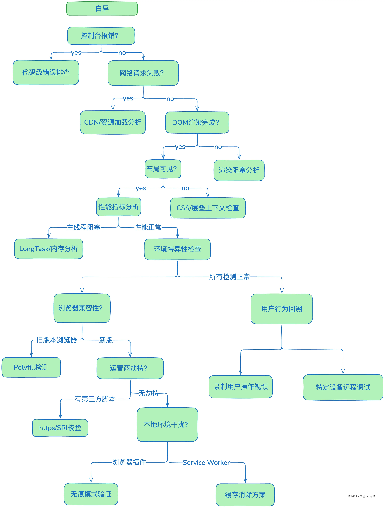

## 灏仟亿

1. 

2. 自动分包的方式？splitChunkpuglin

3. Vizier-cli 做了什么？如果需要拉取一段代码到指定文件区域怎么实现？同时还要校验依赖和验证运行是否报错呢？

4. yarn pnpm 有了解吗

5. 为什么要改为 ice.js

6. monoRepo

- 好处
  - 可见性（Visibility）：每个人都可以看到其他人的代码，这样可以带来更好的协作和跨团队贡献
  - 更简单的依赖关系管理（Simpler dependency management）：共享依赖关系很简单，因为所有模块都托管在同一个存储库中，因此都不需要包管理器。
  - 唯一依赖源（Single source of truth）：每个依赖只有一个版本，意味着没有版本冲突，没有依赖地狱。
  - 一致性（Consistency）：当你把所有代码库放在一个地方时，执行代码质量标准和统一的风格会更容易。
  - 共享时间线（Shared timeline）：API 或共享库的变更会立即被暴露出来，迫使不同团队提前沟通合作，每个人都得努力跟上变化。
  - 统一的 CI/CD/构建
- 坏处
  - 性能差（Bad performance）：单一代码库难以扩大规模，像 git blame 这样的命令可能会不合理的花费很长时间执行，IDE 也开始变得缓慢，生产力受到影响，对每个提交测试整个 repo 变得不可行。
  - 破坏主线（Broken main/master）：主线损坏会影响到在单一代码库中工作的每个人
  - 学习曲线（Learning curve）：如果代码库包含了许多紧密耦合的项目，那么新成员的学习曲线会更陡峭。
  - 大量的数据（Large volumes of data）：单一代码库每天都要处理大量的数据和提交。
  - 所有权（Ownership）：维护文件的所有权更有挑战性，因为像 Git 或 Mercurial 这样的系统没有内置的目录权限。

与技术无关，而是与工作文化和沟通有关。

7. 模块联邦和微前端的区别

8. class 组件和 function 组件的区别，为啥弃用 class 组件

| 特性         | Class 组件                               | Function 组件                    |
| ------------ | ---------------------------------------- | -------------------------------- |
| 定义方式     | 继承 React.Component 的 ES6 Class        | 普通 JavaScript 函数             |
| 状态管理     | 使用 this.state 和 this.setState()       | 使用 useState Hook               |
| 生命周期方法 | componentDidMount, componentDidUpdate 等 | 使用 useEffect Hook 模拟         |
| 代码复杂度   | 模板代码较多（构造函数、render 等）      | 更简洁，逻辑集中                 |
| 逻辑复用     | 通过 HOC（高阶组件）或 Render Props      | 通过自定义 Hook（如 useFetch）   |
| 性能优化     | PureComponent 或 shouldComponentUpdate   | React.memo + useMemo/useCallback |

新特性（如并发模式）优先适配 Function 组件。

9. http2 为啥没有对头阻塞？如何判断 tcp 数据段是否属于同一个请求？

10. 从传输、构建等方面说说性能优化

11. ts 比 js 好在哪里

## 次元进化

1. 组件如果维护的
2. cli 脚手架怎么实现的
3. react 和 vue 的区别
4. tcp 和 udp 的区别
5. 优化的方式
6. 了解哪些设计原则、模式

- 单例模式
- 发布-订阅模式
- 工厂模式
  - 核心：将对象创建逻辑封装在工厂函数中，隐藏实例化细节。
- 策略模式
  - 核心：定义一系列算法并封装，使它们可相互替换。

```javascript
const paymentStrategies = {
  alipay: (amount) => console.log(`Paid ${amount} via Alipay`),
  wechat: (amount) => console.log(`Paid ${amount} via WeChat`),
};
function pay(amount, method) {
  return paymentStrategies[method](amount);
}
pay(100, "alipay"); // 输出 "Paid 100 via Alipay"
```

- 装饰器模式
  - 核心：动态扩展对象功能而不修改原对象。
- 代理模式
- 适配器模式
  - 核心：转换接口以兼容不同系统。

7. 说说学习的开源项目的细节
8. 前端转发是怎么维护的
9. 算法题：给定 n 个不同的整数,问这些数中有多少对整数,它们的值正好相差 1

10. ui 规范化怎么能提升访问率
11. 升级 webpack 和 node 后怎么提升的效率

- 持久化缓存

```javascript
module.exports = {
  cache: { type: "filesystem" },
};
```

- Module Federation
- node 提供更快 io

12. 选型方案对比了哪些

- Next.js。需强 SEO 或全栈能力的应用
- Ant Design Pro。更侧重 UI 组件, 工程化能力如 redux 需结合 Umi 等框架补足。

13. 如果有些依赖想要在实时共享和不实时之间动态切换该如何处理，在不希望改动源码的基础上

- 将依赖 module federation 和通过 cdn 异步获取的方式封装到一个装饰器中，后续获取通过这个装饰器获取，判断条件通过运行时注入

14. 青蛙阶梯算法

## 灵犀一点

1. 白屏怎么检测

- 全局错误监听

```javascript
window.addEventListener("error", (e) => {
  const root = document.querySelector("body");
  // 一级监测
  if (
    root &&
    root.innerText === "" &&
    document.querySelector("#app").childElementCount === 0
  ) {
    // 上报白屏
  }
  // 二级监测
  if (root && root.innerText === "") {
    // 上报白屏：根节点无内容
  }
  // 判断是否是资源加载错误
  const t = e.target || e.srcElement;
  if (t instanceof HTMLScriptElement || t instanceof HTMLLinkElement) {
    console.error("Resource failed:", t.tagName, t.src || t.href);
  }
});
// 捕获异步错误
window.addEventListener("unhandledrejection", (e) => {});
```

- 资源加载监控

```javascript
document.querySelectorAll("script, link").forEach((el) => {
  el.addEventListener("error", () => {
    console.error(`资源加载失败: ${el.src || el.href}`);
  });
});
```

- 关键节点检测

```javascript
const observer = new MutationObserver(function (mutations) {
  // mutation有mutation.type、 mutation.addedNodes、mutation.removedNodes等属性可用于问题追溯
  const root = document.querySelector("body");
  if (root && root.innerText === "") {
    // 上报白屏：根节点无内容
  }
});
observer.observe(document.body, {
  subtree: true,
  childList: true,
});
```

- E2E 测试（端到端）

```javascript
const browser = await puppeteer.launch();
const page = await browser.newPage();
await page.goto("https://your-site.com");
const content = await page.$eval("#root", (el) => el.innerHTML);
if (!content.trim()) throw new Error("页面空白！");
await browser.close();
```

- 性能指标监控

```javascript
new PerformanceObserver((list) => {
  const fcpEntry = list.getEntriesByName("first-contentful-paint")[0];
  if (fcpEntry && fcpEntry.startTime > 3000) {
    sendErrorLog({
      type: "FCP_TIMEOUT",
      time: fcpEntry.startTime,
      scriptDuration: calculateScriptDuration(),
    });
  }
}).observe({ type: "paint", buffered: true });
```

- 主线程阻塞检测

```javascript
// 检测长任务阻塞渲染
new PerformanceObserver((list) => {
  list.getEntries().forEach((entry) => {
    if (entry.duration > 100 && entry.startTime < 5000) {
      sendErrorLog({
        type: "LONG_TASK_BLOCKING",
        duration: entry.duration,
        stack: getFunctionStack(),
      });
    }
  });
}).observe({ entryTypes: ["longtask"] });
```

- 通过 document.elementsFromPoint 进行元素点采样，预设包裹节点如 body、#container 等

```javascript
export function blankScreen() {
  // 👉 1. 定义白屏判断中“wrapper”元素，即最顶层的空节点容器
  const wrapperElements = ["html", "body", "#container", ".content"];

  // 用于统计在采样点上检测到“空白包装节点”的次数
  let emptyPoints = 0;

  /**
   * 获取目标元素的选择器字符串
   * @param {Element} element
   * @returns {string} 例如 '#app', '.main', 'div'
   */
  function getSelector(element) {
    if (!element) return "";

    if (element.id) {
      // 有 ID 就返回 "#id"
      return "#" + element.id;
    } else if (element.className) {
      // 多 class 转成 ".class1.class2"
      return (
        "." +
        element.className
          .split(" ")
          .filter((item) => item) // 过滤掉空字符串
          .join(".")
      );
    } else {
      // 没有 id 或 class，用标签名小写
      return element.nodeName.toLowerCase();
    }
  }

  /**
   * 判断元素是否属于包裹（wrapper）节点
   * 如果是，就将 emptyPoints 累加
   */
  function isWrapper(element) {
    const selector = getSelector(element);
    if (wrapperElements.indexOf(selector) !== -1) {
      emptyPoints++;
    }
  }

  /**
   * 📌 onload 意味着视图和资源加载完成后才会执行检测逻辑
   */
  onload(function () {
    // 2. 拿 9 个点横向 + 9 个点纵向做采样，一共 18 次检测
    for (let i = 1; i <= 9; i++) {
      // 横向采样点：屏幕宽度的 1/10、2/10 ... 9/10，垂直中心
      const xElements = document.elementsFromPoint(
        (window.innerWidth * i) / 10,
        window.innerHeight / 2
      );
      // 纵向采样点：屏幕高度的 1/10、2/10 ... 9/10，水平中心
      const yElements = document.elementsFromPoint(
        window.innerWidth / 2,
        (window.innerHeight * i) / 10
      );

      // 判断每个采样点上的第一个元素是否为“wrapper”
      isWrapper(xElements[0]);
      isWrapper(yElements[0]);
    }

    // 3. 如果 wrapper 探测次数超过 16（即大部分点都只命中 html/body 等空白层）
    if (emptyPoints > 16) {
      const centerElement = document.elementsFromPoint(
        window.innerWidth / 2,
        window.innerHeight / 2
      )[0];

      // 上报白屏数据，通过 tracker SDK、或者通过Sentry 日志上报
      tracker.send({
        kind: "stability", // 类别：稳定性
        type: "blank", // 类型：白屏
        emptyPoints, // 空白点数量
        screen: window.screen.width + "*" + window.screen.height, // 物理屏幕分辨率
        viewPoint: window.innerWidth + "*" + window.innerHeight, // 可视窗口尺寸
        selector: getSelector(centerElement), // 中心点元素的选择器，用于定位问题
      });
    }
  });
}
```

- 通过 performance api 判断是否出现资源加载缓慢导致短时白屏情况

```javascript
const entries = performance.getEntriesByType("resource");
entries.forEach((r) => {
  // 典型字段：r.name, r.initiatorType ('script', 'css', 'img', 'font'), r.duration, r.transferSize
  if (
    (r.initiatorType === "script" ||
      r.initiatorType === "css" ||
      r.initiatorType === "font" ||
      r.initiatorType === "img") &&
    r.duration > 2000
  ) {
    console.warn("Slow resource:", r.name, r.duration);
    reportSlowResource({ url: r.name, duration: r.duration });
  }
});
```

- Puppeteer 进行页面渲染截图分析，编写自动化性能测试脚本

```javascript
const puppeteer = require("puppeteer");

// LCP 监听函数，将页面窗口挂载 largestContentfulPaint 值
const LCP_SCRIPT = `
      window.largestContentfulPaint = 0;
      const po = new PerformanceObserver(list => {
        const entries = list.getEntries();
        const last = entries[entries.length - 1];
        window.largestContentfulPaint = last.renderTime || last.loadTime;
      });
      po.observe({ type: 'largest-contentful-paint', buffered: true });
      document.addEventListener('visibilitychange', () => {
        if (document.visibilityState === 'hidden') {
          po.takeRecords();
          po.disconnect();
        }
      });
    `;

/** 在浏览器端注入 LCP 监听逻辑 */
async function installLCP(page) {
  await page.evaluateOnNewDocument(LCP_SCRIPT);
}

async function captureAtPoints(url, device) {
  const browser = await puppeteer.launch({ headless: true });
  const page = await browser.newPage();
  if (device) await page.emulate(device);

  await installLCP(page);

  // 1. DOMContentLoaded 触发截图
  await page.goto(url, { waitUntil: "domcontentloaded", timeout: 60000 });
  const domReadyShot = await page.screenshot({ fullPage: true });
  console.log("[✳️] DOMContentLoaded screenshot taken");

  // 2. networkidle2 或 load 时机截图，并后置延时
  await page.goto(url, { waitUntil: "load", timeout: 60000 });
  await page.waitForTimeout(1000);
  const onLoadShot = await page.screenshot({ fullPage: true });
  console.log("[✅] load screenshot taken");

  // 3. 获取 LCP 值
  const lcp = await page.evaluate(() => window.largestContentfulPaint);
  console.log("🏁 Captured LCP:", lcp, "ms");

  await browser.close();
  return { domReadyShot, onLoadShot, lcp };
}

/** 白屏像素分析，用于 onload 时的截图 */
function analyzeWhiteScreen(buffer) {
  return new Promise((resolve) => {
    const img = new Image();
    img.src = "data:image/png;base64," + buffer.toString("base64");
    img.onload = () => {
      const canvas = document.createElement("canvas");
      canvas.width = img.width;
      canvas.height = img.height;
      const ctx = canvas.getContext("2d");
      ctx.drawImage(img, 0, 0);
      const data = ctx.getImageData(0, 0, img.width, img.height).data;
      const total = img.width * img.height;
      let whites = 0;
      for (let i = 0; i < data.length; i += 4) {
        if (data[i] > 240 && data[i + 1] > 240 && data[i + 2] > 240) whites++;
      }
      resolve(whites / total);
    };
  });
}

// 主流程，依次执行、检测
(async () => {
  const { KnownDevices } = require("puppeteer");
  const devices = [
    KnownDevices["iPhone 13 Pro"],
    KnownDevices["Pixel 6"],
    null,
  ];

  for (const device of devices) {
    const { onLoadShot, lcp } = await captureAtPoints(
      "https://example.com",
      device
    );

    const ratio = await analyzeWhiteScreen(onLoadShot);
    console.log(
      `Device ${device?.name || "Desktop"} white pixel ratio:`,
      ratio.toFixed(3)
    );

    if (ratio >= 0.95) {
      console.warn(
        `⚠️ White-screen detected at onload on ${device?.name || "Desktop"}`
      );
      console.log("📊 LCP was", lcp, "ms – helps判断是否是性能问题");
    }
  }
})();
```

- devtool 面板中的内存、performance、network 面板

- 用户操作视频录制（接入 rrweb 等工具, 大公司监控体系下一般都有用到, 没有用上的建议也可以加上）
- 特定设备远程调试（使用 Chrome Remote Debugging）



2. 错误处理怎么实现？了解过市面上常用的错误检测实现方式吗或者第三方？为什么不直接用第三方？
3. react 实现原理？可中断更新怎么实现的
4. 性能检测手段（Lighthouse 生成报告 → 2. Network/Performance 面板深入分析 → 3. 代码级优化 → 4. RUM 长期监控(sentry 或自定义错误上报)）

- 开发者工具
  - network 面板，分析资源加载瓶颈、优化请求合并
  - Performance 面板，可查看 fps、main 线程长任务、重绘重排情况，解决卡顿、优化渲染性能
  - Lighthouse (Audits)，自动化生成性能报告（SEO、可访问性、最佳实践、性能指标）
  - Memory 面板，堆快照（Heap Snapshots）对比内存变化
- JavaScript 性能 API
  - Navigation Timing API

```javascript
const [timing] = performance.getEntriesByType("navigation");
console.log("DNS查询耗时:", timing.domainLookupEnd - timing.domainLookupStart);
console.log("TCP连接耗时:", timing.connectEnd - timing.connectStart);
console.log("白屏时间:", timing.responseStart - timing.startTime);
```

- Resource Timing API

```javascript
performance.getEntriesByType("resource").forEach((resource) => {
  console.log(`${resource.name} 加载耗时:`, resource.duration);
});
```

- User Timing API

```javascript
performance.mark("start_work");
// 执行代码...
performance.mark("end_work");
performance.measure("work_duration", "start_work", "end_work");
```

5. 面向切面编程
6. 模块联邦实现原理

- remoteEntry 文件中包含 remote module 的加载逻辑
- 将共享依赖进行注册，然后后续通过 get 方法判断需要使用主应用还是子应用下的依赖
- 可以通过 promise entry 实现动态设置 remote

7. 首页加载优化
8. 白屏原因、优化

- 原因
  - 初始化脚本、样式等加载失败
  - 第三方 SDK 报错（如埋点、广告、支付等）阻断主线程；
  - 组件渲染、生命周期调用过程中出现错误
  - 路由未匹配到，没有兜底方案
- 优化
  - 骨架屏

## 37

1. 浏览器事件循环和 node 的区别

- 浏览器
  - 宏任务：setInterval、setTimeout、用户交互事件、资源加载
  - 微任务：promise、mutationObserver
- [node](https://juejin.cn/post/7326803868326592539?searchId=20250722144232313EA00CD81513D1BC62)
  - 依次清空每个阶段的任务
  - timer 阶段：setTimeout、setInterval
  - poll 阶段：除 timers 和 check 队列外的绝大多数 I/O 回调任务，如文件读取、监听用户请求等
  - check 阶段：负责处理 setImmediate 定义的回调函数
  - 每次打算进入下个阶段之前，必须要先依次反复清空 nextTick 和 promise 队列
  - 通过 process.nextTick() 将回调函数加入 nextTick 队列，和通过 Promise.resolve().then() 将回调函数加入 Promise 队列，且 nextTick 队列的优先级还要高于 Promise 队列，所以 process.nextTick 是 nodejs 中执行最快的异步操作。

2. 页面卡顿的原因

- 长任务占用，通过 web worker 改善，当任务的运算时长 - worker 加载时长 > 50ms，推荐使用 Web Worker
- 大数据量渲染，js 执行线程操作 dom 后才会进行后续渲染，造成页面卡顿

3. 监控页面的错误，如何设计 sdk 减少接入改动
4. interface 和 type 的区别

- 扩展性
  - interface 通过 extends 继承
  - type 通过 & 交叉类型合并
- 声明合并
  - interface 支持同名接口自动合并
  - type 不支持
- 类型范围
  - interface 仅描述对象类型
  - type 可描述任意类型（对象、原始值、元组、联合类型等）

5. ref 和 reactive 的区别

- ref 适用于基本类型和对象类型，通过 .value 属性访问/修改值；reactive 仅适用于对象类型,无需 .value
- reactive 直接解构会丢失响应性！需配合 toRefs 转换

```javascript
const state = reactive({ x: 1, y: 2 });
const { x, y } = toRefs(state); // 转为 ref 结构
x.value++; // 响应式修改
```

## 编程猫

### 一面

1. webpack 的原理
2. 移动端如何适配的
3. 活动页每次都要单独开发吗？
4. react16.8 之后做了哪些优化
5. 说说 fiber
6. 拖拽实现
7. 避免白屏的方式？

- 骨架屏效果不够好，还是会在挂载时在骨架屏小时候出现短暂白屏，过渡不够自然
- SSR 在高并发时对服务器压力大
- SSG

8. Electron 有了解过嘛
9. 打字机的实现
10. 动态虚拟滚动怎么实现
11. ai 工具有用过吗？cursor?
12. 原型链

### 二面

1. 弹幕量过大怎么处理
2. 自己的弹幕在大量弹幕的时候怎么在比较前面显示的

## shopee

1. 原型链

```javascript
// 定义 Parent 类
function Parent(age) {
  this.age = age; // 初始化 age 属性
}

// 在 Parent 原型上添加 hello 方法
Parent.prototype.hello = function () {
  console.log("Hello, I am " + this.age + " years old.");
};

// 定义 Child 类并继承 Parent
function Child(age) {
  // 调用父类构造函数初始化 age 属性
  Parent.call(this, age);
}

// 设置原型链继承
Child.prototype = Object.create(Parent.prototype);
// 修复构造函数指向
Child.prototype.constructor = Child;

// 使用示例
const parent = new Parent(40);
parent.hello(); // 输出: "Hello, I am 40 years old."

const child = new Child(10);
child.hello(); // 输出: "Hello, I am 10 years old."

console.log(child instanceof Parent); // true
console.log(child instanceof Child); // true
```

2. 写一个并发请求类，最大并发请求为 maxReq
3. 为什么会出现 fiber 架构，之前的架构有什么问题;合成事件
4. 微前端的实现，css 隔离实现方案
5. 状态方案了解过哪些

### 二面

1. 给你一个整数数组 nums 你需要找出一个 连续子数组，如果对这个子数组进行升序排序，那么整个数组都会变为升序排序。
   请你找出符合题意的 最短 子数组，并输出它的长度。

```
输入:nums = [2,6,4,8, 10,9,15]输出:5解释:你只需要对[6，4，8，10，9]进行升序排序，那么整个表都会变为升序排序。
```

```javascript
function findSubArr(nums) {
  let startIndex = 0;
  let endIndex = nums.length - 1;
  const middleArrLength = validateArr(
    nums,
    startIndex,
    endIndex,

    nums[startIndex],
    nums[endIndex],
    nums.length
  );
  return middleArrLength;
}

function validateArr(nums, startIndex, endIndex, startEle, endEle, minLength) {
  const middleArr = nums.slice(startIndex + 1, endIndex);
  const middleArrCopy = [...middleArr];
  const sortedMiddle = middleArrCopy.sort((a, b) => a - b);
  const left = sortedMiddle[0];
  const right = sortedMiddle[sortedMiddle.length - 1];
  if (left >= startEle) {
    startIndex++;
  }
  if (endEle >= right) {
    endIndex--;
  }
  if (left < startEle && right > endEle) {
    console.log(middleArr);
    return minLength;
  }
  return validateArr(
    nums,
    startIndex,
    endIndex,
    nums[startIndex],
    nums[endIndex],
    endIndex - startIndex + 1
  );
}
console.log(findSubArr([2, 6, 4, 8, 10, 9, 15]));
```

## 文远知行

1. 多层嵌套表单渲染如何优化
2. immerjs 听说过嘛
3. 音频 rtc
4. 离屏渲染

## 百田

1. with 和 iife 有啥区别
2. 不是在所有应用中都需用模块联邦共享要如何处理
3. 怎么就能判断升级 ui 后导致的访问量提升，排除其他因素的干扰
4. 抓包软件用过哪些
5. 怎么做真机调试，除了 vconsole, chrome://inspect?
6. monorepo、pnpm
7. 单 feature 测试怎么实现，test.a.com-sds8d34.a.com, 环境多治理泳道?
8. 以下 effect 会在依赖改变的时候调用吗？

```javascript
watchEffect(async () => {
  await api();
  console.log(num.value);
});

num.value++;
```

9. vue 里面为什么要用 WeakMap
10. requestAnimationFrame、idle 的执行顺序
11. SDK.report 的 script 异常的时候如何处理，如何在 sdk 层面做处理,而不是 try catch，因为这样每次都要 trycatch
12. 为什么没用 cors 而用 node 转发
