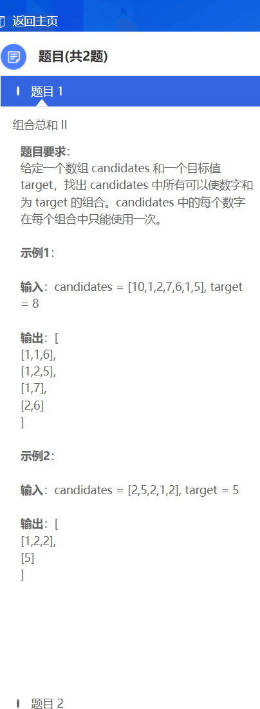
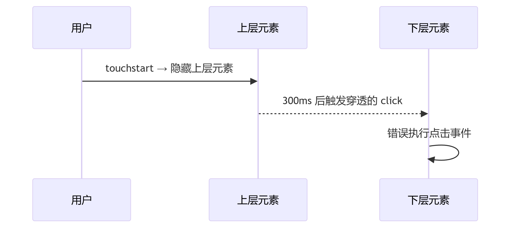

## 网上面经

### 算法

1. 两个链表求和
2. 判断两个二叉树是否相同
3. 求两个有序数组的中位数 要求时间复杂度 o(log(m+n))
4. 打家劫舍 3（什么是动态规划？什么是贪心？）
5. 函数柯里化和数组转树
6. LAU
7. 双链表升序合并
8. 组合总数
9. 字符串数字相乘的积，不能转成数字相乘

### 网络

#### keepalive 模式下为什么需要传 contentLength 字段?

在 HTTP 的 keepalive 模式下，客户端和服务器会复用同一个 TCP 连接传输多个请求/响应。为了正确区分每个请求或响应的边界，必须明确告知消息体的长度，这就是 Content-Length 字段的核心作用。具体原因如下：

1. 解决 TCP 流式传输的粘包问题
   TCP 是流式协议，数据没有明确边界。在 keepalive 连接中，多个请求/响应会连续发送，接收端无法自动判断一个消息体的结束位置。

2. 避免接收端无限等待
   若未指定长度，接收方（如客户端）需依赖连接关闭（如 http1.0）判断消息结束。但在 keepalive 模式下，连接不会关闭，导致接收方持续等待更多数据，最终超时。

##### 替代方案：分块传输编码（Chunked Encoding）

当长度未知时（如动态生成内容），可使用 Transfer-Encoding: chunked 替代 Content-Length：

- 将消息体分成多个块（chunk），每块包含自身长度。
- 以 0\r\n\r\n 标记结束，同样能解决边界问题。

#### 启用 http2 需要在 nginx 中做哪些配置?为什么 http2 不能完全解决队头阻塞，而 http3 却可以?

1. 修改 Nginx 的 server 块，在 listen 指令中添加 http2 参数，并配置 SSL 证书：

```nginx
server {
    listen 443 ssl http2;  # 启用 HTTP/2 和 SSL
    server_name example.com;

    # SSL 证书路径
    ssl_certificate /etc/nginx/ssl/fullchain.pem;
    ssl_certificate_key /etc/nginx/ssl/privkey.key;

    # 协议和加密套件优化
    ssl_protocols TLSv1.2 TLSv1.3;
    ssl_ciphers HIGH:!aNULL:!MD5;

    location / {
        root /var/www/html;
        index index.html;
    }

    # 可选：HTTP/2 服务器推送（例如推送 CSS 文件）
    location = /index.html {
        http2_push /style.css;  # 主动推送资源:cite[3]
    }
}
```

2. 重启与验证

```bash
nginx -t           # 测试配置语法
systemctl restart nginx  # 重启生效
```

##### 场景

- 反向代理 HTTP/2 后端：在 proxy_pass 中指定 HTTPS 后端，并启用 HTTP/1.1 代理协议（因后端通常兼容 HTTP/1.1）

```nginx
location / {
    proxy_pass https://backend-server;
    proxy_http_version 1.1;
    proxy_set_header Host $host;
}
```

##### HTTP/3 如何彻底解决队头阻塞

http2 只能解决应用层的对头阻塞，http3 解决的是传输层的对头阻塞

- 传输层替换为 UDP：绕过 TCP 限制，数据包无需严格有序处理，单个包丢失不影响其他包
- 流级隔离：每个流的数据包独立处理，丢失仅影响当前流

#### 怎么验证权威机构颁发的证书是真的?

- 有效期
- 域名匹配

#### ddos 攻击怎么防御?

- 避免单点，负载均衡
- 防火墙，速率限制与黑名单
- 定期演练

### css

#### css 中 relative 定位和 transform 都是视觉上的偏移，那他们有什么不一样的地方?访问元素的 top 属性会不会引起回流?对于这种 2d 平面的 transform 动画有没有什么手段开启 gpu 加速优化它?

| 特性       | position: relative               | transform                  |
| ---------- | -------------------------------- | -------------------------- |
| 文档流影响 | 原位置保留空白，影响其他元素布局 | 视觉偏移，不影响文档流布局 |
| 渲染阶段   | 布局阶段（Layout）               | 合成阶段（Composition）    |
| 性能影响   | 触发回流（Reflow）               | 通常只触发合成（GPU 加速） |
| 动画性能   | 较差（可能引起布局抖动）         | 优秀（适合高频动画）       |

访问布局相关属性(如 top 属性)必然触发回流，浏览器需要计算最新的布局信息，确保返回准确值。频繁访问会导致布局抖动（Layout Thrashing），严重降低性能。

##### 2D Transform 动画的 GPU 加速优化方案

1. 强制创建独立渲染层

```css
.animated-element {
  transform: translateZ(0); /* 最常用技巧 */
  /* 或 */
  will-change: transform; /* 现代浏览器推荐 */
}
```

优化动画执行时机

```javascript
// 使用 requestAnimationFrame
function animate() {
  element.style.transform = `translateX(${pos}px)`;
  pos += 1;
  requestAnimationFrame(animate);
}
```


### js

#### 移动端常见的点击穿透怎么解决?

移动端点击穿透（Ghost Click）是当上层元素（如弹窗、遮罩）快速消失后，触发了下层元素的点击事件的现象。其核心原因是 移动端 click 事件有 300ms 延迟，而 touch 事件会立即触发。以下是系统级解决方案：


1. 统一使用 touch 事件（推荐）

```javascript
// 所有交互元素绑定 touch 事件
element.addEventListener("touchend", (e) => {
  e.preventDefault(); // 阻止后续 click
  // 业务逻辑
});
```

2. 延迟关闭上层元素

```javascript
function closeModal() {
  modal.classList.add("hidden"); // 先隐藏视觉
  setTimeout(() => {
    modal.style.display = "none"; // 300ms 后移除DOM
  }, 350);
}
```

3. 使用 FastClick 库（经典方案）

4. CSS 穿透拦截

```css
/* 下层元素在穿透期间设为不可点 */
.body--modal-open .danger-button {
  pointer-events: none;
}
```

#### localStorage 大小是多少?如果前端要持久化图片这种比较大的资源怎么办?

| 存储机制       | 容量限制              | 生命周期                     | 特点                 |
| -------------- | --------------------- | ---------------------------- | -------------------- |
| Cookie         | 约 4KB                | 可设置过期时间               | 随每个 HTTP 请求发送 |
| localStorage   | 5-10MB (各浏览器不同) | 永久存储（除非用户清除）     | 同源策略，键值对存储 |
|                |
| sessionStorage | 5-10MB                | 会话级别（标签页关闭即清除） | 同源策略，键值对存储 |

大型资源（如图片）持久化方案

解决方案：IndexedDB + 图片压缩策略

#### async 和 await 在 es5 的浏览器中是怎么实现兼容的?

#### 模块联邦 2.0 来做微前端，为什么不用 qiankun 来做？qiankun 也可以加载某个组件

一、核心差异：架构理念与实现机制
| 维度 | 模块联邦 2.0 | qiankun |
| ----- | --------- | -------- |
| 设计目标 | 模块级复用（组件、工具函数等细粒度资源） | 应用级集成（以路由为单位的完整子应用） |
| 技术基础 | Webpack/Rspack 构建时声明共享关系（MF 2.0 解耦 Runtime） | 基于 Single-SPA 的运行时动态加载（HTML Entry） |
| 加载粒度 | 按需加载单个模块（如一个按钮组件） | 加载整个子应用的 JS/CSS 资源（即使只需部分功能） |
| 依赖管理 | 自动共享公共依赖（如 React） | 子应用自带依赖，易重复加载（需手动配置共享） |
| 隔离机制 | 无内置 CSS/JS 隔离，依赖 Webpack 作用域 | 完善的 JS 代理沙箱 + CSS 作用域隔离 |

- 模块联邦 聚焦 “代码复用”，适合同技术栈的细粒度模块共享；
- qiankun 聚焦 “应用聚合”，适合异构技术栈的完整应用集成。

二、劣势对比

| 问题       | 模块联邦 2.0                                          | qiankun                                |
| ---------- | ----------------------------------------------------- | -------------------------------------- |
| 技术栈耦合 | 要求主/子应用均使用 Webpack 5+ 或 Rspack              | 无构建工具限制                         |
| 隔离性缺陷 | 无内置 CSS 隔离，需手动处理样式冲突（如 CSS Modules） | 天然支持运行时隔离                     |
| 通信复杂度 | 模块间直接引用或事件通信，较简单                      | 需依赖全局状态管理（如 Redux），易耦合 |
| 旧系统兼容 | 需改造为 Webpack 5+ 项目                              | 原生支持非现代化应用（如 jQuery）      |

#### JS 为什么是单线程？

1. DOM 操作安全

- 多线程并发操作 DOM 会导致竞态条件

2. 渲染引擎与 JS 引擎互斥

- 若允许多线程并行操作，渲染和 JS 执行可能同时读写 DOM → 状态不一致

#### 比较说明一下 react 和 vue 两者的优劣

一、核心设计理念对比
| 维度 | React | Vue |
| ------ | -------- | -------- |
| 定位 | 视图层库（UI Library） | 渐进式框架（Framework）
|
| 编程范式 | 函数式优先（Hooks + JSX） | 选项式/组合式 API（模板语法 + SFC）
|
| 数据流 | 单向数据流（Props + Callback） | 双向绑定（v-model） + 单向流 |
| 响应式原理 | 手动状态更新（setState/useState） | 自动依赖追踪（Proxy-based 响应式系统） |
| 组件通信 | Context API / 状态管理库 | 事件总线 $emit / Provide-Inject |
| ------ | -------- | -------- |

- React 以 JavaScript 为中心，强调逻辑与 UI 融合（JSX）；
- Vue 以传统 Web 技术为基础，通过模板语法降低前端入门成本
- vue 选项式 API 在复杂组件中易导致代码碎片化

二、性能优化机制

| 技术     | React                                   | Vue                                |
| -------- | --------------------------------------- | ---------------------------------- |
| 更新机制 | 虚拟 DOM Diff + Fiber 调度（并发渲染）  | 虚拟 DOM + 响应式依赖追踪          |
| 关键优化 | React.memo/useMemo 避免重渲染           | 编译时优化（静态节点提升）         |
| 性能场景 | 大型应用树更新更高效（Concurrent Mode） | 中小应用响应更快（细粒度依赖追踪） |
| 瓶颈     | 过度重渲染需手动干预                    | 超大响应式对象可能引发性能开销     |

#### Map 实现的原理

#### hash 实现的原理

#### 说说桶排序

### restful?

RESTful API 是一种遵循 REST 架构风格的应用程序编程接口，它通过统一的 HTTP 方法（如 GET、POST、PUT、DELETE）对网络资源进行操作，强调无状态通信、资源标识和可扩展性 ‌。

### vue

#### vue 中对于监听的数据 number，假如我多次修改他的值，用户界面是直接显示最后的值还是一次次变化过去？

在 Vue 中，当你连续多次修改同一个响应式数据（如 number）时，用户界面只会渲染一次，最终显示最后的值。这是因为 Vue 的异步更新队列机制在起作用，，具体过程如下：

1. Vue 的异步批量更新机制

- Vue 会将同一个事件循环内的所有数据变更放入一个异步更新队列中
- 多次修改同一个数据时，只有最后一次修改会触发视图更新
- DOM 更新是异步执行的

2. 特殊情况：需要显示中间状态

方案 1：使用 nextTick 分割更新

```javascript
async updateNumber() {
  this.number = 1
  await this.$nextTick() // 等待一次 DOM 更新

  this.number = 2
  await this.$nextTick() // 再等待一次更新

  this.number = 3
}
```

- 同一异步队列内的修改：合并为一次渲染

```javascript
// 同一微任务队列内的多次修改只渲染一次
this.$nextTick(() => {
  this.count = 2; // 修改1
  this.count = 3; // 修改2 → 只渲染最终值 3
});
```

- 每次 $nextTick 中的修改都会创建新的微任务队列

3. 性能优化原理

1) 虚拟 DOM 比对：Vue 会在内存中合并所有修改
2) 批量更新：避免频繁操作真实 DOM（昂贵操作）
3) 事件循环机制：

- 同步代码中的修改被推入队列
- 微任务阶段一次性更新 DOM

#### vue 遍历虚拟 DOM 是深度优先还是广度优先遍历？

Vue 在生成虚拟 DOM 树时，采用的是深度优先遍历（DFS）策略。在更新（patch）过程中，同样遵循深度优先的顺序。

### 性能

首屏加载时间怎么优化?

#### 资源方面

1. tree-shaking
2. 懒加载资源

#### 传输

1. gzip 压缩
2. cdn
3. 预加载
4. HTTP2/3 支持

#### 渲染运行时

1. SSG

#### 缓存

#### 核心指标阈值

- FCP（首次内容渲染）
- LCP（最大内容渲染）
- CLS（布局偏移）

#### 平时发现页面性能问题的时候，如何去查看性能指标

- Performance 标签：录制页面运行时性能

- Network 标签：分析资源加载瀑布流

- Lighthouse 标签：生成综合性能报告

### 构建

#### 打包工具写一个自动转换 0.5px 边框的 loader，该 loader 能自动将 0.5px 边框转换成安卓兼容的样式

在移动端开发中，0.5px 边框是实现高清屏下细边框效果的重要技术，但在安卓设备上存在兼容性问题：

- 部分安卓设备会将 0.5px 渲染为 0px（边框消失）
- 部分安卓设备会将 0.5px 渲染为 1px（边框过粗）

Loader 核心实现：

```javascript
const postcss = require("postcss");

module.exports = function (source) {
  // 使用PostCSS解析CSS
  const root = postcss.parse(source);

  // 遍历所有规则
  root.walkRules((rule) => {
    let hasHalfPixelBorder = false;
    const borderDeclarations = [];

    // 检查所有声明
    rule.walkDecls(/^border(-top|-right|-bottom|-left)?$/, (decl) => {
      // 匹配0.5px边框声明
      if (decl.value.includes("0.5px")) {
        hasHalfPixelBorder = true;
        borderDeclarations.push({
          prop: decl.prop,
          value: decl.value,
        });

        // 移除原始声明
        decl.remove();
      }
    });

    // 如果发现0.5px边框
    if (hasHalfPixelBorder) {
      // 确保元素有定位
      let hasPosition = false;
      rule.walkDecls("position", () => (hasPosition = true));

      if (!hasPosition) {
        rule.append({ prop: "position", value: "relative" });
      }

      // 创建::after伪元素规则
      const pseudoRule = postcss.rule({
        selector: `${rule.selector}::after`,
      });

      // 添加伪元素公共样式
      pseudoRule.append([
        { prop: "content", value: '""' },
        { prop: "position", value: "absolute" },
        { prop: "top", value: "0" },
        { prop: "left", value: "0" },
        { prop: "width", value: "200%" },
        { prop: "height", value: "200%" },
        { prop: "transform", value: "scale(0.5)" },
        { prop: "transform-origin", value: "0 0" },
        { prop: "box-sizing", value: "border-box" },
        { prop: "pointer-events", value: "none" },
      ]);

      // 添加边框声明
      borderDeclarations.forEach((border) => {
        const borderValue = border.value.replace("0.5px", "1px");
        pseudoRule.append({ prop: border.prop, value: borderValue });
      });

      // 将伪元素规则添加到样式表中
      rule.parent.insertAfter(rule, pseudoRule);
    }
  });

  // 返回转换后的CSS
  return root.toString();
};
```

webpack 配置

```javascript
// webpack.config.js
module.exports = {
  module: {
    rules: [
      {
        test: /\.css$/,
        use: [
          "style-loader",
          "css-loader",
          {
            loader: path.resolve(__dirname, "half-px-border-loader.js"),
            options: {
              // 可选配置项
            },
          },
        ],
      },
    ],
  },
};
```

原始 css:

```css
.thin-border {
  border: 0.5px solid #e0e0e0;
}

.top-border {
  border-top: 0.5px solid #ff0000;
}
```

转换后：

```css
.thin-border {
  position: relative;
}

.thin-border::after {
  content: "";
  position: absolute;
  top: 0;
  left: 0;
  width: 200%;
  height: 200%;
  transform: scale(0.5);
  transform-origin: 0 0;
  box-sizing: border-box;
  pointer-events: none;
  border: 1px solid #e0e0e0;
}

.top-border {
  position: relative;
}

.top-border::after {
  content: "";
  position: absolute;
  top: 0;
  left: 0;
  width: 200%;
  height: 200%;
  transform: scale(0.5);
  transform-origin: 0 0;
  box-sizing: border-box;
  pointer-events: none;
  border-top: 1px solid #ff0000;
  border-right: 1px solid transparent;
  border-bottom: 1px solid transparent;
  border-left: 1px solid transparent;
}
```

这个自动转换 0.5px 边框的 Webpack loader 通过智能识别 CSS 中的 0.5px 边框声明，并使用伪元素缩放技术转换为安卓兼容的样式，完美解决了移动端高清屏下的细边框兼容性问题。

#### webpack 插件（plugin）和 loader 的区别

- Loader： 文件转换器
- Plugin：构建过程增强器，通过 Tapable 钩子系统监听事件，介入整个编译生命周期

#### 热更新的实现原理；

热更新（Hot Update）是一种在不重启应用的情况下动态更新代码或资源的技术

一、核心原理

热更新的本质是动态替换运行时模块，具体流程如下：

1. 监听文件变化：构建工具（如 Webpack）监听文件系统的改动
2. 增量构建：仅重新编译变更的模块，生成差量补丁（如.hot-update.js 文件）
3. 通信机制：通过 WebSocket 建立浏览器与开发服务器的长连接，实时推送更新消息（如新模块的 Hash 值）
4. 运行时替换：客户端 HMR 运行时接收更新，加载新模块并替换旧模块，触发 module.hot.accept 回调完成局部更新

#### 是怎么体现构建时和运行时效率提升的？升级为 webpack@5、node@18？

#### 比较自研微前端和市面上的优劣势

#### shadow 实现的 css 沙箱在设置子应用的 body 是什么效果？

#### 大数据量处理主要是处理哪些，momo 只是常规用法
